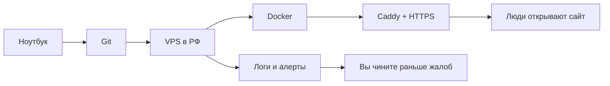

# DevOps и SRE с нуля до продакшена

Курс для человека, который уже умеет собирать проекты (вайбкодинг, n8n, нейросети) и хочет **правильно выкладывать их на свой сервер в России**: безопасно, с запасной копией, с понятными сигналами «что-то сломалось», без чёрной магии Kubernetes в первый день.

Это учебник в браузере, не видеоплатформа. Слева — оглавление, внизу каждой страницы — следующий урок, в конце урока — кнопка «пройдено».

Уроки написаны **рассказом**: зачем штука нужна, какую боль закрывает, как работает — и только потом команды. Схемы иллюстрируют текст, а не заменяют его. Если встретили незнакомое имя службы, в том же уроке должно быть «для чего она», не просто список терминов.

## Для кого

- Вы запускали проекты на своём компьютере и в облачных конструкторах.
- Linux и «прод» пока звучат пугающе.
- Есть (или будет) небольшой VPS: **1 процессор, 1 ГБ памяти, 10 ГБ диска**.
- Хотите понимать принципы, а не копировать чужие команды вслепую.

## Что вы умеете к концу полного курса

1. Зайти на сервер по ключу, а не по паролю, и не оставить дверь открытой.
2. Упаковать приложение в Docker и поднять его так, чтобы оно ожило после перезагрузки.
3. Повесить домен и HTTPS.
4. Понимать логи, бэкапы, алерты в Telegram, доступы людей и подписку как у продукта.
5. Объяснить своими словами, **зачем** нужны Kubernetes и AWS — и почему они не нужны на вашем текущем сервере.

Готовы **все модули 0–19**. Kubernetes и AWS — понимание и песочница, не установка на VPS 1 ГБ.

## Как устроен путь

Сквозной учебный сервис — **«Пульс»**: крошечная страница «я жив» плюс одна заметка. Он нужен не как продукт, а как подопытный, на котором отрабатываются все приёмы. Свой настоящий проект подставите, когда принципы станут руками привычны.

## Что понадобится

- Компьютер с Python 3.11+ (чтобы открыть этот сайт локально).
- Учебный VPS с Ubuntu 22.04 или 24.04.
- Желательно домен — с модуля 5. До этого работаете по IP.
- Терминал: на Windows удобен PowerShell + клиент SSH (в Windows 10 он уже есть).

Как открыть учебник локально: команды в [README](https://github.com/automationmag/DevOPS_SRE_course/blob/main/README.md) в корне репозитория. После `mkdocs serve` адрес: `http://127.0.0.1:8000`.

## Карта курса

| Модуль | О чём | Статус |
|---|---|---|
| 0 | Карта, DevOps/SRE, путь запроса, три правила | Готово |
| 1 | Сервер, DNS, SSH, Linux, хостеры РФ | Готово |
| 2 | Обновления, файрвол, не-root, секреты | Готово |
| 3 | Docker и лимиты памяти | Готово |
| 4 | Первый запуск на сервере | Готово |
| 5 | Домен, Caddy, HTTPS | Готово |
| 6 | Данные, 3-2-1, восстановление | Готово |
| 7 | Среды, staging, ротация ключей | Готово |
| 8 | Git, CI/CD, Pages, откат | Готово |
| 9 | Логи и расследование | Готово |
| 10 | Наблюдаемость: лёгкий стек и Prometheus-грамотность | Готово |
| 11 | Алерты в Telegram, n8n, дежурство | Готово |
| 12 | SLI/SLO, инцидент, postmortem | Готово |
| 13 | Вертикаль/горизонталь, узкие места, очередь, масштаб в РФ | Готово |
| 14 | Ключи, роли, админки, отзыв доступа | Готово |
| 15 | Арендаторы, ЮKassa, вебхуки, сверка | Готово |
| 16 | Счёт, календарь, живой инвентарь | Готово |
| 17 | Чеклист и диплом: сервис + Pages | Готово |
| 18 | Kubernetes глубоко, «Пульс» в YAML, песочница | Готово |
| 19 | AWS как грамотность, таблица перевода, Terraform | Готово |

## Честно про ваш сервер

На **1 ГБ памяти** можно научиться главному: доступ, безопасность, один контейнер, домен, замочек в браузере. Нельзя одновременно поставить «как у большой компании» — Grafana, Prometheus, Loki и Kubernetes. Это не ваша слабость, это арифметика памяти. В уроках будет пометка:

- **влезает в 1 ГБ**
- **нужен сервер больше**
- **только теория или песочница в браузере**

## Куда возвращаться потом

Когда курс пройден и нужна конкретная команда, не листайте модули — откройте [«Все команды курса»](cheatsheet.md). Там всё собрано по задачам: логи, бэкап, порты, память, домен.

Начните с [Как учиться](how-to-study.md) и [Мой учебный VPS](lab-server.md).
