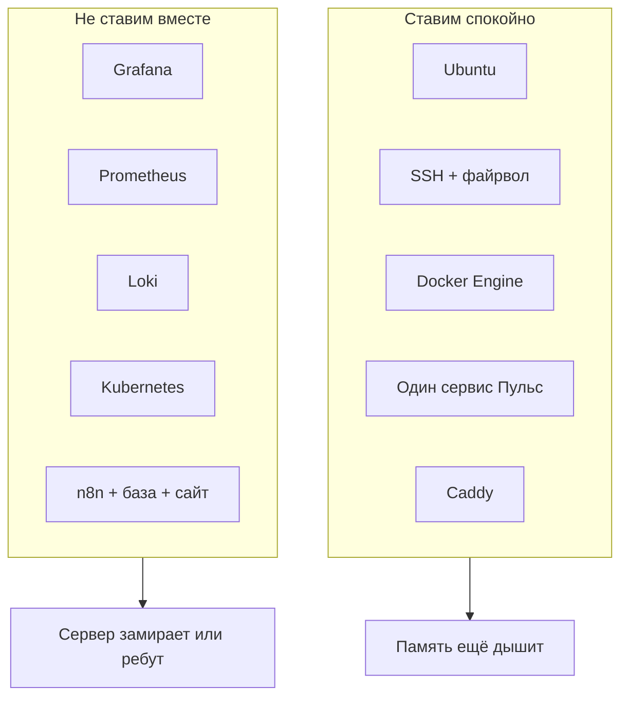

# Мой учебный VPS: 1 CPU, 1 ГБ, 10 ГБ

Эта страница — честный паспорт железа, на котором вы будете учиться. Если хостер показывает другие цифры — читайте смысл, цифры подставьте свои.

## Что это значит

- **CPU (процессор)** — «мозг» сервера. У вас одно ядро: он делает одно тяжёлое дело за раз нормально, два тяжёлых — уже в очереди.
- **RAM (оперативная память)** — рабочий стол. 1 ГБ — маленький стол. Система Linux сама занимает примерно 150–300 МБ. Остальное — ваши программы.
- **Диск 10 ГБ** — шкаф. Система, обновления, образы Docker и логи быстро его забивают, если не чистить.

## Что влезет на этот сервер



**Влезает:** обновлённая Ubuntu, пользователь не-root, ufw, fail2ban, Docker, один маленький контейнер приложения, Caddy как вход с HTTPS.

**Влезает с оговоркой:** Uptime Kuma (лёгкая проверка «сайт открывается») — *вместо* тяжёлых графиков, не вместе с ними. Даже её лучше ставить, когда «Пульс» уже работает, и смотреть `free -h`.

**Не влезает как учебный «полный прод»:** Prometheus + Grafana + Loki + приложение. Kubernetes (k3s/k8s). «Панель всего» + n8n + Postgres + Redis на той же машине.

Это не запрет навсегда. Это запрет **на этот сервер в начале курса**.

## Swap — подушка, когда памяти не хватает

Swap (файл подкачки) — кусок диска, который система использует как «медленную память». Сервер начинает тормозить, но чаще остаётся жив, а не молча умирает.

На 1 ГБ RAM разумно сделать **1–2 ГБ swap**. Диск маленький, поэтому **1 ГБ**.

Под root или через `sudo`:

```bash
sudo fallocate -l 1G /swapfile
sudo chmod 600 /swapfile
sudo mkswap /swapfile
sudo swapon /swapfile
echo '/swapfile none swap sw 0 0' | sudo tee -a /etc/fstab
```

Проверка:

```bash
free -h
```

Вы должны увидеть строку `Swap` с цифрой около `1.0Gi`. Если Swap всё ещё `0B` — файл не включился, не идите дальше, разберите ошибку команды `swapon`.

!!! warning "Swap не увеличивает мозги сервера"
    Если программа хочет 3 ГБ, swap только оттягивает падение. Не ставьте Grafana «потому что swap есть».

## Порядок установки на весь курс (модули 1–5)

Не ставьте Docker в первый же час. Иначе вы чините десять вещей сразу.

1. Зайти по SSH, создать обычного пользователя, ключ, запретить пароль root (модуль 1).
2. Обновления, файрвол, fail2ban (модуль 2).
3. Swap, если ещё не сделали.
4. Docker + один «Пульс» (модули 3–4).
5. Caddy и домен (модуль 5).
6. Всё остальное — только когда `free -h` показывает свободные сотни мегабайт, не нули.

## Как понять, что памяти уже нет

```bash
free -h
df -h
sudo dmesg | grep -i -E "killed process|out of memory"
```

- `available` в `free -h` близко к нулю — не ставьте ничего нового.
- `df -h` по `/` больше 85% — чистите образы: `docker system prune` (осторожно, удалит неиспользуемое).
- В `dmesg` есть `Out of memory` — система убила процесс. Обычно это Docker или само приложение. Перезапуск в панели хостера — нормальный первый шаг, потом разбор.

## Панель хостера

У каждого РФ-хостера своя картинка. Вам нужны три кнопки:

<div class="placeholder-screen" markdown>
**Что найти в панели**

1. **IP-адрес** сервера (цифры вида `185.x.x.x`).
2. **VNC / консоль** — экран сервера, если SSH не пускает (как монитор, прикрученный в дата-центре).
3. **Перезагрузить**.

Если видите root-пароль, который прислали на почту — используйте его только для самого первого входа, потом вход по паролю отключите.
</div>

## Запись в инвентарь

Сразу заведите строку в [инвентаре](inventory-template.md): хостер, IP, тариф, дата оплаты, где лежит SSH-ключ, кто имеет доступ. Будущий вы скажет спасибо.
