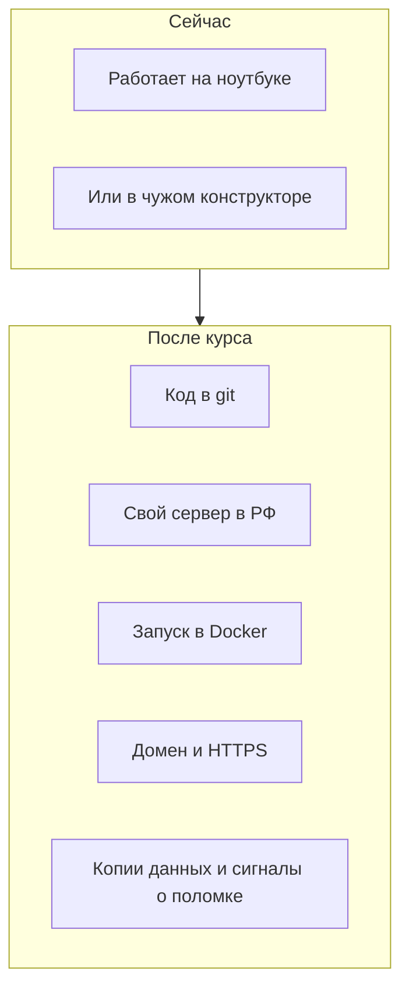

# Зачем этот курс

## Ситуация

Вы умеете собирать проекты: бот, сценарий в n8n, обёртка над нейросетью, небольшой сайт. На ноутбуке всё работает. Но стоит закрыть крышку — и проекта для мира больше нет. Или он живёт в чужом конструкторе, где вы не управляете ни данными, ни тарифом.

Не хватает одного навыка: **вывести проект на свой сервер так, чтобы он работал без вас**. Этому и посвящён курс.

## Зачем это нужно

Чтобы приложением пользовались другие люди, вокруг кода нужно ещё пять вещей:

1. **Постоянно включённый компьютер** в интернете — не ваш ноутбук.
2. **Безопасный вход** на него, чтобы сервер не увели в первую же ночь.
3. **Одинаковый запуск** — чтобы на сервере работало ровно так же, как у вас.
4. **Нормальный адрес с замочком** — имя вместо цифр и HTTPS вместо предупреждения браузера.
5. **Сигнал о поломке** — чтобы узнавать об аварии раньше, чем вам напишут.

Всё это вместе называется **инфраструктурой**. Курс идёт ровно по этому списку, по одному пункту за модуль.

Чего в курсе нет:

- обучения программированию — код вы уже пишете как умеете;
- Kubernetes в первый день — к нему придём в модуле 18, когда будет с чем сравнивать;
- «волшебной кнопки» — её не существует, зато существует понятная последовательность шагов.

## Как это устроено

Курс ведёт от текущей картины к целевой.



Учиться на живом проекте опасно, поэтому в курсе есть учебный подопытный — сервис **«Пульс»**. Это крошечная страница, которая отвечает «я жив» и умеет сохранить одну заметку. Он не продукт, а полигон: на нём отрабатывается каждый приём, который вы потом перенесёте на свой настоящий проект.

Важно: **сам учебник не живёт на вашем сервере**. Вы открываете его в браузере на компьютере, а позже можно выложить на бесплатный хостинг страниц. Сервер нужен только для практики.

!!! note "Новые слова"
    - **Инфраструктура** — всё вокруг программы, без чего человек до неё не доберётся: сервер, сеть, адрес, диски, копии.
    - **Деплой (выкладка)** — перенос конкретной версии программы туда, где её откроют люди.
    - **Прод (production)** — живая версия, которой пользуются реальные люди. Даже если их пока двое.

## Как читать команды в курсе

Дальше будет много команд. Почти все ошибки новичков происходят от одного: **команду ввели не там, где нужно**. Поэтому перед каждым блоком команд в курсе стоит подпись, где именно их выполнять. Мест всего два.

| Подпись | Где это | Как выглядит |
|---|---|---|
| **PowerShell на вашем компьютере** | Обычное окно PowerShell в Windows, вы ещё не подключены к серверу | В строке виден путь вида `PS C:\Users\...>` |
| **Терминал сервера** | То же окно, но уже после подключения командой `ssh` | В строке видно имя пользователя и сервера, например `deploy@vps:~$` |

Проверить, где вы находитесь, можно всегда одной командой.

**Где вводить:** терминал сервера

```bash
whoami
```

**Что должно получиться:** имя пользователя на сервере — `root` или `deploy`. Если команда не сработала или ответ похож на ваше имя в Windows, вы ещё не подключились к серверу.

После каждой команды в курсе будет блок «Что должно получиться». Он важнее самой команды: именно по нему вы поймёте, идти дальше или разбираться.

## Практика

1. Откройте [страницу про учебный VPS](../../lab-server.md) и прочитайте, что помещается в 1 ГБ памяти, а что нет.
2. Заведите [инвентарь](../../inventory-template.md) — файл или таблицу, где будете записывать хостера, адрес сервера, тариф, домены. Заполните первую строку.
3. Решите, где читаете учебник. Команда `mkdocs serve` даёт адрес `127.0.0.1:8000` — это **только тот компьютер, на котором она запущена**. С телефона по этому адресу зайти не получится.
4. Отметьте урок пройденным кнопкой внизу страницы.

Команд на сервере в этом уроке нет — здесь только карта.

## Проверка

Ответьте себе на три вопроса:

- Чем курс не является? *(Не курс программирования и не установка Kubernetes.)*
- Где живёт сам учебник? *(На вашем компьютере или на бесплатном хостинге страниц, не на VPS.)*
- Зачем нужен «Пульс»? *(Учебный подопытный, чтобы отрабатывать приёмы не на живом проекте.)*

## Частые ошибки

!!! failure "Сразу поставить на сервер всё подряд"
    Панель управления, n8n, Grafana и бот одновременно не поместятся в 1 ГБ памяти. Сервер начнёт зависать, и вы возненавидите Linux раньше, чем разберётесь во входе по ключу. Порядок установки — на [странице про VPS](../../lab-server.md).

!!! failure "Искать одну кнопку «сделать прод»"
    В конструкторах такая кнопка есть, на своём сервере — нет. Прод складывается из привычек: секреты отдельно, копии данных, сигналы о поломке.

!!! failure "Пропустить модули 1–2, потому что там «скучная теория»"
    Без безопасного входа Docker станет способом быстро выставить в интернет дырявое приложение.

## Как это в больших командах

Шаги те же, но их выполняют не руками: сервер создаётся автоматически, версию выкладывает робот, за сигналами следит дежурный. Суть не меняется — нужная версия запущена, нужная дверь открыта, процесс не падает. Разница в масштабе и цене ошибки.

## Итог

Вы учитесь не словарю из вакансий, а последовательности: доступ → безопасность → упаковка → публикация → умение чинить.

Следующий урок разводит два слова, которые в статьях постоянно путают: DevOps и SRE.

Далее: [DevOps и SRE простыми словами](02-devops-sre.md).

!!! info "Нагрузка на учебный VPS"
    **Только чтение.** Сервер не трогаем.
