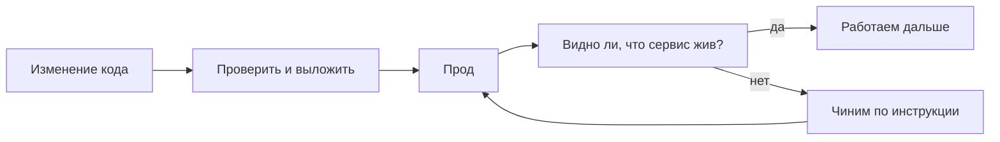

# DevOps и SRE простыми словами

## Ситуация

В статьях и вакансиях слова DevOps, SRE и Kubernetes идут через запятую, будто это одно и то же. Из-за этого складывается ощущение, что профессия — это «уметь Kubernetes».

На самом деле за этими словами стоят две разные работы. В большой компании их делят между отделами. У вас они обе будут в одних руках, и это нормально.

## Зачем это нужно

**DevOps** отвечает на вопрос: **как доставить изменение до пользователей**.

Слово появилось из старого конфликта: одни люди писали код, другие отвечали за серверы, между ними была стена. Разработчик «перебрасывал» работу через стену, админ боялся её принимать, выкладка растягивалась на недели, а при поломке каждый винил другого. DevOps — это договорённость, что довезти изменение до людей — общая задача.

На практике это выражается в привычках:

- код хранится в одном месте с историей;
- выкладка делается одинаково каждый раз, а не «как вчера получилось»;
- поломка сборки видна сразу, до того как её увидят пользователи.

**SRE** (Site Reliability Engineering, инженерия надёжности) отвечает на другой вопрос: **как жить с сервисом, который уже работает**.

Боль здесь другая: сервис выложен, но никто не договорился, насколько хорошо он обязан работать. Поэтому любой сбой — повод для героизма в три часа ночи. SRE предлагает сначала определить цифрой, какая доступность считается нормальной, потом измерять её, настроить сигналы и написать короткие инструкции на случай аварии. Если надёжности не хватает — меняют систему, а не требуют от человека не спать.

Короткая формула на весь курс:

- **DevOps** — как везём изменения.
- **SRE** — как живём, когда уже в проде.

Kubernetes в это определение не входит вообще. Это инструмент, который может помочь и с тем, и с другим, когда серверов становится много.

## Как это устроено

Посмотрите на жизнь одной правки в коде:

1. Вы меняете код. Пока изменение у вас на компьютере — это ещё не прод.
2. Изменение проверяется и попадает на сервер. Это зона DevOps.
3. Версия работает, и кто-то следит: жива ли она, хватает ли места на диске. Это зона SRE.
4. Если что-то сломалось — чините по заранее написанной инструкции, а не наугад.

На вашем будущем «Пульсе» это будет выглядеть конкретно так:

- **Зона DevOps:** приложение упаковано в Docker, на сервер попадает та же версия, что хранится в истории, а не файл, который вы вчера подправили прямо на сервере и забыли.
- **Зона SRE:** вы заранее решили, что десять минут недоступности — уже событие, и у вас есть [карточка «сайт не открывается»](../../runbooks/site-down.md) вместо паники.

!!! note "Новые слова"
    - **DevOps** — практика, при которой путь «код → пользователи» короткий, понятный и повторяемый.
    - **SRE** — практика, при которой надёжность измеряется цифрой, а аварии чинятся по инструкции.
    - **Runbook** — короткая карточка «если случилось вот это, делай раз, два, три». Три готовых есть в конце курса.

## Практика

Возьмите любой свой прошлый проект — бот, сценарий n8n, лендинг. Запишите честные ответы на два вопроса:

1. **Как вы его выкладываете?** Например: копирую файлы вручную, жму кнопку в конструкторе, надеюсь что не сломается.
2. **Как вы узнаёте, что он упал?** Например: мне пишут в личку. Или вообще не узнаю.

Первый ответ — это зона DevOps вашего проекта. Второй — зона SRE. Курс закроет обе.

Сервер в этом уроке не трогаем.

## Проверка

Попробуйте объяснить знакомому без IT-опыта, не используя слово Kubernetes:

- DevOps нужен, чтобы путь от «я поменяла код» до «это уже у людей» был понятным и повторяемым.
- SRE нужен, чтобы падение не было сюрпризом и было понятно, сколько недоступности мы вообще готовы терпеть.

Если в объяснении остаётся только «это когда графики» — смысл ещё не пойман. График без договорённости о том, какое значение считается плохим, никого не разбудит.

## Частые ошибки

!!! failure "Считать, что DevOps — это человек, который жмёт кнопки в специальной программе"
    Кнопки — следствие. Суть в том, что за доставку изменения отвечают совместно. Когда вы работаете одна, это означает: не бросать проект сразу после копирования файлов на сервер.

!!! failure "Считать, что SRE — это поставить Grafana"
    Grafana рисует числа. Пока не решено, какое число означает катастрофу, она никого не разбудит.

!!! failure "Решить, что одному человеку SRE не нужен"
    Как раз нужен, в уменьшенном виде. Иначе сервис работает по принципу «как повезёт» — до первого отпуска.

## Как это в больших командах

В компании DevOps-привычки зашиты в шаблон: новый сервис создаётся сразу с настроенной выкладкой и сбором логов. Отдельные люди считают надёжность и имеют право сказать «на этой неделе новых функций не выкатываем, сначала чиним».

Вы сделаете уменьшенную копию того же: робота для выкладки в модуле 8 и цифру доступности в модуле 12.

## Итог

Два вопроса на весь курс: как везём изменения и как живём в проде.

Чтобы чинить осознанно, надо понимать, что вообще происходит между вводом адреса в браузере и появлением страницы. Это следующий урок.

Далее: [Путь запроса](03-put-zaprosa.md).

!!! info "Нагрузка на учебный VPS"
    **Только теория.**
