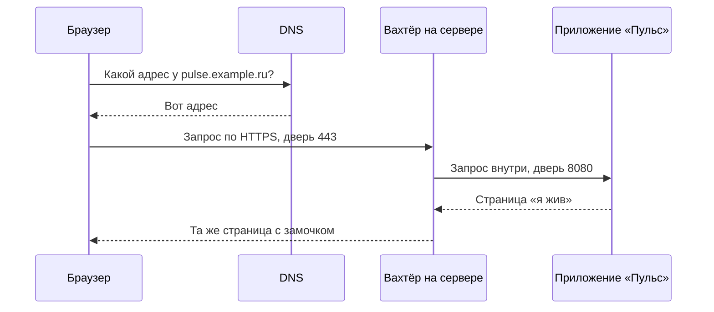

# Путь запроса от браузера до приложения

## Ситуация

Человек вводит адрес и видит вашу страницу. Между этими двумя событиями происходит несколько шагов, и каждый может сломаться отдельно.

Пока вы не видите эти шаги, любая инструкция звучит как заклинание: «откройте порт 443», «проверьте A-запись». Когда видите — те же слова становятся понятными действиями, и главное, становится ясно, **что именно чинить**.

## Зачем это нужно

Страница — это не файл, который человек скачивает с вашего диска. Это **ответ на запрос**. Браузер просит, программа отвечает. Разговор идёт на языке HTTP; HTTPS — тот же разговор, но в зашифрованном конверте.

Чтобы запрос дошёл, кроме самой программы нужны три вещи.

**1. Имя.** Люди не помнят `185.12.34.56`, они помнят `pulse.example.ru`. Справочник, который переводит имя в адрес, называется DNS. Если запись в справочнике неверная, браузер даже не узнает, к какому компьютеру стучаться. Docker тут ни при чём: приложение может быть совершенно здорово, а человек увидит «не удаётся найти сервер».

**2. Дверь (порт).** На одном компьютере работает много программ, и чтобы запросы не перепутались, у каждой есть номер двери:

| Порт | Кто за ним | Зачем |
|---|---|---|
| 443 | веб-сервер | сайт с HTTPS, обычный вход для людей |
| 80 | веб-сервер | сайт без шифрования, нужен для получения сертификата |
| 22 | SSH | ваш вход в терминал сервера |
| 8080 | приложение | внутренняя дверь «Пульса», наружу её открывать не нужно |

Если дверь закрыта файрволом, запрос долетает до сервера и умирает на пороге. Приложение при этом живо.

**3. Вахтёр.** Пускать гостей сразу в комнату приложения необязательно. У входа стоит отдельная программа — Caddy или Nginx. Она принимает HTTPS, смотрит, какое имя спросили, и только потом обращается к приложению по внутренней двери 8080.

Зачем нужен этот посредник:

- приложению не нужно уметь работать с сертификатами;
- на одной машине могут жить несколько сайтов с разными именами;
- внутреннюю дверь 8080 не надо показывать интернету.

## Как это устроено

Разговор по шагам:

1. Человек вводит имя в браузере.
2. Браузер спрашивает DNS: «какой адрес у этого имени?»
3. Справочник отвечает цифрами.
4. Браузер стучится по этому адресу в дверь 443.
5. Вахтёр здоровается по HTTPS и обращается к приложению внутри по двери 8080.
6. Приложение отдаёт страницу, вахтёр заворачивает её в шифрование и возвращает человеку.

Главная практическая польза этой схемы — **чинить нужно тот слой, который сломался**, а не переустанавливать всё подряд:

| Что видит человек | Где искать причину |
|---|---|
| «Не удаётся найти сервер» | справочник имён: неверная запись или домен не оплачен |
| Долго крутится, потом таймаут | сервер выключен, неверный адрес или дверь закрыта файрволом |
| Ошибка 502 | вахтёр жив, а приложения за ним нет: контейнер упал |
| Открывается по адресу с `:8080`, а по имени нет | вы обошли вахтёра: так можно на день учёбы, но не постоянно |
| Показывает старую версию | открыли не то приложение или браузер показывает сохранённую копию |

!!! note "Новые слова"
    - **Клиент** — тот, кто просит: браузер или приложение на телефоне.
    - **Сервер (программа)** — тот, кто отвечает. Работает на сервере-машине, то есть на вашем VPS.
    - **Порт** — номер двери, за которой слушает конкретная программа.
    - **Вахтёр (reverse proxy)** — программа на входе, которая принимает запросы снаружи и передаёт их внутрь.

## Практика

Упражнение на пять минут, сервер не нужен.

1. Откройте любой знакомый сайт и нажмите на замочек слева от адреса. Посмотрите, что там написано про сертификат и защищённое соединение.
2. Прочитайте таблицу поломок выше и попробуйте по памяти ответить, какой слой смотреть первым, если человек говорит: «у тебя сайт не грузится, крутится и всё».
3. Откройте панель хостера и найдите IPv4-адрес сервера. Пока домена нет, это и есть конечная точка пути: браузер может обратиться прямо по цифрам, минуя справочник.

## Проверка

Нарисуйте на бумаге пять прямоугольников: браузер → DNS → файрвол → вахтёр → приложение. Подпишите на каждой стрелке, что увидит человек, если она порвётся. Получилось — урок усвоен.

## Частые ошибки

!!! failure "Считать, что Docker и есть интернет"
    Docker запускает программу на машине. Интернет начинается раньше: с адреса, имени, двери и разрешения файрвола.

!!! failure "Открыть все порты, чтобы точно заработало"
    Заработает не только у вас: в случайные двери круглосуточно стучатся автоматические сканеры. Двери открывают по одной и осознанно.

!!! failure "Путать 127.0.0.1 и адрес сервера"
    `127.0.0.1` означает «этот же компьютер». На сервере это сам сервер, на ноутбуке — ноутбук. Поэтому учебник, запущенный командой `mkdocs serve`, с телефона по этому адресу не откроется.

## Как это в больших командах

Путь тот же самый. Разница в количестве: вахтёров несколько, серверов много, справочник имён умеет проверять, жив ли сервер, и отдавать разные адреса.

Названия меняются — в облаке вахтёра называют балансировщиком, в Kubernetes он называется Ingress, — но стрелки на схеме остаются те же. В модуле 19 будет таблица перевода этих названий.

## Итог

Сайт — это ответ на запрос, который прошёл через имя, дверь и вахтёра. Каждый участок ломается отдельно и чинится отдельно.

Остались три правила, без которых даже правильно настроенный путь превращается в лотерею.

Далее: [Три правила прода](04-tri-pravila.md).

!!! info "Нагрузка на учебный VPS"
    **Только теория.** Можно посмотреть адрес в панели хостера.
