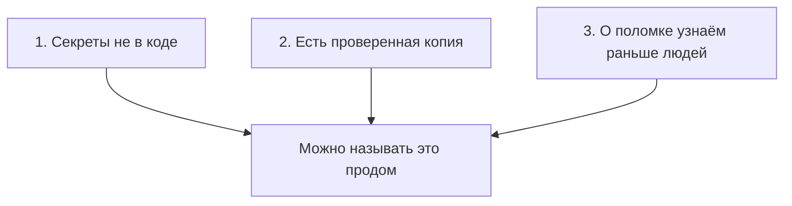

# Три правила прода

## Ситуация

Можно выучить Docker и за один вечер потерять проект:

- ключ от платного сервиса уехал в открытый репозиторий, и им воспользовался кто-то чужой;
- диск сервера умер вместе с единственной копией данных;
- сайт лежал с утра до вечера, а вы узнали об этом от знакомого.

Ни одна из этих бед не лечится знанием команд. Они лечатся тремя привычками.

## Зачем это нужно

Эти три правила — фильтр для любого совета из интернета. Если совет их нарушает, он подождёт.

### Правило 1. Секреты не в коде

**Секрет** — всё, чем можно войти или заплатить от вашего имени:

- пароли;
- токены ботов;
- ключи доступа к нейросетям и платным сервисам;
- приватные ключи SSH.

Код путешествует: попадает в репозиторий, в чат «посмотри, почему не работает», внутрь образа Docker. Если секрет лежит в коде, он путешествует вместе с ним.

Правильное место секрета — отдельный файл `.env` на конкретной машине плюс менеджер паролей. Не репозиторий, не скриншот, не строка прямо в коде.

Адрес вашего учебного сервера тоже лучше не выкладывать в публичный репозиторий. В текстах курса вы увидите адреса вида `203.0.113.10` — это специально зарезервированные примеры из документации, а не чьи-то настоящие серверы.

### Правило 2. Есть проверенная копия

Разделите две вещи:

- **код** — его можно собрать заново из репозитория;
- **данные людей** — их восстановить неоткуда.

Папка с названием `backup` на том же диске, которую вы ни разу не распаковывали, — самообман. В день аварии выяснится, что архив пустой или битый.

Ключевая мысль: **восстановление важнее копирования**. Копия, из которой вы ни разу не восстанавливались, копией не считается. В модуле 6 вы специально сломаете файл и вернёте его из архива — именно чтобы эта привычка появилась.

### Правило 3. О поломке узнаём раньше людей

Пока вы не смотрите на сервис, он работает по принципу «как повезёт».

На сервере с 1 ГБ памяти это не означает графики и дашборды. Достаточно простой цепочки:

1. сейчас — процесс запущен и логи читаются;
2. раз в день — открыть адрес глазами;
3. позже, в модуле 11, — сообщение в Telegram, когда сайт не отвечает.

Цель не в героизме 24/7, а в том, чтобы не узнавать о смерти сайта из переписки.

## Как это устроено

Три правила не независимы: они работают только вместе. Секреты снаружи защищают от кражи доступа, копия — от потери данных, сигнал — от долгого незамеченного простоя. Пропущенное правило оставляет открытой свою дыру, которую два других не закрывают.

Пока все три правила не выполнены, слово «прод» лучше не произносить. Честнее говорить «учебный сервис в интернете».

!!! note "Новые слова"
    - **Секрет** — знание, которое даёт возможность войти или потратить деньги от вашего имени.
    - **Бэкап** — копия данных, из которой вы уже пробовали восстановиться хотя бы раз.
    - **Ротация ключа** — выпустить новый ключ и отключить старый. Именно отключить, а не просто удалить файл.

## Практика

Три коротких действия, сервер не нужен.

**1. Поиск секретов в старых проектах.** Откройте любой свой проект на компьютере и поищите по папке слова `token`, `api_key`, `password`, `secret`. Если ключи найдутся прямо в коде — выпишите задачу «вынести в `.env`». Как это делается, разберём в модулях 2 и 7.

**2. Вопрос о данных.** Ответьте себе: если ноутбук завтра не включится, где лежит копия ваших *данных*? Ответ «в репозитории» годится только для кода — базы и загруженные файлы туда обычно не попадают.

**3. Напоминание в календарь.** Когда в следующем модуле появится сервер, поставьте повторяющееся напоминание на десять минут: «открыть учебный адрес, проверить что жив». Это зародыш третьего правила.

## Проверка

Три правила держатся в голове без подсказки. Откройте [чеклист продакшена](../../checklists/production.md) и посмотрите, как они там разложены на конкретные пункты. Сейчас почти все пункты не выполнены — так и должно быть, вы будете закрывать их по ходу курса.

## Частые ошибки

!!! failure "Выложить ключ в открытый репозиторий, а потом сделать его приватным"
    История сохраняет всё. Ключ, который побывал в открытом доступе, считается украденным: его нужно заменить, а не спрятать.

!!! failure "Хранить бэкап на том же диске сервера"
    Диск умер — исчезли обе копии. Для учёбы достаточно копии на вашем компьютере: это уже другой носитель и другое место.

!!! failure "Поставить мониторинг вместо бэкапа"
    График красиво покажет момент, когда данные пропали, но не вернёт их.

## Как это в больших командах

Правила те же, декорации дороже. Секреты лежат в специальном хранилище с доступом по ролям. Копии делаются по расписанию, и раз в квартал команда устраивает учебную аварию, чтобы проверить восстановление. Третье правило превращается в дежурства и согласованные цифры доступности.

## Итог

Прод начинается не с модных инструментов, а с трёх привычек: секреты отдельно, копия проверена, о поломке узнаёте первой.

Модуль 0 закончен. Дальше — практика: что именно вы арендуете у хостера и как на это зайти.

Далее: [Что такое сервер и VPS](../m01/01-chto-takoe-server.md).

!!! info "Нагрузка на учебный VPS"
    **Только теория.**
