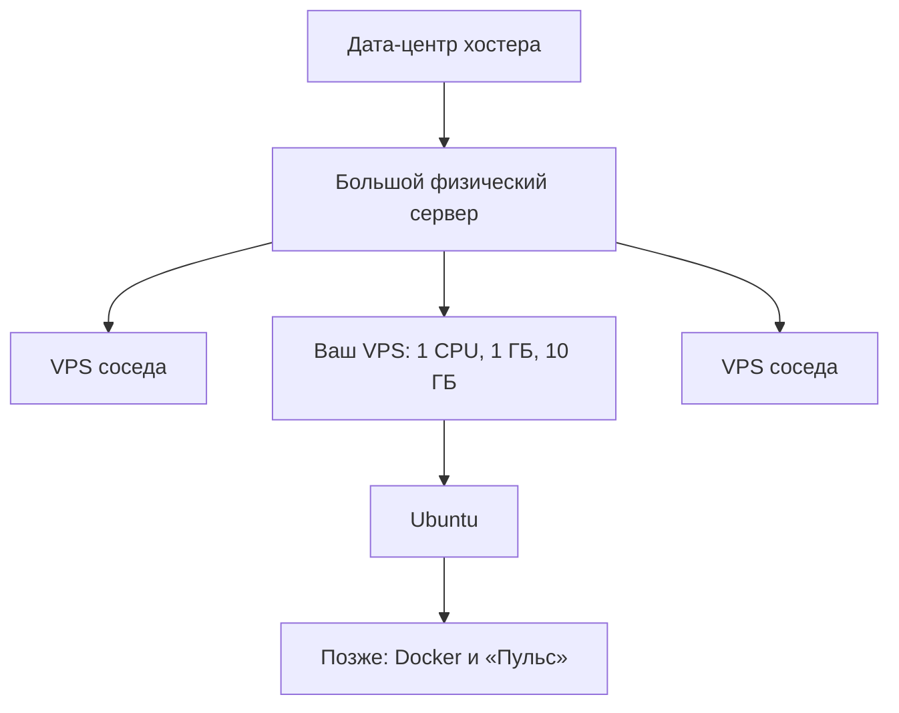

# Что такое сервер и VPS

## Ситуация

Приложение на вашем ноутбуке работает, пока ноутбук включён и открыт. Чтобы им пользовались другие люди, нужен компьютер, который:

- работает круглосуточно и не уходит в спящий режим;
- всегда доступен по одному и тому же адресу;
- принимает запросы из интернета.

Домашний ноутбук не подходит не потому, что слабый, а потому что он личный: вы его выключаете и носите с собой, домашний интернет меняет адрес, роутер закрывает вход снаружи. Поэтому компьютер для приложения арендуют.

## Зачем это нужно

Сначала разведём два значения слова «сервер» — именно из-за них чаще всего возникает путаница:

- **сервер-машина** — компьютер, который держат включённым, чтобы он отвечал по сети;
- **сервер-программа** — процесс на этой машине, который принимает запросы и отвечает.

Ваш будущий «Пульс» — это программа. Фраза «сервер лежит» обычно про машину, «сервер вернул ошибку» — про программу. Дальше в курсе я всегда уточняю, о чём речь.

Целый физический компьютер в дата-центре ради одной страницы — дорого и бессмысленно. Поэтому хостинг-компании берут мощную машину и делят её на части. Такая часть называется **VPS** — виртуальный частный сервер. Вы получаете:

- выделенную долю процессора, оперативной памяти и диска;
- свою операционную систему, которой управляете полностью;
- отдельный публичный адрес в интернете.

За это вы и платите хостеру: за включённую машину с адресом, электричеством и каналом связи. Всё остальное — установка, настройка, безопасность, копии данных — ваша работа. Собственно, курс о ней.

## Как это устроено

В дата-центре — здании с охраной, резервным питанием и охлаждением — стоит мощный компьютер. На нём работает программа виртуализации, которая делит железо на независимые виртуальные машины. Одна из них ваша.

Соседи по железу друг друга не видят: у каждого своя система, свои файлы, свой доступ. Общее только физическое железо, поэтому на дешёвых тарифах иногда чувствуется «шумный сосед» — кто-то рядом нагружает процессор, и ваша часть работает медленнее.

Управлять своим VPS вы будете двумя способами:

| Способ | Что это | Когда используется |
|---|---|---|
| **Панель хостера** | сайт компании, где вы купили сервер | включить, выключить, перезагрузить, посмотреть адрес, переустановить систему |
| **Терминал по SSH** | текстовый доступ к самой системе | вся основная работа, начиная с третьего урока |

Ещё два слова, которые часто путают:

- **дата-центр** — здание, где физически стоит железо;
- **облако** — чужой дата-центр плюс каталог готовых услуг: базы данных, хранилища, сети.

Ваш VPS у российского хостера — это уже облако в простом смысле. AWS — облако с огромным каталогом. Разница не в физике, а в количестве услуг и в способе тарификации. Подробно — в модуле 19.

!!! note "Новые слова"
    - **VPS** — арендованная часть большого компьютера, которая ведёт себя как отдельная машина.
    - **IPv4** — адрес машины в интернете, четыре числа через точки, например `185.10.20.30`.
    - **VNC-консоль** — «монитор» вашего сервера прямо в браузере, в панели хостера. Нужна, если вход по сети перестанет работать.

## Практика

Команд в этом уроке нет — работаем только с панелью хостера.

Откройте панель и найдите четыре вещи:

1. **Статус** — сервер должен быть включён.
2. **IPv4-адрес** — запишите, он понадобится со следующего урока.
3. **Операционная система** — нужна Ubuntu 22.04 или 24.04. Если стоит Windows Server или другая система, переустановите на Ubuntu. Учтите: переустановка полностью стирает диск.
4. **Тариф** — сколько процессоров, памяти и диска.

Сверьте тариф с [памяткой про учебный VPS](../../lab-server.md): там написано, что поместится в 1 ГБ памяти, а что нет.

Найдите и просто откройте один раз кнопку **VNC** или «Консоль». Сейчас она не нужна, но важно знать, где она находится: это аварийный вход, если вы случайно закроете себе доступ по сети.

Запишите адрес сервера в [инвентарь](../../inventory-template.md). В репозиторий курса его класть не нужно — это ваши данные.

**Что должно быть на экране панели**

Карточка сервера: зелёный статус «работает», строка с IPv4-адресом, характеристики тарифа вида «1 CPU / 1 GB RAM / 10 GB SSD», кнопки перезагрузки и консоли.

## Проверка

- [ ] Вы знаете адрес своего сервера и записали его.
- [ ] Знаете, где в панели кнопка перезагрузки и где консоль.
- [ ] Можете объяснить своими словами: «я арендую виртуальную машину с Ubuntu у такого-то хостера, физически она стоит в их дата-центре».

## Частые ошибки

!!! failure "Взять конструктор сайтов вместо VPS"
    В конструкторах обычно нет доступа в терминал и нельзя поставить Docker. Нужен именно VPS, иногда его называют «облачный сервер».

!!! failure "Работать только через панель управления хостингом"
    Панели вроде ISPmanager прячут систему за кнопками. Для учёбы это мешает: вы не видите, что происходит на самом деле.

!!! failure "Ждать от 1 ГБ памяти поведения большого облака"
    Память не растягивается. Когда дойдёте до тяжёлых инструментов, тариф можно будет увеличить — это нормальный ход, а не поражение.

## Как это в больших командах

Разница в количестве, а не в сути. Машин десятки или сотни, их не заказывают руками в панели, а описывают текстом и создают автоматически. Раскладывают по разным дата-центрам, чтобы авария в одном здании не уронила сервис целиком.

Внутри каждой такой машины — та же Ubuntu с адресом и диском. В AWS она называется EC2, в Yandex Cloud — Compute Cloud. Это тот же VPS под другим именем.

## Итог

VPS — арендованный компьютер с постоянным адресом, который работает без вас. Панель хостера — пульт от него, терминал — основное рабочее место.

Дальше разберёмся, как этот компьютер находят в интернете.

Далее: [IP, домен и DNS](02-ip-domen-dns.md).

!!! info "Нагрузка на учебный VPS"
    **Влезает в 1 ГБ.** В этом уроке вы только смотрите панель.
