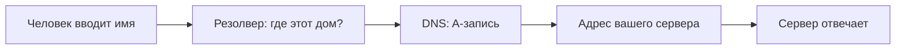

# IP, домен и DNS

## Ситуация

У вас есть машина и её адрес — четыре числа через точки. По этому адресу сервер уже можно будет открыть в браузере, как только на нём появится приложение.

Но диктовать людям цифры неудобно, а браузер не покажет замочек безопасного соединения для голого адреса. Значит, нужно имя — и понимание, как имя связывается с адресом.

## Зачем это нужно

Здесь три разные вещи, и половина путаницы — от того, что их считают одним целым.

| Что | На какой вопрос отвечает | Простыми словами |
|---|---|---|
| **IP-адрес** | куда идти | номер машины в сети, как номер телефона |
| **Домен** | как это назвать | имя, которое вы купили; сам по себе никуда не ведёт |
| **DNS** | как связать одно с другим | справочник: спросили имя — получили адрес |

Подробнее про каждую:

**IP-адрес** есть у вашего сервера с момента покупки. По нему до машины может достучаться любой компьютер в интернете. Пока домена нет, вы открываете сервер прямо по цифрам — для учёбы это нормально.

**Домен** вы покупаете у регистратора — компании, которая торгует именами. Важный момент: имя ничего не содержит и никуда не ведёт само по себе. Это наклейка. Пока вы не приклеите её к конкретному адресу, домен — просто строка, за которую вы заплатили.

**DNS** приклеивает наклейку к адресу. Это распределённая записная книжка интернета. Нужная вам запись называется **A-запись** и означает ровно одно: «имя `pulse.example.ru` ведёт на адрес такой-то».

Ещё одна причина разобраться сейчас: бесплатный сертификат для HTTPS выдаётся на **имя**, а не на цифры. Поэтому замочек в браузере появится только после домена, в модуле 5.

## Как это устроено

Что происходит, когда человек вводит имя:

1. Браузер цифр не знает, поэтому спрашивает **резолвер** — служебный сервер, который умеет искать в справочнике. Обычно он принадлежит вашему интернет-провайдеру.
2. Резолвер проходит по цепочке справочников и находит вашу A-запись.
3. Браузер получает адрес и дальше разговаривает напрямую с вашей машиной.



Пока домена нет, левая часть схемы просто пропускается: вы идёте сразу по адресу.

Две детали, о которые спотыкаются почти все.

**TTL** — время, которое разрешено помнить полученный ответ, указывается в секундах в настройках записи. Если бы каждый браузер спрашивал справочник заново при каждом клике, интернет бы задохнулся, поэтому ответы запоминаются. Обратная сторона: вы поменяли адрес, а часть мира ещё какое-то время ходит по старому. Это не поломка, а ожидание.

**127.0.0.1**, он же `localhost`, — это «я сам». На ноутбуке означает ноутбук, на сервере — сам сервер. Отсюда классическое «у меня работает, а у вас нет»: человек проверил `localhost` на своей машине и решил, что сайт доступен всем.

!!! note "Новые слова"
    - **Регистратор** — компания, которая продала вам доменное имя.
    - **DNS-хостинг** — место, где хранятся записи домена. Чаще всего у того же регистратора, раздел «DNS» или «Управление зоной».
    - **A-запись** — строка «имя ведёт на такой-то IPv4». Есть ещё CNAME — «это имя живёт там же, где другое имя». Для учебного сервера нужна именно A.

## Практика

### Шаг 1. Проверить связь с сервером

**Где вводить:** PowerShell на вашем компьютере

```powershell
ping 203.0.113.10
```

Вместо `203.0.113.10` подставьте адрес своего сервера из панели хостера.

**Что должно получиться:** одно из двух, и оба варианта нормальные.

- Идут строки вида `Ответ от 203.0.113.10: число байт=32 время=25мс` — связь есть.
- Строки `Превышен интервал ожидания` — многие хостеры по умолчанию запрещают такие проверки. Это **не** значит, что сервер мёртв. Настоящая проверка будет в следующем уроке, через SSH.

### Шаг 2. Записать, где управляется домен

Если домен уже куплен, пока **не** переводите его на новый адрес. Сначала на сервере должно появиться приложение и настроенный HTTPS, иначе имя будет открывать полупустую страницу без замочка, и станет непонятно, что именно сломано.

Запишите в инвентарь:

- у какой компании куплено имя;
- где управляются его записи;
- когда заканчивается оплата домена.

### Шаг 3. Как вы будете проверять запись в модуле 5

Эту команду сейчас выполнять не нужно — она пригодится, когда вы создадите A-запись.

**Где вводить:** PowerShell на вашем компьютере

```powershell
nslookup pulse.example.ru
```

Вместо `pulse.example.ru` — ваше будущее имя.

**Что должно получиться:** в ответе будет блок `Имя:` и `Address:` с адресом. Этот адрес обязан совпадать с адресом в панели хостера. Если адрес другой или пришёл ответ `Не удается найти` — запись ещё не разошлась по интернету или сделана с ошибкой, и идти за сертификатом рано.

## Проверка

- [ ] Вы знаете адрес своего сервера.
- [ ] Можете объяснить: домен — это наклейка на адрес, а не второй компьютер.
- [ ] Понимаете, почему после смены записи изменения видны не сразу.

## Частые ошибки

!!! failure "A-запись ведёт на адрес старого сервера"
    Бывает после смены тарифа или переезда. Люди открывают чужую или мёртвую машину, а вы в это время чините приложение, с которым всё в порядке. Всегда сверяйте результат `nslookup` с панелью хостера.

!!! failure "Поменяли запись и через минуту паникуете"
    Подождите время TTL. Пока ждёте, проверяйте работу по адресу, а не по имени.

!!! failure "Пытаться получить сертификат на голый адрес"
    Бесплатные сертификаты выдают на доменное имя. Без домена вы работаете по адресу и без замочка — для учёбы это нормально.

## Как это в больших командах

Записей у компании десятки: отдельные имена для почты, документации, тестовых копий сервиса. Их не правят руками в панели, а описывают в файлах и применяют автоматически, чтобы никто случайно не удалил чужую строку.

Сам справочник часто арендуют у облака: в AWS он называется Route 53, в Yandex Cloud — Cloud DNS. Смысл A-записи там точно такой же, как у регистратора за двести рублей.

## Итог

Адрес — это машина, домен — имя для людей, DNS — справочник, который связывает одно с другим. До модуля 5 вы спокойно работаете по адресу.

Теперь самое важное: как попасть внутрь машины и не отдать её первому же боту.

Далее: [SSH и ключи](03-ssh-kluchi.md).

!!! info "Нагрузка на учебный VPS"
    **Влезает в 1 ГБ.** Все проверки делаются с вашего компьютера.
