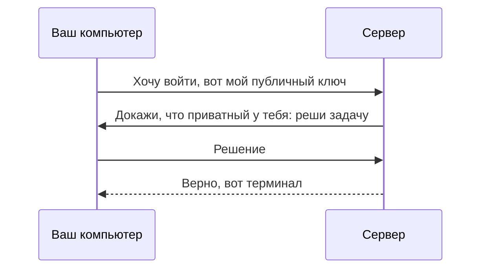

# SSH и ключи

## Ситуация

После покупки сервера хостер присылает на почту адрес и пароль пользователя `root` — главного пользователя системы, которому можно всё. Этим паролем можно зайти прямо сейчас.

Проблема в том, что про этот вход знаете не только вы. Как только у машины появляется публичный адрес, к ней начинают стучаться автоматические программы и перебирать пароли — круглосуточно, по всему диапазону адресов. Это не атака лично на вас, это фоновый шум интернета. Пароль из письма в такой обстановке — ключ под ковриком.

## Зачем это нужно

**SSH** (Secure Shell, «защищённая оболочка») — способ открыть терминал удалённой машины так, будто вы сидите перед ней, но через интернет и в зашифрованном виде. Без него работа сведётся к кнопкам в панели хостера.

Зайти по SSH можно двумя способами, и они принципиально разные.

**По паролю.** Пароль короткий, его можно подобрать перебором, подсмотреть, случайно переслать в чате. Каждый вход отправляет пароль на сервер.

**По ключу.** Вы создаёте на своём компьютере два связанных файла:

- **приватный ключ** — ваш настоящий пропуск. Остаётся на вашем компьютере навсегда. Его не отправляют на сервер, не выкладывают в репозиторий, не пересылают в мессенджере. Утёк — считайте, что утёк доступ целиком, нужна новая пара.
- **публичный ключ** — замочная скважина под этот пропуск. Его наоборот можно спокойно показывать. Одной строкой он кладётся на сервер в файл `authorized_keys`.

Почему второй способ безопаснее: пароль по сети не передаётся вообще. Сервер загадывает математическую задачу, решить которую быстро может только владелец приватного файла. Подобрать такой ключ перебором практически невозможно.

## Как это устроено

Вход по ключу шаг за шагом:

1. Вы даёте команду подключиться к серверу под определённым пользователем.
2. Ваш компьютер сообщает, на какой ключ претендует.
3. Сервер заглядывает в файл `authorized_keys` этого пользователя и находит подходящую строку.
4. Сервер отправляет задачу-проверку, ваша программа решает её приватным ключом.
5. Сервер открывает терминал.



Отсюда следует порядок действий, который мы выполним в лаборатории:

1. создать пару ключей на своём компьютере;
2. один раз зайти по паролю из письма — только чтобы положить публичную строку на сервер;
3. проверить, что вход по ключу работает;
4. и только потом выключить вход по паролю.

Последний шаг делается осторожно: ошибка в настройках при выключенном пароле означает, что вы сами не попадёте на сервер. Страховка — VNC-консоль в панели хостера.

Ещё две вещи, которые вы обязательно встретите:

- **passphrase** — пароль на сам файл ключа, его можно задать при создании. Это не пароль от сервера: он защищает файл, если ноутбук попадёт в чужие руки. Полезно, но для учёбы не обязательно.
- **known_hosts** — файл на вашем компьютере со списком «сервер по такому адресу представился вот такой подписью». Если подпись изменилась, SSH предупредит. Обычная причина безобидная — вы переустановили систему. Но существует это предупреждение на случай, когда кто-то пытается выдать себя за ваш сервер.

!!! note "Новые слова"
    - **Оболочка (shell)** — программа на сервере, которая принимает ваши команды.
    - **root** — пользователь без ограничений, может всё, включая стереть систему.
    - **deploy** — обычный рабочий пользователь, которого заведём в лаборатории. Под ним вы будете работать каждый день.
    - **Порт 22** — дверь, на которой сервер слушает SSH. Именно в неё стучатся боты.

## Практика

### Шаг 1. Проверить, есть ли уже ключи

**Где вводить:** PowerShell на вашем компьютере

```powershell
ls $env:USERPROFILE\.ssh
```

**Что должно получиться:**

- Если видите файлы `id_ed25519` и `id_ed25519.pub` — пара уже есть, можно пользоваться ею.
- Если видите ошибку «Не удается найти путь» — ключей нет, делаем следующий шаг.

### Шаг 2. Создать учебную пару ключей

**Где вводить:** PowerShell на вашем компьютере

```powershell
ssh-keygen -t ed25519 -C "uchebnyy-vps" -f $env:USERPROFILE\.ssh\id_ed25519_ucheb
```

Программа спросит passphrase — можно придумать пароль, можно дважды нажать Enter и оставить пустым.

**Что должно получиться:** сообщение `Your identification has been saved` и рисунок из символов. В папке `.ssh` появятся два файла:

- `id_ed25519_ucheb` — приватный, никуда не отправляем;
- `id_ed25519_ucheb.pub` — публичный, его будем класть на сервер.

### Шаг 3. Посмотреть публичную строку

**Где вводить:** PowerShell на вашем компьютере

```powershell
Get-Content $env:USERPROFILE\.ssh\id_ed25519_ucheb.pub
```

**Что должно получиться:** одна длинная строка, которая начинается с `ssh-ed25519` и заканчивается комментарием `uchebnyy-vps`. Она понадобится в лаборатории целиком, без переносов.

### Шаг 4. Первый вход по паролю

**Где вводить:** PowerShell на вашем компьютере

```powershell
ssh root@203.0.113.10
```

Подставьте свой адрес. При первом подключении SSH спросит, доверяете ли вы этому серверу, — ответьте `yes`. Затем введите пароль из письма хостера.

!!! warning "Пароль при вводе не отображается"
    Ни точек, ни звёздочек — курсор просто стоит на месте. Это нормально, печатайте вслепую и нажимайте Enter. Пароль удобнее вставить из буфера правой кнопкой мыши.

**Что должно получиться:** строка приглашения изменится на что-то вроде `root@vps-12345:~#`. Символ `#` в конце означает, что вы вошли как root. Вы на сервере.

### Шаг 5. Убедиться, что вы действительно на сервере

**Где вводить:** терминал сервера

```bash
whoami
```

**Что должно получиться:** слово `root`. Если видите своё имя пользователя Windows — вы ещё в PowerShell и команда `ssh` не сработала.

Выйти обратно на свой компьютер:

```bash
exit
```

**Что должно получиться:** приглашение снова станет `PS C:\Users\...>`.

На этом урок заканчивается. Создание пользователя `deploy`, перенос ключа и запрет входа по паролю — в [лаборатории 1](../../labs/lab-01-pervyy-vhod.md), там каждый шаг с проверками.

## Проверка

- [ ] Вы понимаете, какой из двух файлов можно показывать, а какой нельзя.
- [ ] Пара ключей создана, публичную строку вы умеете вывести на экран.
- [ ] Вы зашли на сервер и команда `whoami` напечатала `root`.

## Частые ошибки

!!! failure "Отправить приватный ключ на сервер или в чат «чтобы не потерять»"
    Пара считается скомпрометированной: нужно создать новую и удалить старую строку из `authorized_keys`. Приватный ключ живёт только на вашем компьютере.

!!! failure "Windows пишет, что ssh не является командой"
    Не установлен клиент OpenSSH. Ставится так: «Параметры» → «Приложения» → «Дополнительные компоненты» → «Добавить компонент» → «Клиент OpenSSH».

!!! failure "Предупреждение о смене подписи сервера, и вы сразу соглашаетесь"
    Если только что переустанавливали систему — так и должно быть. Если нет — остановитесь и разберитесь, прежде чем вводить что-либо.

!!! failure "Выключить вход по паролю, не проверив вход по ключу"
    Самый быстрый способ потерять доступ к собственному серверу. В лаборатории порядок обратный: сначала проверяем новый вход во втором окне, потом закрываем старый.

## Как это в больших командах

Тот же SSH и те же ключи, но с дополнительными правилами: общий пароль root запрещён, у каждого сотрудника свой именной ключ, при увольнении ключ удаляют. Часто ключи делают временными — они действуют несколько часов и перевыпускаются автоматически.

На важные серверы обычно не заходят напрямую: сначала на промежуточную машину, чтобы все входы шли через одну точку и записывались.

## Итог

SSH — защищённый способ работать в терминале сервера. Ключевая пара заменяет пароль: приватный файл остаётся у вас, публичный лежит на сервере. Пароль из письма нужен ровно один раз.

Терминал открыт, но пока непонятно, что в нём делать. Следующий урок — минимум про устройство Linux.

Далее: [Linux на минимуме](04-linux-minimum.md).

!!! info "Нагрузка на учебный VPS"
    **Влезает в 1 ГБ.** Вход по SSH почти не расходует ресурсы.
