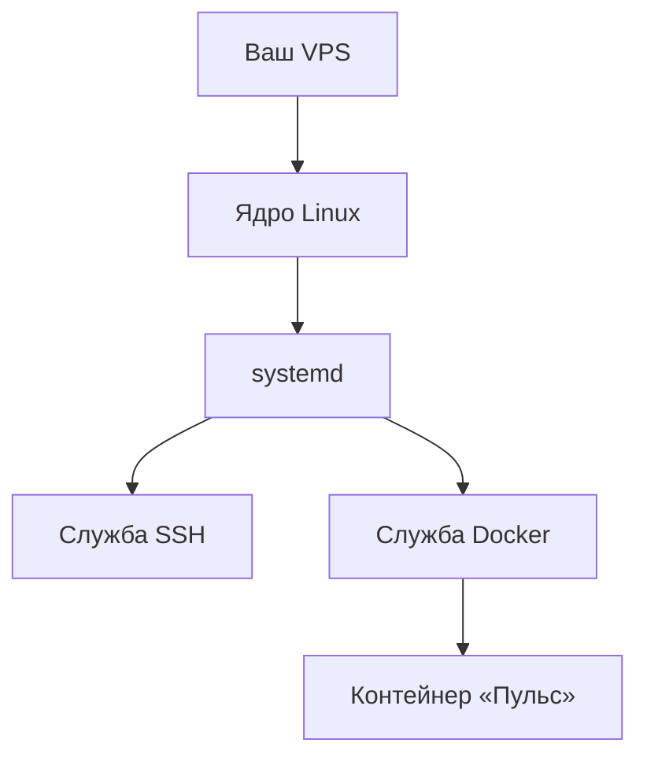

# Linux на минимуме

## Ситуация

Вы зашли на сервер, перед вами чёрное окно и мигающий курсор. Привычных папок и иконок нет, и первое желание — поскорее поставить Docker, чтобы вернуться в знакомый мир.

Так делать рано. Docker будет работать внутри этой системы, и половина будущих проблем окажется не в контейнере, а рядом с ним: кончилось место, не хватило памяти, упала служба, файл создан не тем пользователем.

Администратором становиться не нужно. Достаточно пяти понятий и десятка команд.

## Зачем это нужно

Пять понятий — как ответы на вопросы, которые у вас возникнут.

**Пользователь — от чьего имени это сделано.** В Linux каждое действие выполняется кем-то. `root` — главный, ему можно всё, включая одной опечаткой стереть систему. Поэтому в лаборатории мы заведём обычного пользователя `deploy` и будем работать под ним: большинство опасных команд под ним просто не выполнится.

**Права на файл — кому можно читать, писать и запускать.** Когда увидите в списке файлов запись вида `rwxr-xr-x` — это оно. Разбираться в ней детально сейчас не нужно, достаточно правила: у файлов с секретами доступ должен быть только у владельца.

**Процесс — запущенная программа.** У каждого процесса есть номер и владелец. Список процессов нужен, когда сервер тормозит: сразу видно, кто занял память.

**Служба и systemd — кто запускает программы сам.** В Linux есть управляющая программа `systemd`: она запускает нужное при включении машины и перезапускает упавшее. SSH — служба. Docker тоже станет службой. Благодаря этому сервер после перезагрузки поднимается сам.

**sudo — как выполнить одну административную команду, не живя под root.** Пишете `sudo` перед командой — она выполняется с полными правами, а вы остаётесь обычным пользователем.

Где что лежит:

| Путь | Что там |
|---|---|
| `/` | корень, начало всей файловой системы |
| `/home/deploy` | домашняя папка пользователя |
| `/opt` | сюда кладут свои приложения, у нас будет `/opt/pulse` |
| `/etc` | настройки системы |
| `/var/log` | журналы работы |

## Как это устроено

Слои складываются так: железо → ядро Linux → systemd → службы → ваш контейнер.



Из схемы следует важное: контейнер не живёт в параллельной вселенной. Диск и память у него общие с системой. Поэтому:

- кончилось место на диске — приложению тоже некуда писать;
- кончилась память — система начинает снимать процессы, и это может оказаться ваш SSH.

!!! note "Новые слова"
    - **Ядро** — основа операционной системы, распределяет ресурсы между программами.
    - **Служба (сервис)** — программа, которую система запускает сама и следит, чтобы она работала.
    - **Swap** — кусок диска, который используется как запасная память. Работает медленно, но спасает от зависания. На машине с 1 ГБ его стоит включить, инструкция есть в [памятке про VPS](../../lab-server.md).

## Практика

Все команды этого урока только показывают состояние системы — сломать ничего нельзя.

Подключитесь к серверу и выполняйте по одной.

### Шаг 1. Кто я и где я

**Где вводить:** терминал сервера

```bash
whoami
pwd
ls -la
```

**Что должно получиться:**

- `whoami` — имя пользователя, сейчас скорее всего `root`;
- `pwd` — путь текущей папки, например `/root`;
- `ls -la` — список файлов со всеми подробностями, включая скрытые (те, что начинаются с точки).

### Шаг 2. Сколько места на диске

**Где вводить:** терминал сервера

```bash
df -h
```

**Что должно получиться:** таблица разделов. Найдите строку, где в последней колонке `Mounted on` стоит одинокий `/` — это ваш основной диск.

- колонка `Size` — около 10 ГБ;
- колонка `Use%` — сколько занято. За этим числом надо следить: выше 85% уже повод чистить.

### Шаг 3. Сколько памяти

**Где вводить:** терминал сервера

```bash
free -h
```

**Что должно получиться:** две строки.

- `Mem` — около 950 МБ, это ваш гигабайт за вычетом служебного. Самая важная колонка — `available`: сколько памяти реально доступно новым программам.
- `Swap` — запасная память. Если там `0B`, swap ещё не включён.

### Шаг 4. Кто занимает память

**Где вводить:** терминал сервера

```bash
ps aux --sort=-%mem | head
```

**Что должно получиться:** список процессов, отсортированный по расходу памяти, первые десять строк. Сейчас там будет немного и ничего прожорливого. Запомните команду: когда сервер начнёт тормозить, выполнять нужно именно её.

### Шаг 5. Жива ли служба SSH

**Где вводить:** терминал сервера

```bash
sudo systemctl status ssh
```

**Что должно получиться:** строка `Active: active (running)`, обычно выделенная зелёным. Выйти из этого экрана — клавиша `q`.

Если написано `failed` — чините немедленно: после следующей перезагрузки вы можете не попасть на сервер.

### Шаг 6. Создать папку для будущего приложения

**Где вводить:** терминал сервера

```bash
sudo mkdir -p /opt/pulse
sudo chown deploy:deploy /opt/pulse
ls -ld /opt/pulse
```

Разберём, что делает каждая строка:

- `mkdir -p` создаёт папку;
- `chown` передаёт её пользователю `deploy` — без этого файлы останутся принадлежать root и вы не сможете их редактировать;
- `ls -ld` показывает результат.

**Что должно получиться:** строка вида `drwxr-xr-x 2 deploy deploy 4096 ... /opt/pulse`. Двойное `deploy deploy` означает, что владелец и группа правильные.

Если пользователя `deploy` вы ещё не создали, вторая команда выдаст ошибку `invalid user` — это ожидаемо, вернётесь к ней после лаборатории 1.

### Словарь команд на будущее

| Команда | Что делает |
|---|---|
| `cd /opt/pulse` | перейти в папку |
| `cat файл` | показать содержимое файла |
| `nano файл` | открыть файл в простом редакторе (сохранить — `Ctrl+O`, выйти — `Ctrl+X`) |
| `sudo -i` | полностью переключиться в root (без необходимости не надо) |
| `exit` | выйти из root или закрыть сессию SSH |
| `sudo reboot` | перезагрузить сервер, связь при этом оборвётся |

Конфиги в курсе правятся по одной-две строки в `nano`. Учить более сложные редакторы не нужно.

## Проверка

- [ ] Вы понимаете вывод `df -h`: какая строка — ваш диск, сколько процентов занято.
- [ ] Понимаете вывод `free -h`: где общая память, где доступная, где swap.
- [ ] Знаете, как проверить, работает ли служба, и как выйти из этого экрана.
- [ ] Знаете команду, которая покажет, кто съел память.

## Частые ошибки

!!! failure "Работать весь курс под root"
    Под root любая опечатка выполняется молча и до конца. Заведите `deploy` в лаборатории 1 и используйте `sudo` для административных команд.

!!! failure "Копировать из интернета команды с rm -rf"
    Это удаление без вопросов и без корзины. Если не понимаете каждое слово в строке — не выполняйте её.

!!! failure "Создать файлы под root, а потом получить отказ в доступе"
    Папка принадлежит root, а вы работаете под deploy. Лечится командой `chown`, как в шаге 6.

!!! failure "Не замечать, что диск заполняется"
    Чаще всего его забивают журналы и старые образы. Если `Use%` подбирается к 85%, действуйте по [карточке про диск](../../runbooks/disk-full.md), не дожидаясь аварии.

## Как это в больших командах

Система та же. Отличается организация: пользователи приходят из общего каталога сотрудников, а не создаются на каждой машине руками. Права расписаны по ролям — разработчик может перезапустить приложение, но не может тронуть сеть. Журналы автоматически уезжают в общее хранилище, где можно искать сразу по всем серверам.

Модель при этом ровно та, которую вы сейчас учите на одном пользователе.

## Итог

Linux держится на четырёх вещах: пользователи, права на файлы, процессы и службы. Этого достаточно, чтобы не теряться в терминале и понимать, где искать проблему.

Остался последний вопрос модуля — как выбирать хостера и на что смотреть в тарифе.

Далее: [Хостеры в РФ](05-hostery-rf.md).

!!! info "Нагрузка на учебный VPS"
    **Влезает в 1 ГБ.** Все команды урока только читают состояние системы.
