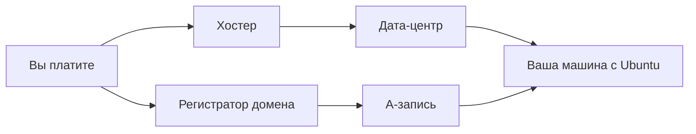

# Хостеры в РФ: на что смотреть

## Ситуация

Сервер у вас уже есть, и может показаться, что урок лишний. Но через несколько модулей вы упрётесь в память и будете решать, менять тариф или хостера. Лучше заранее знать, на что смотреть.

Заодно полезно понять, что входит в стоимость аренды, а что придётся делать самостоятельно.

## Зачем это нужно

Хостер отвечает за то, что машина включена и доступна из интернета. Он даёт:

- процессор, память, диск;
- публичный адрес;
- электричество, охлаждение, канал связи;
- панель управления и аварийную консоль.

Чего хостер **не** делает:

- не ставит и не настраивает ваши программы;
- не настраивает файрвол под ваши задачи;
- не делает копии данных вашего приложения.

Даже платная галочка «резервное копирование» в панели — это снимок всего диска, который лежит у того же хостера. Как страховка перед рискованным шагом — хорошо, как единственная копия данных — нет. Почему, разберём в модуле 6.

Курс ориентирован на российские компании по практическим причинам: понятная оплата, меньше сюрпризов с доступом, пользователи рядом. Зарубежные провайдеры разбираются отдельно, в модуле 19.

## Как это устроено

Картина целиком: вы платите хостеру — он даёт виртуальную машину. Отдельно, часто в другой компании, вы покупаете доменное имя. Связывает их A-запись.

Что действительно важно при выборе тарифа:

**Тип виртуализации.** Ищите слово **KVM**. Это честная виртуализация: внутри вы получаете почти полноценный компьютер, и Docker работает без плясок. На совсем дешёвых тарифах иногда используется другая технология с общим ядром, где часть вещей просто не запускается.

**Свой публичный IPv4.** Должен быть явно указан в тарифе. Без отдельного адреса сложнее и с доступом снаружи, и с получением сертификата.

**Аварийная консоль (VNC).** Экран сервера прямо в браузере, работает даже когда SSH сломан. Понадобится, если вы ошибётесь в настройках файрвола или SSH.

**Ресурсы.** 1 ГБ памяти и 10 ГБ диска нормально тянут всё до модуля 5 включительно. Для инструментов наблюдения из модуля 10 понадобится больше — это заранее отмечено в уроках.

**Дата-центр.** Город, где физически стоит железо. Для учёбы неважно, для реальных пользователей логично выбирать регион поближе к ним.

**Защита аккаунта.** Доступ в панель равен доступу к серверу: оттуда можно перезагрузить машину, открыть консоль, переустановить систему. Без двухфакторной защиты все ключи и файрволы теряют смысл.

!!! note "Новые слова"
    - **KVM** — технология виртуализации, при которой ваша машина ведёт себя как самостоятельный компьютер.
    - **Снимок (snapshot)** — сохранённая копия всего диска, к которой можно откатиться.
    - **Двухфакторная защита (2FA)** — вход в панель не только по паролю, но и по коду из приложения на телефоне.

## Практика

Команд на сервере нет — работаем с панелью хостера.

Откройте карточку своего сервера и пройдите по списку:

1. **Операционная система** — Ubuntu 22.04 или 24.04 LTS. Буквы LTS означают долгую поддержку: обновления безопасности будут выходить годами.
2. **Ресурсы** — запишите, сколько процессоров, памяти и диска.
3. **IPv4** — убедитесь, что адрес ваш личный.
4. **Консоль** — найдите кнопку VNC и откройте её один раз, чтобы знать, где она.
5. **Резервные копии** — посмотрите, включены ли, сколько стоят, как часто делаются.
6. **Оплата** — когда следующее списание и хватает ли денег. Если есть уведомления о нехватке средств, включите их.
7. **Двухфакторная защита** — включите в профиле, если ещё не включена.

**Результат этого упражнения** — несколько строк в [инвентаре](../../inventory-template.md):

- хостер и тариф;
- адрес сервера;
- дата следующего списания;
- где находится аварийная консоль.

**Что смотреть на странице тарифа**

Строку вида «1 vCPU, 1 GB RAM, 10 GB NVMe, 1× IPv4» и упоминание KVM. Если видите 512 МБ памяти — для связки Docker плюс веб-сервер будет тесно даже со swap.

## Проверка

- [ ] Вы можете назвать хостера, тариф и дату следующего списания.
- [ ] Знаете, где кнопка перезагрузки и где аварийная консоль.
- [ ] Двухфакторная защита аккаунта включена.
- [ ] Инвентарь заполнен.

## Частые ошибки

!!! failure "Выбрать самый дешёвый тариф без KVM"
    На таких тарифах Docker может не запуститься вовсе или вести себя непредсказуемо. Если это ваш случай — пересоздайте сервер на нормальной виртуализации.

!!! failure "Аккаунт хостера без двухфакторной защиты"
    Это главный ключ от вашего сервера, важнее пароля root. Включается за две минуты.

!!! failure "Считать резервные копии хостера полноценным бэкапом"
    Копия лежит у того же провайдера и содержит весь диск целиком. Как страховка перед рискованным шагом — хорошо, как единственная копия — нет.

!!! failure "Сразу купить управляемый Kubernetes «на вырост»"
    Это дорого и пока непонятно. В модуле 18 увидите, что на вашем масштабе он не нужен.

## Как это в больших командах

Компании держат серверы у нескольких провайдеров сразу, чтобы проблемы одного не останавливали работу. Оплата идёт по договору, а не с личной карты. Отдельно следят за качеством канала связи, а не только за состоянием машин.

Yandex Cloud и VK Cloud ближе к формату «облако с большим меню услуг», Timeweb и Selectel чаще начинают с простого понятного VPS. И там, и там крупные команды в итоге перестают создавать серверы руками и описывают их конфигурацию кодом — к этому вернёмся в модуле 19.

## Итог

Хостер — арендодатель компьютера, а не ваш системный администратор. От него нужны нормальная виртуализация, Ubuntu, свой адрес, аварийная консоль и понятный счёт.

Теория модуля закончилась. Дальше практика: зайти на сервер, завести рабочего пользователя, настроить вход по ключу и закрыть вход по паролю.

Далее: [Лаборатория. Первый вход](../../labs/lab-01-pervyy-vhod.md).

!!! info "Нагрузка на учебный VPS"
    **Влезает в 1 ГБ.** Урок не требует действий на сервере.
