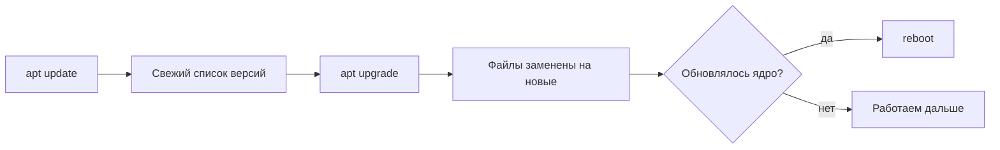

# Обновления системы

## Ситуация

Ваш сервер собран из готовых программ: система, SSH, библиотеки. В любой из них рано или поздно находят ошибку, через которую можно войти без спроса или уронить службу.

Такие находки публикуются открыто. Одновременно появляются исправления — и появляются автоматические программы, которые ищут в интернете машины, где исправление ещё не поставлено. Необновлённый сервер не «рискует теоретически»: его ищут прямо сейчас.

## Зачем это нужно

Ubuntu собрана из **пакетов** — отдельных программ и библиотек, которые ставятся из официального хранилища. Обновление пакета означает замену файлов на исправленную версию.

Две команды, которые постоянно путают:

| Команда | Что делает | Аналогия |
|---|---|---|
| `apt update` | обновляет **список** доступных версий | открыть свежий каталог магазина |
| `apt upgrade` | **ставит** обновления из этого списка | купить то, что в каталоге |

Если выполнить только `upgrade`, система будет сверяться со вчерашним каталогом и может ничего не найти. Поэтому порядок всегда такой: сначала `update`, потом `upgrade`.

Отдельно стоит **ядро** — основа системы. Новое ядро начинает работать только после перезагрузки: старое продолжает работать в памяти. Поэтому после обновления ядра нужен `reboot`. Это не поломка, а завершение процедуры.

И последнее: **LTS** в названии версии Ubuntu (22.04 LTS, 24.04 LTS) означает долгую поддержку — обновления безопасности выходят несколько лет. Для сервера берут именно такие версии, а не самые свежие ради новизны.

## Как это устроено

Последовательность всегда одинаковая:



На диске в 10 ГБ есть нюанс: скачанные пакеты остаются в кэше и занимают место. Поэтому в конце мы будем его чистить — иначе обновления ради безопасности сами забьют диск.

!!! note "Новые слова"
    - **Пакет** — программа или библиотека, установленная из хранилища Ubuntu.
    - **Ядро (kernel)** — основа операционной системы. После его обновления нужна перезагрузка.
    - **unattended-upgrades** — служба, которая сама ставит обновления безопасности, пока вы заняты.

## Практика

### Шаг 1. Обновить список пакетов

**Где вводить:** терминал сервера (`ssh ucheb`)

```bash
sudo apt update
```

**Что должно получиться:** строки, начинающиеся с `Hit`, `Get` или `Ign`, и в конце одно из двух:

- `All packages are up to date` — обновлять нечего;
- `N packages can be upgraded` — есть что ставить.

Если видите ошибки `404` или `Could not resolve` — проблема с сетью или хранилищем пакетов. **Не переходите к следующему шагу**, сначала разберитесь с ошибкой.

### Шаг 2. Поставить обновления

**Где вводить:** терминал сервера

```bash
sudo apt upgrade -y
```

Флаг `-y` означает «отвечать да на вопросы».

**Что должно получиться:** список обновляемых пакетов и прогресс установки. Процесс может занять несколько минут.

Если появится синий экран с вопросом про изменённый конфигурационный файл — выбирайте вариант «keep the local version» (оставить текущую версию), если вы этот файл правили. Для учебного сервера это редкость.

### Шаг 3. Убрать лишнее

**Где вводить:** терминал сервера

```bash
sudo apt autoremove -y
sudo apt clean
df -h
```

Что делает каждая команда:

- `autoremove` удаляет пакеты, которые больше никому не нужны, например старые ядра;
- `clean` чистит кэш скачанных файлов;
- `df -h` показывает результат.

**Что должно получиться:** в строке с `/` процент занятого места не вырос, а скорее уменьшился.

### Шаг 4. Перезагрузить, если обновлялось ядро

Посмотрите вывод шага 2: если среди обновлённых пакетов было что-то вроде `linux-image-...`, нужна перезагрузка.

**Где вводить:** терминал сервера

```bash
sudo reboot
```

**Что должно получиться:** соединение оборвётся с сообщением вроде `Connection to ... closed by remote host`. Это нормально — сервер перезагружается.

Подождите минуту и зайдите снова:

**Где вводить:** PowerShell на вашем компьютере

```powershell
ssh ucheb
```

**Что должно получиться:** обычное приглашение `deploy@...$`. Если сервер не отвечает дольше трёх минут — откройте аварийную консоль в панели хостера и посмотрите, загрузилась ли система.

### Шаг 5. Включить автоматические обновления безопасности

**Зачем:** чтобы критичные исправления ставились сами, пока вы заняты другими делами.

**Где вводить:** терминал сервера

```bash
sudo apt install -y unattended-upgrades
sudo dpkg-reconfigure -plow unattended-upgrades
```

Появится синий экран с вопросом об автоматической установке обновлений — ответьте «Yes».

**Что должно получиться:** возврат к обычной командной строке. Служба настроена.

Это не отменяет ваш собственный взгляд раз в неделю, но закрывает самые опасные дыры без вашего участия.

## Проверка

**Где вводить:** терминал сервера

```bash
sudo apt update
uptime
```

**Что должно получиться:**

- `apt update` сообщает `All packages are up to date` или небольшое число обновлений;
- `uptime` показывает, сколько времени сервер работает с последней загрузки. После перезагрузки там будут минуты.

Отметьте себе:

- [ ] Понимаете разницу между `update` и `upgrade`.
- [ ] Знаете, когда нужна перезагрузка.
- [ ] Автоматические обновления безопасности включены.

## Частые ошибки

!!! failure "Прервать обновление на середине"
    Если соединение оборвалось во время `upgrade`, менеджер пакетов может остаться в незавершённом состоянии. Зайдите снова и выполните `sudo dpkg --configure -a`, затем повторите `upgrade`.

!!! failure "Обновляться, когда диск заполнен"
    Обновление скачивает файлы и требует места. Если `df -h` показывает больше 90% — сначала чистите по [карточке про диск](../../runbooks/disk-full.md).

!!! failure "Бояться перезагрузки"
    Учебный сервер без приложения можно перезагружать спокойно. Позже, когда появится «Пульс», перезагрузка станет полезной проверкой: поднимается ли всё само.

!!! failure "Не обновляться вообще, чтобы ничего не сломалось"
    Так копится катастрофа: чем дольше пропуск, тем больше меняется за раз и тем выше риск. Регулярные небольшие обновления безопаснее редких больших.

## Как это в больших командах

Обновления накатывают волнами: сначала на тестовые серверы, потом на боевые. Часто машину не обновляют вовсе — вместо этого создают новую из свежего образа и переключают на неё нагрузку.

Смысл тот же: не жить на версиях с известными дырами.

## Итог

Сначала свежий список пакетов, потом установка, при обновлении ядра — перезагрузка. Автоматические обновления безопасности закрывают промежутки.

Дальше закроем лишние двери, в которые стучатся снаружи.

Далее: [Файрвол и fail2ban](02-firewall-fail2ban.md).

!!! info "Нагрузка на учебный VPS"
    **Влезает в 1 ГБ.** Следите за свободным местом на диске.
