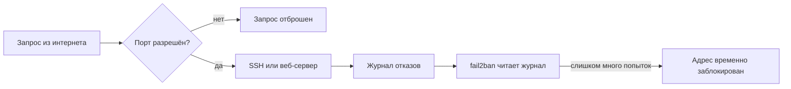

# Файрвол и fail2ban

## Ситуация

У вашего сервера есть публичный адрес. Это значит, что к нему может обратиться кто угодно — и обращаются постоянно.

Автоматические сканеры непрерывно проверяют адреса в интернете: не открыта ли база данных, не осталась ли панель управления, не подберётся ли пароль к SSH. Вы это уже можете увидеть в журналах сервера. Это не персональная атака, а фон, в котором живёт любая машина с адресом.

Защита от этого фона строится из двух разных инструментов.

## Зачем это нужно

Два инструмента решают две разные задачи.

**Файрвол** отвечает на вопрос: **какие двери вообще существуют для внешнего мира**. Запрос приходит на сервер, файрвол смотрит номер порта. Нет в списке разрешённых — запрос отбрасывается молча, будто там никого нет.

В Ubuntu для этого есть простая надстройка `ufw`. Это не отдельная программа-сервер, а удобный способ управлять встроенной защитой системы.

Ключевой принцип — **запретить всё, разрешить нужное**. Обратный подход («разрешить всё, закрыть опасное») не работает: забытая дверь остаётся дырой.

Для учебного сервера наружу нужны максимум три двери:

| Порт | Кому нужен | Когда открывать |
|---|---|---|
| 22 | вам, для входа по SSH | сразу, первым делом |
| 80 | сайту без шифрования и проверке сертификата | можно сейчас, понадобится в модуле 5 |
| 443 | сайту с HTTPS | можно сейчас, понадобится в модуле 5 |

Порты 80 и 443 можно открыть заранее: пока за ними никто не слушает, обращаться туда бесполезно.

**fail2ban** отвечает на другой вопрос: **что делать с теми, кто слишком настойчив в разрешённую дверь**. Программа читает журналы отказов и, если с одного адреса идёт поток неудачных попыток входа, временно блокирует его.

Это не замена ключам. Ключи отвечают на вопрос «кто свой», fail2ban — на вопрос «кто надоел». Даже при выключенном входе по паролю он полезен: журналы становятся чище, а нагрузка меньше.

## Как это устроено

Запрос проходит два рубежа:



Пока запрос не прошёл первый рубеж, он даже не доходит до SSH. Если прошёл и начал перебирать пароли — второй рубеж временно убирает дверь для конкретного адреса.

!!! note "Новые слова"
    - **ufw** — простой способ управлять файрволом Ubuntu.
    - **Политика по умолчанию** — что делать с тем, что не указано явно. Для входящих должно быть «запретить».
    - **jail** — правило fail2ban «за каким журналом следить». Нам нужен один, для SSH.

## Практика

!!! danger "Порядок действий здесь критичен"
    Если включить файрвол, не разрешив SSH, вы потеряете доступ к серверу. Сначала разрешаем 22, потом включаем. Аварийная консоль в панели хостера — страховка.

### Шаг 1. Задать политику и разрешить SSH

**Где вводить:** терминал сервера (`ssh ucheb`)

```bash
sudo ufw default deny incoming
sudo ufw default allow outgoing
sudo ufw allow OpenSSH
```

Что делает каждая строка:

- запретить все входящие соединения, кроме разрешённых явно;
- разрешить исходящие — чтобы сервер мог сам скачивать обновления;
- разрешить SSH. Слово `OpenSSH` здесь — готовый профиль, он же порт 22.

**Что должно получиться:** после каждой команды строка `Rules updated` или `Rules updated (v6)`.

### Шаг 2. Проверить правила до включения

**Где вводить:** терминал сервера

```bash
sudo ufw status
```

**Что должно получиться:** строка `Status: inactive`. Файрвол ещё выключен, правила подготовлены — именно этого мы и добиваемся на этом шаге.

### Шаг 3. Открыть порты для будущего сайта

**Где вводить:** терминал сервера

```bash
sudo ufw allow 80/tcp
sudo ufw allow 443/tcp
```

**Что должно получиться:** снова `Rules updated`.

### Шаг 4. Включить файрвол

**Где вводить:** терминал сервера

```bash
sudo ufw enable
```

Система предупредит, что соединение может прерваться, и спросит подтверждение — ответьте `y`.

**Что должно получиться:** строка `Firewall is active and enabled on system startup`. Ваша текущая сессия SSH при этом не оборвётся.

### Шаг 5. Немедленно проверить вход во втором окне

**Зачем:** убедиться, что вы не закрыли себе доступ. Делать это нужно **сейчас**, не откладывая.

**Где вводить:** PowerShell на вашем компьютере, новое окно

```powershell
ssh ucheb
```

**Что должно получиться:** обычный вход, приглашение `deploy@...$`.

Если вход не проходит — не закрывайте первое окно. Выполните в нём `sudo ufw disable` и разберитесь с правилами.

### Шаг 6. Посмотреть итоговый список правил

**Где вводить:** терминал сервера

```bash
sudo ufw status numbered
```

**Что должно получиться:** таблица примерно такого вида:

```
Status: active

     To                         Action      From
     --                         ------      ----
[ 1] OpenSSH                    ALLOW IN    Anywhere
[ 2] 80/tcp                     ALLOW IN    Anywhere
[ 3] 443/tcp                    ALLOW IN    Anywhere
```

Строк должно быть немного. Каждая строка — открытая дверь, и вы должны понимать, зачем она.

### Шаг 7. Установить fail2ban

**Где вводить:** терминал сервера

```bash
sudo apt install -y fail2ban
sudo systemctl enable --now fail2ban
sudo systemctl status fail2ban
```

Команда `enable --now` означает «запустить сейчас и запускать при каждой загрузке системы».

**Что должно получиться:** в выводе `status` — строка `Active: active (running)`. Выйти из экрана — клавиша `q`.

### Шаг 8. Проверить, что слежение за SSH включено

**Где вводить:** терминал сервера

```bash
sudo fail2ban-client status sshd
```

**Что должно получиться:** блок с информацией о правиле, включая строки `Currently failed` и `Total banned` с числами. Нули в начале — это нормально.

Если вместо этого видите ошибку `NOK: ('sshd',)`, правило не включено. Создайте файл настроек:

```bash
sudo nano /etc/fail2ban/jail.local
```

Впишите три строки:

```
[sshd]
enabled = true
```

Сохраните (`Ctrl+O`, Enter, `Ctrl+X`) и перезапустите службу:

```bash
sudo systemctl restart fail2ban
sudo fail2ban-client status sshd
```

**Что должно получиться:** теперь блок с информацией выводится нормально.

## Проверка

- [ ] `sudo ufw status` показывает `active` и не больше трёх-четырёх правил.
- [ ] Вход `ssh ucheb` работает из нового окна.
- [ ] `sudo fail2ban-client status sshd` отвечает без ошибки.
- [ ] Вы можете объяснить, за что отвечает каждый из двух инструментов.

## Частые ошибки

!!! failure "Включить файрвол до разрешения SSH"
    Самая частая авария на этом уроке. Спасает аварийная консоль в панели хостера: зайдите через неё и выполните `ufw disable`.

!!! failure "Разрешить на всякий случай все порты"
    Это превращает файрвол в декорацию. Каждая открытая дверь должна иметь причину.

!!! failure "Считать, что fail2ban заменяет ключи"
    Он только ограничивает назойливых. Пускает внутрь по-прежнему ключ.

!!! failure "Открыть порт базы данных наружу"
    Базам в интернете делать нечего. Они должны быть доступны только изнутри сервера.

## Как это в больших командах

Защита обычно двухэтажная: правила на уровне облачной сети (там их называют группами безопасности) плюс файрвол на самой машине. Блокировка назойливых адресов делается ещё раньше — на границе сети, вместе с защитой от массовых атак.

Вопрос при этом задаётся ровно тот же, что вы себе задали сегодня: что именно торчит в интернет и зачем.

## Итог

Файрвол определяет, какие двери существуют. fail2ban ограничивает тех, кто ломится в разрешённые. Вместе они убирают большую часть фонового шума.

Дальше — привычка не работать под главным пользователем.

Далее: [Не работать под root](03-ne-root.md).

!!! info "Нагрузка на учебный VPS"
    **Влезает в 1 ГБ.** fail2ban расходует единицы мегабайт.
