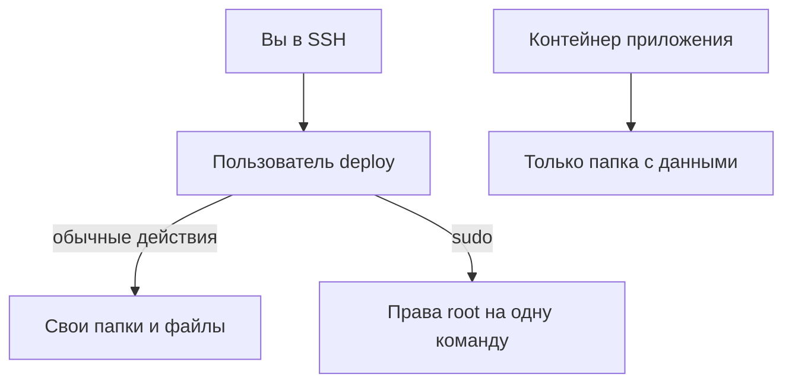

# Не работать под root

## Ситуация

Пользователь `root` выполняет любую команду без вопросов и подтверждений. Опечатка в пути, случайно вставленная из чата команда, неверный символ — всё выполнится молча и до конца.

Учебный сервер такое простит: переустановили и начали заново. Привычка работать под root не простит уже на настоящем проекте.

## Зачем это нужно

Идея называется «минимальные права»: и человек, и программа получают ровно столько возможностей, сколько нужно для работы. Не больше.

Как это выглядит на практике:

| Кто | Что может | Чего не может |
|---|---|---|
| `root` | всё, включая удаление системы | — |
| `deploy` (вы каждый день) | работать со своими файлами, запускать приложение | менять системные настройки без `sudo` |
| `deploy` через `sudo` | одну административную команду | —  |
| контейнер приложения | писать в свою папку с данными | читать чужие файлы системы |

Три инструмента, которые это обеспечивают:

**sudo** позволяет выполнить одну команду с полными правами и сразу вернуться обратно. Дополнительный бонус: такие команды записываются в журнал, и видно, что именно делалось.

**Отдельный пользователь для работы** означает, что случайная ошибка затронет только ваши файлы, а не систему.

**Права на папки и файлы** определяют, кто может читать и писать. Файл с секретами должен быть доступен только владельцу — и ниже мы это настроим.

Отдельно про **группу docker**, которая появится в следующем модуле. Участник этой группы фактически равен root: через Docker можно получить доступ ко всему диску. На учебном сервере мы всё равно добавим `deploy` в эту группу — иначе работать невозможно, — но важно понимать, что это осознанный компромисс, а не безобидная настройка.

## Как это устроено



Главная мысль: права выдаются под задачу, а не «на всякий случай». Если приложению нужна одна папка — оно получает одну папку.

!!! note "Новые слова"
    - **root (uid 0)** — пользователь, для которого ограничения прав не действуют.
    - **Минимальные права** — принцип: выдавать ровно столько, сколько нужно для работы.
    - **chown** — команда смены владельца файла или папки.
    - **chmod** — команда смены прав доступа.

## Практика

### Шаг 1. Убедиться, что вы работаете не под root

**Где вводить:** терминал сервера (`ssh ucheb`)

```bash
whoami
```

**Что должно получиться:** слово `deploy`.

Если получили `root` — вы зашли не тем способом. Вернитесь к [лаборатории 1](../../labs/lab-01-pervyy-vhod.md) и заходите по короткой команде `ssh ucheb`.

Есть ещё быстрый визуальный признак: посмотрите на символ в конце приглашения. `$` — обычный пользователь, `#` — root.

### Шаг 2. Посмотреть, что разрешено через sudo

**Где вводить:** терминал сервера

```bash
sudo -l
```

Система может спросить пароль пользователя `deploy`.

**Что должно получиться:** в конце вывода строка вида `(ALL : ALL) ALL`. Это значит, что `deploy` может выполнить любую команду через `sudo`. Для единственного владельца сервера это нормально: разделять роли начнём в модуле 14, когда появятся другие люди.

### Шаг 3. Проверить владельца рабочей папки

**Где вводить:** терминал сервера

```bash
ls -ld /opt/pulse
```

**Что должно получиться:** строка вида:

```
drwxr-xr-x 2 deploy deploy 4096 Sep 25 10:00 /opt/pulse
```

Читается так:

- `d` в начале — это папка;
- `deploy deploy` — владелец и группа;
- дальше дата и путь.

Если видите `root root`, исправьте:

```bash
sudo chown -R deploy:deploy /opt/pulse
ls -ld /opt/pulse
```

**Что должно получиться:** теперь в строке `deploy deploy`.

### Шаг 4. Проверить, что можете работать без sudo

**Зачем:** убедиться, что права настроены правильно и повседневная работа не требует административных прав.

**Где вводить:** терминал сервера

```bash
touch /opt/pulse/test.txt
ls -l /opt/pulse/test.txt
rm /opt/pulse/test.txt
```

**Что должно получиться:**

- первая команда отработает молча — файл создан;
- вторая покажет строку с владельцем `deploy deploy`;
- третья молча удалит файл.

Если на первом шаге получили `Permission denied` — папка принадлежит не вам, вернитесь к шагу 3.

### Шаг 5. Запомнить правило для файлов с секретами

Файл `.env` появится в модуле 3. Заранее запомните команду, которой ему выставляют права:

```bash
chmod 600 /opt/pulse/.env
```

Число `600` означает: владелец может читать и писать, все остальные — ничего. Проверить можно так же, через `ls -l`: в начале строки должно быть `-rw-------`.

## Проверка

- [ ] `whoami` отвечает `deploy`.
- [ ] Вы можете создать и удалить файл в `/opt/pulse` без `sudo`.
- [ ] Понимаете разницу между `$` и `#` в приглашении.
- [ ] Знаете, чем `chown` отличается от `chmod`: первая меняет владельца, вторая — права.

## Частые ошибки

!!! failure "Поставить chmod 777, чтобы заработало"
    Эта команда открывает файл на запись всем подряд, включая любую запущенную на сервере программу. Почти всегда настоящая проблема — неверный владелец, и лечится она через `chown`.

!!! failure "Держать открытой сессию root в аварийной консоли"
    Консоль — инструмент для аварии, а не рабочее место. Закрывайте её после использования.

!!! failure "Выдать кому-то sudo «на час» и забыть"
    Такие доступы живут годами. Чеклист выдачи и отзыва — в модуле 14. Пока никого не добавляйте.

!!! failure "Работать под root, потому что так меньше писать"
    Экономия три символа, цена — вся система. Если команд с `sudo` много подряд, это признак, что вы делаете настройку, а не повседневную работу.

## Как это в больших командах

Личных паролей root не существует вовсе. Права выдаются по ролям: кому-то можно перезапускать приложение, кому-то только читать журналы. Каждое повышение прав записывается и проверяется.

Внутри контейнеров приложения тоже запускают не под root — в нашем Dockerfile для «Пульса» это сделано именно так. Увидите в модуле 3.

## Итог

Повседневная работа — под `deploy`. Права root — через `sudo`, на одну команду. Права на файлы выдаются под задачу.

Остался последний и самый нарушаемый вопрос безопасности — где хранить ключи и пароли.

Далее: [Секреты](04-sekrety.md).

!!! info "Нагрузка на учебный VPS"
    **Влезает в 1 ГБ.**
