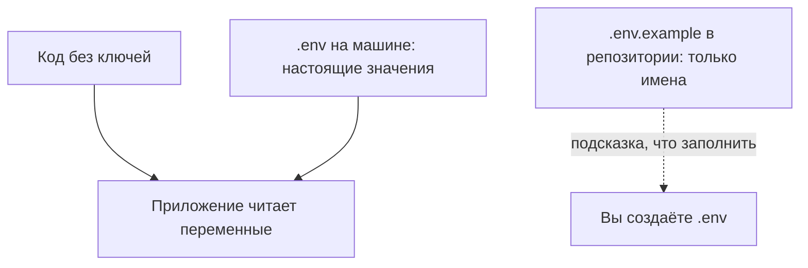

# Секреты

## Ситуация

Ключ от платного сервиса, случайно оказавшийся в открытом репозитории, находят автоматические программы за минуты. Дальше им пользуются чужие люди, а счёт приходит вам.

Токен бота в переписке, пароль базы в скриншоте, ключ прямо в коде приложения — всё это одна и та же ошибка. Первое правило прода из модуля 0 здесь превращается в конкретные действия.

## Зачем это нужно

**Секрет** — всё, чем можно войти или заплатить от вашего имени:

- пароли от панелей и баз данных;
- токены ботов;
- ключи доступа к нейросетям и другим платным сервисам;
- приватные ключи SSH;
- секреты для проверки платежей.

Что секретом **не** является и чего можно не бояться:

- публичный ключ (файл с расширением `.pub`);
- адрес документации;
- название используемого образа Docker.

Проблема в том, что код путешествует, а секрет внутри кода путешествует вместе с ним: попадает в историю репозитория, в чат «посмотри, почему не работает», внутрь собранного образа.

Решение простое и состоит из трёх частей:

1. **В коде секретов нет.** Программа читает их из окружения.
2. **На машине есть файл `.env`** с настоящими значениями. В репозиторий он не попадает.
3. **В репозитории есть `.env.example`** — тот же список имён, но без значений. Это подсказка, какие переменные нужно заполнить.

Отдельно про утечки. Если секрет где-то засветился, недостаточно удалить строку: история сохраняет всё, а тот, кто успел скопировать, уже скопировал. Нужна **ротация** — выпустить новый ключ и **отключить старый**.

## Как это устроено



Важная деталь для следующего модуля: секреты передают контейнеру через настройку `env_file` в файле запуска, а **не** строкой внутри Dockerfile. Всё, что написано в Dockerfile, сохраняется в слоях готового образа — то есть уезжает вместе с ним.

!!! note "Новые слова"
    - **Переменная окружения** — значение, которое программа получает при запуске, не из своего кода.
    - **.env** — файл со списком таких переменных в формате `ИМЯ=значение`.
    - **Ротация** — замена секрета на новый с обязательным отключением старого.
    - **.gitignore** — список файлов, которые система контроля версий игнорирует.

## Практика

### Шаг 1. Создать свой файл с переменными на компьютере

**Где вводить:** PowerShell на вашем компьютере, в папке курса

```powershell
copy .env.example .env
```

**Что должно получиться:** сообщение об успешном копировании или просто новая строка приглашения. В папке появится файл `.env`.

Откройте его любым редактором. Внутри — имена переменных без значений. Настоящие пароли от сервера сюда вписывать не нужно: файл нужен для примера и для будущих локальных запусков.

### Шаг 2. Убедиться, что файл не попадёт в репозиторий

**Где вводить:** PowerShell на вашем компьютере, в папке курса

```powershell
Get-Content .gitignore | Select-String "env"
```

**Что должно получиться:** строка `.env` в выводе. Это значит, что система контроля версий будет игнорировать файл с секретами.

Если у вас уже настроен git, есть более точная проверка:

```powershell
git check-ignore -v .env
```

**Что должно получиться:** строка с указанием, какое правило игнорирует файл. Пустой вывод означает, что файл **не** игнорируется — это опасно, проверьте `.gitignore`.

### Шаг 3. Подготовить место для секретов на сервере

Файл приложения появится в модуле 3, но команду стоит увидеть заранее.

**Где вводить:** терминал сервера (`ssh ucheb`)

```bash
cd /opt/pulse
nano .env
```

Откроется пустой редактор. Впишите для примера одну строку:

```
PULSE_TITLE=Мой учебный Пульс
```

Сохраните: `Ctrl+O`, Enter, `Ctrl+X`.

Теперь закроем файл от посторонних:

```bash
chmod 600 .env
ls -l .env
```

**Что должно получиться:** строка вида:

```
-rw------- 1 deploy deploy 32 Sep 25 10:00 .env
```

Разбор: `-rw-------` означает, что читать и писать может только владелец. `deploy deploy` — владелец правильный.

### Шаг 4. Проверить свои старые проекты

**Где вводить:** PowerShell на вашем компьютере, в папке любого старого проекта

```powershell
Select-String -Path .\* -Pattern "api_key|token|password|sk-" -SimpleMatch
```

**Что должно получиться:** список найденных строк с именами файлов. Если в коде нашлись настоящие ключи — выпишите задачу перенести их в `.env`. Если вывод пустой, команда ничего не напечатает.

## Что делать, если ключ уже утёк

Порядок именно такой, менять шаги местами нельзя:

1. Зайдите в панель сервиса (бот, нейросеть, платёжный сервис) и **выпустите новый ключ**.
2. **Отключите старый** — это главный шаг. Пока старый ключ действует, им можно пользоваться.
3. Впишите новый ключ в `.env` на сервере.
4. Перезапустите приложение.
5. Проверьте счёт и историю обращений: вдруг ключом уже воспользовались.

## Проверка

- [ ] Файл `.env` создан на компьютере и не попадает в репозиторий.
- [ ] На сервере `.env` имеет права `-rw-------`.
- [ ] Вы можете перечислить, что считается секретом, а что нет.
- [ ] Знаете порядок действий при утечке: сначала новый ключ, потом отключение старого.

## Частые ошибки

!!! failure "Вписать секрет в Dockerfile"
    Строка вида `ENV TOKEN=...` сохраняется в слоях образа. Если образ попадёт в общее хранилище, секрет уедет вместе с ним.

!!! failure "Прислать скриншот файла .env с вопросом «почему не работает»"
    Замазывание часто оказывается неполным, а символы угадываются. Присылайте пример без значений.

!!! failure "Один файл с секретами на все среды"
    Тестовая копия с боевым ключом однажды спишет настоящие деньги или испортит настоящие данные. Разделение сред — модуль 7.

!!! failure "Удалить строку с ключом и считать вопрос закрытым"
    История хранит всё. Ключ нужно заменить.

## Как это в больших командах

Секреты хранятся в отдельном сервисе, который выдаёт их приложениям по запросу и записывает, кто что запрашивал. Ключи часто временные и обновляются автоматически. Копировать секреты на рабочие ноутбуки запрещено политикой.

Файл `.env` с правами `600` на маленьком сервере — честный стартовый уровень. Плохо не это, плохо — ключ в репозитории.

## Итог

Секреты живут в отдельном файле на конкретной машине, а не в коде. В репозитории — только список имён. При утечке ключ заменяют, а не прячут.

Модуль 2 закончен. Пора свести всё в чеклист и убедиться, что сервером можно пользоваться.

Далее: [Лаборатория. Сервер можно использовать](../../labs/lab-02-server-gotov.md).

!!! info "Нагрузка на учебный VPS"
    **Влезает в 1 ГБ.**
