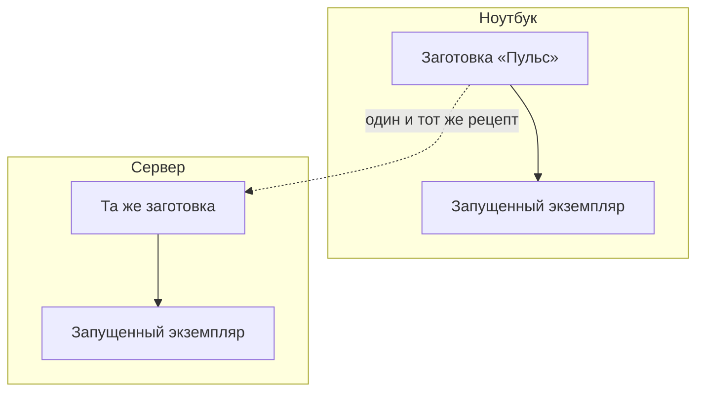

# Зачем нужен контейнер

## Ситуация

Знакомая история: на ноутбуке приложение запускается, на сервере — нет. Там другая версия Python, не установлена библиотека, другой путь к файлу, другая кодировка.

Вечер уходит не на проект, а на выяснение, чем окружение сервера отличается от вашего. И даже когда всё заработало, повторить это на другой машине будет так же больно, потому что никто не помнит, что именно доставляли руками.

## Зачем это нужно

Docker решает ровно одну задачу: **упаковать программу вместе с её окружением**, чтобы запуск на сервере совпадал с запуском у вас.

Аналогия: контейнер — это коробка с едой, в которой лежит не только блюдо, но и тарелка с приборами. На любой кухне получится одинаково, потому что от кухни ничего не требуется.

Что попадает внутрь коробки:

- ваш код;
- нужная версия языка (например, Python 3.12);
- библиотеки нужных версий;
- команда запуска.

Что остаётся снаружи:

- данные пользователей;
- файл с секретами;
- настройки конкретного сервера.

Это разделение важно: коробку можно выбросить и создать заново, а данные должны пережить эту операцию.

### Чем контейнер отличается от виртуальной машины

Вопрос возникает сразу, поэтому разберём:

| | Виртуальная машина | Контейнер |
|---|---|---|
| Что это | полноценная операционная система | изолированный процесс со своим набором файлов |
| Размер | гигабайты | десятки-сотни мегабайт |
| Запуск | минута | секунды |
| Пример | ваш VPS | «Пульс» внутри этого VPS |

Ваш сервер — уже виртуальная машина. Контейнеры живут внутри неё. Это не конфликт: VPS — здание, контейнер — комната с готовой обстановкой.

### Чего Docker не делает

Это важно понимать сразу, чтобы не расслабляться раньше времени:

- **не делает код безопасным** — уязвимость внутри коробки остаётся уязвимостью;
- **не заменяет резервные копии** — данные нужно копировать отдельно;
- **не публикует сайт в интернете** — для этого нужны адрес, порт, файрвол и вахтёр;
- **не добавляет памяти** — на 1 ГБ по-прежнему помещается немного.

## Как это устроено

Схема работы такая: из рецепта собирается заготовка, из заготовки запускается рабочий экземпляр. Одна и та же заготовка даёт одинаковый результат и на ноутбуке, и на сервере.

Именно это и лечит фразу «у меня работает»: вы переносите не инструкцию по сборке, а собранную заготовку.

Альтернатива без Docker тоже существует: поставить на сервер Python, библиотеки, написать службу для автозапуска. Так работают многие. Минус в том, что состояние сервера постепенно расходится с вашим компьютером, а восстановить его на новой машине сложно.

!!! note "Новые слова"
    - **Контейнер** — запущенный изолированный процесс со своим набором файлов.
    - **Образ** — готовая заготовка, из которой запускают контейнеры. Подробнее в следующем уроке.
    - **Docker** — программа, которая всем этим управляет. На сервере работает как служба.

## Практика

Docker в этом уроке не ставим — установка будет в лаборатории 3. Сейчас два упражнения на понимание, оба на вашем компьютере.

### Упражнение 1. Вспомнить свой случай

Возьмите любой свой проект и ответьте письменно:

- Какие версии библиотек в нём используются?
- Сможете ли вы через полгода воспроизвести то же окружение на новой машине?

Если ответ на второй вопрос «наверное, нет» — вы только что описали задачу, которую решает Docker.

### Упражнение 2. Разделить внутреннее и внешнее

Для своего проекта (или для «Пульса») составьте две колонки:

| Внутри коробки | Снаружи коробки |
|---|---|
| код приложения | заметки и файлы пользователей |
| версия языка | файл `.env` с ключами |
| библиотеки | резервные копии |
| команда запуска | настройки конкретного сервера |

Всё, что попало в правую колонку, должно пережить удаление контейнера. Это правило будет работать весь курс.

## Проверка

Проверьте себя одной формулировкой:

- контейнер — это приложение вместе с его окружением;
- сервер — это машина, на которой контейнеры работают.

Если получается сказать это своими словами и не перепутать местами — урок усвоен.

## Частые ошибки

!!! failure "Поставить Docker и сразу запустить пять контейнеров «посмотреть»"
    На 1 ГБ памяти это заканчивается зависанием. В курсе работает один небольшой контейнер, позже добавится второй — лёгкий веб-сервер.

!!! failure "Считать контейнер защитой"
    Изоляция ограничивает доступ к файлам сервера, но не исправляет ошибки в вашем коде. И помните: тот, кто состоит в группе `docker`, фактически равен root.

!!! failure "Хранить данные внутри контейнера"
    Пересоздали контейнер — данные исчезли. Как этого избежать, разберём в следующем уроке.

## Как это в больших командах

Docker тот же самый. Разница в том, кто и где собирает заготовки: обычно это делает робот на отдельной машине, а готовое складывается в общее хранилище.

Когда серверов становится много, появляется отдельная программа, которая решает, на какой машине что запускать. Это и есть Kubernetes, к нему придём в модуле 18. На одной машине его роль выполняет обычный список контейнеров.

## Итог

Контейнер нужен ради повторяемости: одна и та же заготовка работает одинаково везде. Данные и секреты остаются снаружи.

Дальше — четыре слова, без которых команды Docker выглядят набором букв.

Далее: [Образ, контейнер, том, сеть](02-obraz-konteyner.md).

!!! info "Нагрузка на учебный VPS"
    **Только теория.** Установка — в лаборатории 3.
