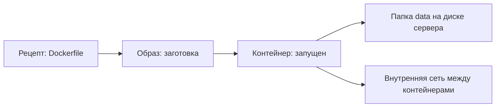

# Образ, контейнер, том, сеть

## Ситуация

В командах и сообщениях Docker постоянно встречаются четыре слова: образ, контейнер, том, сеть. Их легко перепутать, и тогда происходит странное: удалили контейнер, а место на диске не освободилось. Или наоборот — пересоздали приложение, и данные исчезли.

Разберём каждое слово отдельно: что это, зачем нужно и что с ним происходит при удалении.

## Зачем это нужно

### Образ — заготовка

Образ отвечает за **повторяемость**. Это неподвижный снимок: код, библиотеки, версия языка, команда запуска. Сам по себе он не работает — как PDF-бланк, который можно распечатать много раз.

Образы либо собираются из вашего рецепта, либо скачиваются готовыми. Например, `python:3.12-slim` — официальная заготовка с уже установленным Python.

### Контейнер — запущенный экземпляр

Контейнер отвечает за **работу**. Это образ, который запустили: процесс с именем и состоянием. Из одного образа можно запустить несколько контейнеров, как распечатать несколько бланков с одной формы.

Ключевое: контейнер одноразовый. Его нормально удалить и создать заново — при условии, что данные лежат не внутри.

### Том — постоянные данные

Том отвечает за **сохранность**. Файловая система внутри контейнера исчезает вместе с ним. Заметка, которую сохранил пользователь, так исчезнуть не должна.

Поэтому мы говорим Docker: папка `/opt/pulse/data` на сервере — это папка `/data` внутри контейнера. Приложение пишет к себе, файл оказывается на диске сервера и переживает пересоздание контейнера.

В курсе путь указан явно, а не спрятан во внутреннее хранилище Docker. Так вы всегда знаете, что именно копировать в резерв.

### Сеть — разговор между контейнерами

Сеть отвечает за **связь**. Когда в модуле 5 появится веб-сервер, ему нужно будет обращаться к «Пульсу». Делать это через интернет бессмысленно — они на одной машине.

Docker создаёт для них внутреннюю сеть, где контейнеры находят друг друга по именам. Веб-сервер обращается к `pulse:8080`, и наружу этот разговор не выходит.

### Что происходит при удалении

| Удалили | Что исчезает | Что остаётся |
|---|---|---|
| контейнер | запущенный процесс | образ на диске, данные в томе |
| образ | заготовка, место освобождается | данные в томе |
| папку с данными | данные пользователей — безвозвратно | образ и контейнер |

## Как это устроено

Ещё одно слово, которое встретится: **реестр** — хранилище готовых образов в интернете. При первом запуске Docker скачивает оттуда базовые заготовки. Для диска в 10 ГБ это заметно: каждый образ весит сотни мегабайт, поэтому лишние качать не надо.

!!! note "Новые слова"
    - **Слой образа** — часть заготовки, которую можно переиспользовать. Благодаря слоям повторная сборка идёт быстрее.
    - **Реестр** — хранилище образов, откуда они скачиваются.
    - **Bind-mount** — способ подключить конкретную папку сервера внутрь контейнера. Именно его мы используем для данных.

## Практика

Docker ещё не установлен, поэтому выполнять команды рано. Но полезно заранее понимать, что каждая из них показывает — в лаборатории 3 вы будете ими пользоваться постоянно.

| Вопрос | Команда | Что покажет |
|---|---|---|
| Какие заготовки скачаны | `docker images` | список образов и их размер |
| Что запущено сейчас | `docker ps` | работающие контейнеры |
| Что запускалось и остановилось | `docker ps -a` | все контейнеры, включая упавшие |
| Сколько занято места | `docker system df` | размер образов, контейнеров, данных |
| Где лежат данные | смотрим в файле запуска | путь вида `./data:/data` |

### Упражнение на понимание

Ответьте на три вопроса, они пригодятся при разборе поломок:

1. Вы пересоздали контейнер, и заметка исчезла. Что было сделано неправильно? *(Данные писались внутрь контейнера, тома не было.)*
2. Вы удалили контейнер, но место на диске не освободилось. Почему? *(Образ остался, он и занимает место.)*
3. Веб-сервер не может достучаться до приложения. Где искать? *(В настройках сети: правильное ли имя контейнера указано.)*

## Проверка

- [ ] Вы можете объяснить разницу между образом и контейнером.
- [ ] Знаете, где будут лежать данные «Пульса» на сервере.
- [ ] Понимаете, почему удаление контейнера не освобождает место.

Короткая шпаргалка: образ — форма, контейнер — заполненный бланк, том — папка с документами, сеть — коридор между комнатами.

## Частые ошибки

!!! failure "Удалить контейнер и ждать, что освободится диск"
    Место занимают образы. Чистить их нужно отдельной командой и осознанно: `docker image prune`.

!!! failure "Хранить данные во внутреннем томе и не знать, где они"
    Тогда невозможно сделать резервную копию. В курсе путь явный: `/opt/pulse/data`.

!!! failure "Скачать десяток образов «посмотреть»"
    Диск в 10 ГБ закончится быстрее, чем кажется.

## Как это в больших командах

Те же четыре понятия, но масштаб другой: образы хранятся в частном хранилище компании, данные лежат на сетевых дисках, сети разделены на внутренние и внешние.

В Kubernetes у них другие названия: том называется PVC, сеть — Service. Это перевод тех же понятий, а не новая физика. Разберём в модуле 18.

## Итог

Образ — заготовка, контейнер — её запущенный экземпляр, том — данные снаружи, сеть — связь между контейнерами.

Дальше — два файла, которыми всё это описывается, чтобы не вводить длинные команды руками.

Далее: [Dockerfile и Compose](03-dockerfile-compose.md).

!!! info "Нагрузка на учебный VPS"
    **Только теория.** Команды — в лаборатории 3.
