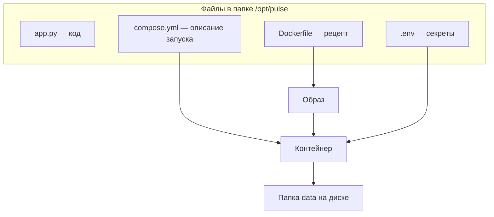

# Dockerfile и Compose

## Ситуация

Запустить контейнер можно одной длинной командой с десятком параметров: какой образ, какие порты, какая папка с данными, какой лимит памяти, откуда брать переменные.

Проблема в том, что через неделю вы эту команду не вспомните. А через месяц, когда понадобится поднять сервис заново или на другой машине, придётся собирать её по кусочкам из истории.

Поэтому всё описывают в файлах. Файлов два, и у них разные задачи.

## Зачем это нужно

### Dockerfile — рецепт заготовки

Отвечает на вопрос: **как собрать образ**.

Что в нём указывается:

- от какой готовой заготовки отталкиваемся (например, `python:3.12-slim`);
- какие файлы кода скопировать внутрь;
- какие библиотеки установить;
- от какого пользователя запускать программу;
- какой командой её стартовать.

Это ещё не запуск. Это инструкция по сборке.

### compose.yml — описание запуска на этой машине

Отвечает на вопрос: **что и как запустить здесь**.

Что в нём указывается:

- какие контейнеры нужны и как они называются;
- какие папки подключить для данных;
- какой лимит памяти поставить;
- откуда брать переменные окружения;
- перезапускать ли после перезагрузки сервера.

Почему файлов два: рецепт универсален и не знает ничего про конкретный сервер. Описание запуска, наоборот, знает про эту машину: её папки, её ограничения. Смешивать их — всё равно что писать адрес квартиры внутрь рецепта торта.

### Две команды, которые вы будете использовать

| Команда | Что делает |
|---|---|
| `docker compose up -d` | собрать при необходимости и запустить в фоне |
| `docker compose ps` | показать, что сейчас запущено |

Флаг `-d` означает «в фоне». Без него контейнер привязан к вашему окну терминала: закрыли окно или оборвалась связь — приложение может остановиться. На сервере всегда `-d`.

## Как это устроено

В репозитории курса лежит готовая папка `labs/pulse/`. Вы скопируете её на сервер, и дальше всё запустится из этих файлов.



Разберём три места в `compose.yml`, смысл которых нужно понимать сразу.

**Лимит памяти:**

```yaml
mem_limit: 64m
```

Ограничивает аппетит контейнера 64 мегабайтами. Без этого одна ошибка в коде может съесть всю память сервера. Подробно — в следующем уроке.

**Автоматический перезапуск:**

```yaml
restart: unless-stopped
```

После перезагрузки сервера Docker поднимет контейнер сам. Исключение — если вы остановили его вручную командой `stop`.

**Секреты из файла:**

```yaml
env_file: .env
```

Переменные берутся из отдельного файла, а не из кода и не из Dockerfile. Почему именно так, разбирали в [уроке про секреты](../m02/04-sekrety.md).

!!! note "Новые слова"
    - **Сервис** — так в `compose.yml` называется описание одного контейнера. По имени сервиса контейнеры находят друг друга.
    - **Сборка (build)** — превращение Dockerfile в образ. Первый раз долго: качаются базовые слои.
    - **YAML** — формат этих файлов. Главное правило: отступы делаются пробелами, табуляция ломает файл.

## Практика

Команды на сервере будут в лаборатории 3. Сейчас разберём файлы на своём компьютере — так в лаборатории не придётся копировать вслепую.

### Шаг 1. Открыть файлы курса

**Где смотреть:** папка курса на вашем компьютере, каталог `labs/pulse/`

Откройте три файла любым редактором:

- `app.py` — само приложение, примерно сто строк на чистом Python;
- `Dockerfile` — рецепт;
- `compose.yml` — описание запуска.

### Шаг 2. Найти в Dockerfile четыре вещи

Пройдитесь по файлу и найдите:

1. Строку `FROM` — от какой заготовки отталкиваемся.
2. Строку `COPY` — какой файл копируется внутрь.
3. Строку с созданием пользователя — обратите внимание, что приложение запускается **не** от root. Это та самая привычка минимальных прав из модуля 2.
4. Строку `CMD` — команда запуска.

### Шаг 3. Найти в compose.yml пять вещей

1. Имя сервиса — `pulse`.
2. Строку с папкой данных — где на сервере и как она видна внутри.
3. `mem_limit` — лимит памяти.
4. `restart` — политика перезапуска.
5. Строку с портом — она временная, в модуле 5 мы её уберём.

### Шаг 4. Проверить, что вы поняли разделение

Ответьте себе: если завтра вы захотите запустить «Пульс» на другой машине, какой из двух файлов придётся править?

Правильный ответ: `compose.yml` — там пути и ограничения конкретного сервера. Рецепт останется прежним.

## Проверка

- [ ] Вы можете объяснить, зачем нужны оба файла, а не один.
- [ ] Нашли в `compose.yml` лимит памяти и политику перезапуска.
- [ ] Понимаете, что `-d` означает «в фоне» и на сервере он обязателен.

## Частые ошибки

!!! failure "Перепечатать YAML руками и сломать отступы"
    Формат чувствителен к пробелам, а табуляция в нём запрещена. Копируйте файлы из репозитория целиком, не набирайте заново.

!!! failure "Запускать без -d на сервере"
    Контейнер привяжется к вашей сессии. Закрыли ноутбук — приложение может остановиться.

!!! failure "Вписать секреты прямо в Dockerfile"
    Они сохранятся в слоях образа. Секреты берутся из `.env` через `env_file`.

!!! failure "Оставить проброс порта 8080 навсегда"
    В модуле 4 он нужен, чтобы увидеть сайт по адресу. В модуле 5 его убираем — снаружи должен быть виден только веб-сервер.

## Как это в больших командах

Dockerfile используется тот же. А вот описание запуска в больших системах выглядит иначе: вместо одного файла — набор описаний для кластера.

Смысл при этом сохраняется: желаемое состояние записано в файле, который лежит в репозитории, а не в памяти человека, который вчера что-то запускал руками.

## Итог

Dockerfile — рецепт образа, `compose.yml` — описание запуска на конкретной машине. Оба файла лежат рядом с проектом и заменяют длинные команды.

Дальше — почему на сервере с 1 ГБ памяти лимит в файле запуска обязателен.

Далее: [Лимиты памяти на 1 ГБ](04-limity-pamyati.md).

!!! info "Нагрузка на учебный VPS"
    **Только чтение файлов.** Сборка образа — в лаборатории 3.
