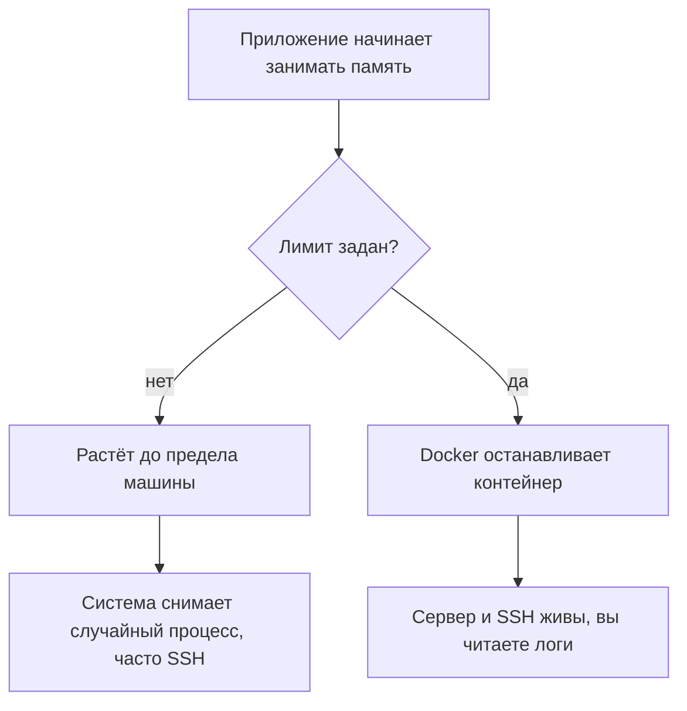

# Лимиты памяти на 1 ГБ

## Ситуация

Память сервера — общая для всех. Если одна программа начинает её поглощать (ошибка в коде, утечка, слишком большой файл в обработке), рано или поздно памяти не хватит всем.

Дальше происходит неприятное: система сама выбирает, какой процесс остановить. И выбирает она не «виновника», а по своим критериям — под удар часто попадает ваш SSH. Со стороны это выглядит так: сервер перестал отвечать, «он сломался».

На машине с 1 ГБ это не редкий сценарий, а вопрос времени.

## Зачем это нужно

Гигабайт памяти делится примерно так:

| Кто | Сколько примерно |
|---|---|
| система Ubuntu и SSH | 200–250 МБ |
| служба Docker | ~150 МБ |
| «Пульс» с лимитом | 64 МБ |
| веб-сервер (появится в модуле 5) | ~50 МБ |
| запас на всплески и кэш | остальное |

Цифры приблизительные, но порядок именно такой. Свободного места немного, и это надо учитывать.

Три механизма, которые вам нужны:

**Лимит памяти контейнера** ставит потолок для одного приложения. Если оно упирается в потолок, Docker останавливает его — а не всю машину. SSH при этом обычно выживает, и вы можете зайти и разобраться.

**Swap** — это часть диска, которую система использует как запасную память. Работает медленно, но спасает от полного зависания при кратковременном всплеске. Это не второй гигабайт памяти, а подушка безопасности.

**Ограничение по процессору** на одном ядре решается дисциплиной, а не настройками: тяжёлую сборку лучше делать не на этой машине.

## Как это устроено

В файле `compose.yml` лимит выглядит одной строкой:

```yaml
mem_limit: 64m
```

Что происходит без неё и с ней:



Второй вариант тоже неприятен — приложение остановилось. Но у него есть решающее преимущество: сервер остался управляемым, а в журналах видно причину.

!!! note "Новые слова"
    - **OOM (out of memory)** — ситуация «память закончилась». В журналах системы это выглядит как строка со словами `Out of memory`.
    - **mem_limit** — потолок памяти для контейнера в файле запуска.
    - **available** — колонка в выводе `free -h`, показывающая реально доступную память. Смотреть надо на неё, а не на `free`.

## Практика

### Шаг 1. Посмотреть текущее состояние памяти

**Где вводить:** терминал сервера (`ssh ucheb`)

```bash
free -h
```

**Что должно получиться:** таблица из двух строк.

- `Mem` — общая память около 950 МБ. Смотрите колонку `available`: до установки Docker там обычно 600–800 МБ.
- `Swap` — если `0B`, включите swap по [инструкции на странице про VPS](../../lab-server.md).

### Шаг 2. Посмотреть расход контейнеров

Эта команда заработает после лаборатории 3, когда появится запущенный контейнер.

**Где вводить:** терминал сервера

```bash
docker stats --no-stream
```

Флаг `--no-stream` означает «показать один раз и выйти», иначе таблица будет обновляться бесконечно.

**Что должно получиться:** таблица с колонкой `MEM USAGE / LIMIT` вида:

```
CONTAINER   MEM USAGE / LIMIT   MEM %
pulse       12.5MiB / 64MiB     19.53%
```

На что смотреть:

- справа от дроби должно стоять `64MiB` — значит, лимит применился;
- если там общий размер памяти сервера, лимит не сработал: проверьте строку `mem_limit` в файле запуска.

### Шаг 3. Что делать, если сервер завис

Порядок действий на случай, когда SSH перестал отвечать:

1. Откройте панель хостера и перезагрузите сервер кнопкой.
2. Дождитесь загрузки и зайдите: `ssh ucheb`.
3. Посмотрите, была ли нехватка памяти:

**Где вводить:** терминал сервера

```bash
sudo dmesg -T | grep -i "out of memory"
```

**Что должно получиться:** либо пустой вывод (значит, причина была другая), либо строки с указанием, какой процесс был остановлен и когда.

4. Не запускайте после этого ещё один тяжёлый контейнер «чтобы проверить».

## Проверка

- [ ] `free -h` показывает ненулевой swap.
- [ ] Вы знаете, какая колонка показывает реально доступную память.
- [ ] Понимаете, зачем нужен лимит: чтобы остановился контейнер, а не сервер.
- [ ] Знаете команду, которой проверяют нехватку памяти после зависания.

## Частые ошибки

!!! failure "Поставить лимит 512 МБ «с запасом»"
    Вы отдали половину сервера одному приложению. Системе и веб-серверу останется слишком мало, и они начнут конкурировать за память.

!!! failure "Считать swap заменой памяти"
    Swap работает через диск и в десятки раз медленнее. Он спасает от зависания, но не позволяет запускать тяжёлые программы.

!!! failure "Собирать большой проект прямо на этом сервере"
    Одно ядро и гигабайт памяти — сборка крупного фронтенда может занять часы или не завершиться вовсе. Собирайте там, где есть ресурсы, а на сервер приносите готовое.

!!! failure "Ставить рядом ещё один тяжёлый сервис"
    Системы мониторинга, панели управления, автоматизация — каждая просит сотни мегабайт. На этом тарифе их не размещают, и в уроках это отдельно отмечено.

## Как это в больших командах

Ограничения по памяти и процессору задаются для каждого приложения обязательно — без них одна ошибка в коде влияет на соседей по серверу.

В Kubernetes это называется `resources.limits` и работает по тому же принципу. Вы осваиваете ту же дисциплину на одной машине.

## Итог

Лимит памяти — это забор, который не даёт одному приложению уронить весь сервер. На 1 ГБ он не опция, а необходимость.

Теория модуля закончилась. Пора поставить Docker и упаковать «Пульс».

Далее: [Лаборатория. Упаковать «Пульс»](../../labs/lab-03-pulse-docker.md).

!!! info "Нагрузка на учебный VPS"
    **Влезает в 1 ГБ** при одном небольшом контейнере. **Не ставьте** рядом системы мониторинга и Kubernetes.
