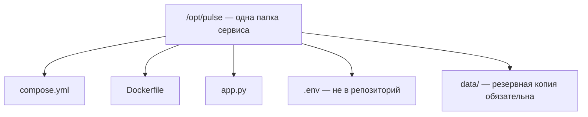

# Файлы на сервере

## Ситуация

Контейнер можно удалить и создать заново — это нормальная операция. А вот файлы, из которых он собирается, удалить нельзя: без них сервис не поднять.

Если эти файлы разложены как придётся — часть в домашней папке, часть во временной, настройки где-то ещё, — то через неделю вы сами не вспомните, откуда запускается приложение и что из этого нужно копировать в резерв.

## Зачем это нужно

Договорённость простая: **всё, что относится к сервису, лежит в одной папке**. В курсе это `/opt/pulse`.

Что там лежит и зачем:

| Файл | Что это | Можно ли восстановить |
|---|---|---|
| `app.py` | код приложения | да, он есть в репозитории |
| `Dockerfile` | рецепт образа | да |
| `compose.yml` | описание запуска | да |
| `.env` | секреты и настройки | нет, если не записали отдельно |
| `data/` | заметки пользователей | **нет** |

Из этой таблицы сразу следует, что копировать в резерв: папку `data` и содержимое `.env`. Остальное скачивается заново.

Почему именно `/opt`: в Linux эта папка традиционно отводится под дополнительные программы, не относящиеся к самой системе. Временная папка `/tmp` не подходит — её периодически чистят. Домашняя папка тоже работает, но единый путь удобнее: все инструкции и карточки по разбору аварий ссылаются на одно место.

Ещё одно важное понятие — **откуда запускается сервис**. Сейчас это папка, которую вы скопировали с компьютера. В модуле 8 её заменит репозиторий: сервер будет получать код автоматически. Но правило останется тем же — есть одно место, откуда всё поднимается.

## Как это устроено



Отдельное правило: файлы `.env` и папка `data` не должны попадать в репозиторий. В первом — секреты, во втором — данные пользователей.

!!! note "Новые слова"
    - **Рабочая папка сервиса** — единственное место, откуда запускается приложение.
    - **Монтирование** — подключение папки сервера внутрь контейнера. В файле запуска выглядит как `./data:/data`.

## Практика

### Шаг 1. Посмотреть содержимое рабочей папки

**Где вводить:** терминал сервера (`ssh ucheb`)

```bash
cd /opt/pulse
ls -la
```

**Что должно получиться:** список файлов приложения. Проверьте два момента:

- владелец у файлов — `deploy`;
- у файла `.env` права `-rw-------`, то есть доступ только владельцу.

Если файлы принадлежат `root`, исправьте:

```bash
sudo chown -R deploy:deploy /opt/pulse
```

При этом папку `data` возвращаем пользователю контейнера:

```bash
sudo chown -R 10001:10001 /opt/pulse/data
```

### Шаг 2. Проверить, что именно подключено внутрь контейнера

**Зачем:** убедиться, что данные пишутся в ту папку, которую вы будете копировать в резерв.

**Где вводить:** терминал сервера

```bash
docker inspect pulse --format '{{ range .Mounts }}{{ .Source }} -> {{ .Destination }}{{ println }}{{ end }}'
```

**Что должно получиться:** строка вида:

```
/opt/pulse/data -> /data
```

Читается так: папка `/opt/pulse/data` на сервере видна приложению как `/data`. Именно туда приложение сохранит заметку.

### Шаг 3. Убедиться, что данные переживают пересоздание контейнера

**Зачем:** это и есть главная проверка всего урока. Лучше убедиться сейчас на учебном файле, чем потом на настоящих данных.

**Где вводить:** терминал сервера

```bash
echo "проверка тома" | sudo tee /opt/pulse/data/test.txt
docker compose down
docker compose up -d
cat /opt/pulse/data/test.txt
```

Что здесь происходит: создаём файл, полностью останавливаем и удаляем контейнер, поднимаем заново, читаем файл.

**Что должно получиться:** после пересоздания контейнера команда `cat` печатает `проверка тома`. Данные на месте.

Уберём за собой:

```bash
sudo rm /opt/pulse/data/test.txt
```

### Шаг 4. Записать путь в инвентарь

Добавьте в инвентарь строку: «Сервис Пульс: `/opt/pulse`, данные в `/opt/pulse/data`». В модуле 6 вы будете копировать именно эту папку.

## Проверка

- [ ] Все файлы сервиса лежат в одной папке.
- [ ] Вы знаете, какая папка содержит данные, а какая — код.
- [ ] Проверили на практике, что данные переживают `down` и `up`.
- [ ] Путь записан в инвентарь.

## Частые ошибки

!!! failure "Разложить файлы по разным местам"
    Временную папку система чистит, а инструкции по разбору аварий рассчитаны на один известный путь. Держите всё в `/opt/pulse`.

!!! failure "Править код прямо на сервере и забыть про копию на компьютере"
    При следующем копировании правка затрётся, и вы потратите вечер на выяснение, куда делось исправление. Пока нет автоматической выкладки — меняйте код в одном месте и осознанно переносите.

!!! failure "Положить .env в репозиторий"
    Секреты окажутся в истории навсегда. В репозиторий кладётся только `.env.example` без значений.

!!! failure "Считать, что резервная копия нужна для всей папки"
    Код и рецепты скачиваются заново, копировать надо `data` и отдельно сохранить значения из `.env`.

## Как это в больших командах

Путь к файлам сервиса стандартизирован: он одинаковый на всех машинах, потому что ночью при аварии некогда выяснять, где что лежит у конкретного сервера.

Часто код на машину вообще не копируют: сервер скачивает готовый образ из хранилища, а на диске остаются только данные и настройки.

## Итог

Одна папка на сервис, данные отдельно от кода, секреты с закрытыми правами. Вы проверили, что данные не исчезают при пересоздании контейнера.

Дальше — как сделать, чтобы приложение поднималось само после перезагрузки сервера.

Далее: [Запуск и автоподъём](02-zapusk-i-avtopodyom.md).

!!! info "Нагрузка на учебный VPS"
    **Влезает в 1 ГБ.**
