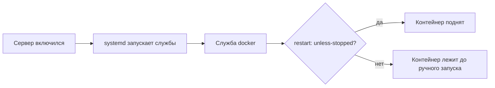

# Запуск и автоподъём

## Ситуация

Серверы перезагружаются. Причины разные: обновление ядра, плановые работы у хостера, авария, ваша собственная команда `reboot`.

Если после перезагрузки приложение не поднимается само и ждёт, пока вы зайдёте и запустите его руками, — это не работающий сервис, а что-то, что работает, пока вы рядом.

## Зачем это нужно

Чтобы сервис поднимался сам, должны сработать две вещи подряд. Обе надо настроить.

**1. Служба Docker должна запускаться при загрузке системы.** За это отвечает команда `systemctl enable docker`. Если её не выполнить, после перезагрузки самого Docker не будет — и поднимать контейнеры станет некому.

**2. У контейнера должна быть политика перезапуска.** Это строка `restart: unless-stopped` в файле запуска. Она означает: «поднимай этот контейнер, если он упал или машина перезагрузилась».

Название `unless-stopped` переводится как «кроме случая, когда остановлен вручную». Логика такая: если вы сами выполнили `stop`, значит, так и было задумано, и Docker не будет воскрешать контейнер против вашей воли.

### Четыре команды, которые надо различать

| Команда | Что делает | Что с данными |
|---|---|---|
| `docker compose up -d` | создать и запустить в фоне | не трогает |
| `docker compose stop` | остановить, контейнер остаётся | не трогает |
| `docker compose down` | остановить и удалить контейнер | папка `data` цела |
| `docker compose down -v` | то же плюс удалить тома | **может удалить данные** |

Последнюю команду часто встречают в советах из интернета. На нашей конфигурации папка `data` подключена напрямую и обычно выживает, но привычка опасная: в модуле 5 появится хранилище сертификатов, которое эта команда снесёт.

## Как это устроено

Цепочка после включения питания:



Если выпадает любое звено, перезагрузка превращается в лотерею.

!!! note "Новые слова"
    - **enable** — пометить службу как запускаемую при каждой загрузке системы.
    - **Политика перезапуска** — правило, по которому Docker поднимает упавший контейнер.
    - **Uptime** — время непрерывной работы с момента последней загрузки.

## Практика

### Шаг 1. Включить автозапуск службы Docker

**Где вводить:** терминал сервера (`ssh ucheb`)

```bash
sudo systemctl enable docker
sudo systemctl is-enabled docker
```

**Что должно получиться:** вторая команда печатает `enabled`. Если `disabled` — первая команда не сработала, повторите с `sudo`.

### Шаг 2. Проверить политику перезапуска контейнера

**Где вводить:** терминал сервера

```bash
docker inspect pulse --format '{{ .HostConfig.RestartPolicy.Name }}'
```

**Что должно получиться:** слово `unless-stopped`.

Если вывод пустой или там `no` — в файле `compose.yml` нет нужной строки. Откройте его и добавьте `restart: unless-stopped` в описание сервиса, затем примените:

```bash
cd /opt/pulse
docker compose up -d
```

### Шаг 3. Проверить перезагрузкой

**Зачем:** это единственная настоящая проверка. Настройки могут выглядеть правильно и не сработать.

**Где вводить:** терминал сервера

```bash
sudo reboot
```

**Что должно получиться:** соединение оборвётся с сообщением `Connection to ... closed by remote host`. Это ожидаемо.

Подождите 1–2 минуты, затем зайдите снова:

**Где вводить:** PowerShell на вашем компьютере

```powershell
ssh ucheb
```

Проверяем, поднялось ли приложение **без вашего участия**:

**Где вводить:** терминал сервера

```bash
cd /opt/pulse
docker compose ps
curl -s http://127.0.0.1:8080/health
uptime
```

**Что должно получиться:**

- `docker compose ps` — статус `Up`, причём время работы контейнера примерно равно времени с перезагрузки;
- `curl` — ответ `{"status":"ok"}`;
- `uptime` — несколько минут, подтверждает, что перезагрузка действительно была.

Если контейнер не поднялся, смотрите причину:

```bash
docker compose logs --tail=50
```

### Шаг 4. Понять разницу между stop и down

**Зачем:** чтобы осознанно останавливать сервис и не удивляться, что он не вернулся.

**Где вводить:** терминал сервера

```bash
cd /opt/pulse
docker compose stop
docker compose ps
```

**Что должно получиться:** в колонке `STATUS` теперь `Exited`. Приложение остановлено, и после перезагрузки оно **не** поднимется — вы остановили его сознательно.

Возвращаем:

```bash
docker compose start
docker compose ps
curl -s http://127.0.0.1:8080/health
```

**Что должно получиться:** снова `Up` и ответ `{"status":"ok"}`.

## Проверка

- [ ] `systemctl is-enabled docker` отвечает `enabled`.
- [ ] Политика перезапуска — `unless-stopped`.
- [ ] После настоящей перезагрузки приложение поднялось само.
- [ ] Вы понимаете разницу между `stop` и `down`.

## Частые ошибки

!!! failure "Запускать без флага -d"
    Контейнер привязывается к вашей сессии терминала. Закрыли окно — работа может прекратиться. На сервере всегда `-d`.

!!! failure "Не проверить перезагрузкой"
    Настройка, которую не проверили, не считается сделанной. Лучше узнать о проблеме сейчас, чем во время настоящей аварии.

!!! failure "Выполнить down -v по совету из интернета"
    Эта команда удаляет тома. В модуле 5 там будут лежать сертификаты, и их придётся получать заново — а у выдающего сервиса есть ограничение на число попыток.

!!! failure "Забыть про enable для Docker"
    Политика перезапуска контейнера не сработает, если сама служба Docker не запустилась. Проверяются обе вещи, а не одна.

## Как это в больших командах

Автоматический подъём после сбоя — базовое требование, а не приятная опция. В системах управления кластером при выходе машины из строя приложение автоматически запускается на другой.

Разница только в масштабе: у вас за это отвечает Docker на одной машине, там — отдельная система на десятках машин. Требование одинаковое.

## Итог

Служба Docker включена в автозапуск, у контейнера есть политика перезапуска, и вы проверили это настоящей перезагрузкой.

Дальше — какие двери вашего сервера видны из интернета и почему это важно.

Далее: [Порты: что торчит наружу](03-porty.md).

!!! info "Нагрузка на учебный VPS"
    **Влезает в 1 ГБ.** Перезагрузка — нормальная проверка, а не авария.
