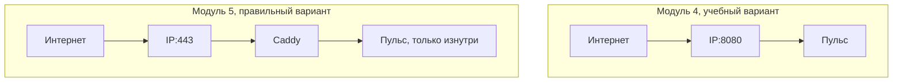

# Порты: что торчит наружу

## Ситуация

Приложение работает, но увидеть его из браузера нельзя. Причина в том, что контейнер — это отдельная комната: внутри он слушает порт 8080, но с улицы в эту комнату дверей нет.

Чтобы дверь появилась, её надо явно прорубить. И тут важно не перестараться: открытая дверь — это дверь для всех, включая тех, кого вы не звали.

## Зачем это нужно

Строка в файле запуска выглядит так:

```yaml
ports:
  - "8080:8080"
```

Читается справа налево:

- **правая цифра** — порт внутри контейнера, там, где слушает приложение;
- **левая цифра** — порт на самом сервере, который увидит внешний мир.

Есть три варианта написания, и разница между ними принципиальная:

| Запись | Кто может достучаться |
|---|---|
| `"8080:8080"` | весь интернет |
| `"127.0.0.1:8080:8080"` | только сам сервер |
| строки нет вообще | только другие контейнеры рядом |

`0.0.0.0` в выводе команд означает «слушаю на всех адресах, включая публичный». Если видите это напротив порта приложения — значит, порт открыт в интернет.

### Почему в курсе мы открываем 8080, а потом закроем

В лаборатории 4 задача учебная: убедиться, что приложение отвечает из интернета, не дожидаясь домена и сертификата. Для этого 8080 временно открыт.

В модуле 5 появится веб-сервер Caddy. Он встанет на порты 80 и 443, а к «Пульсу» будет ходить по внутренней сети Docker. После этого публикацию 8080 мы уберём: наружу должны смотреть только 22, 80 и 443.

Временное решение, которое забыли убрать, — самая частая причина дыр в безопасности. Поэтому шаг «убрать 8080» в модуле 5 обязательный, а не желательный.

!!! danger "Базу данных не публикуют никогда"
    Порт 5432 (PostgreSQL) и подобные не открывают в интернет даже на учебном сервере. Автоматические сканеры находят открытую базу за часы.

## Как это устроено



!!! warning "Проверка с сервера ничего не доказывает"
    Команда `curl http://127.0.0.1:8080` работает всегда, потому что обращается к самому себе. Открыт ли порт наружу, проверяется только с вашего компьютера по публичному адресу.

!!! note "Новые слова"
    - **Публикация порта** — проброс «порт сервера → порт контейнера».
    - **0.0.0.0** — «все адреса машины», то есть в том числе публичный.
    - **docker-proxy** — вспомогательный процесс, который вы увидите в списке слушающих портов рядом с опубликованным портом.

## Практика

### Шаг 1. Посмотреть, какие порты слушает сервер

**Где вводить:** терминал сервера (`ssh ucheb`)

```bash
sudo ss -tulpn
```

**Что должно получиться:** таблица. Смотрите колонку `Local Address:Port`:

- `0.0.0.0:22` — SSH, так и должно быть;
- `0.0.0.0:8080` — ваше приложение, открыто наружу;
- `127.0.0.1:...` — служебное, наружу не видно.

Если в этом списке есть порты, которые вы не открывали, это повод разобраться.

### Шаг 2. Посмотреть публикацию глазами Docker

**Где вводить:** терминал сервера

```bash
docker compose ps
```

**Что должно получиться:** в колонке `PORTS` строка вида `0.0.0.0:8080->8080/tcp`. Слева — что видно снаружи, справа — что внутри.

### Шаг 3. Сверить с файрволом

**Где вводить:** терминал сервера

```bash
sudo ufw status
```

**Что должно получиться:** список разрешённых портов: 22, 80, 443.

!!! warning "Docker может обойти файрвол"
    При публикации порта Docker добавляет собственные правила, и порт бывает доступен снаружи, даже если в `ufw` его нет. Поэтому не добавляйте `ufw allow 8080` — сначала проверьте, открывается ли и так. И тем более надёжный способ закрыть порт — убрать публикацию, а не надеяться на файрвол.

### Шаг 4. Проверить снаружи

**Где вводить:** PowerShell на вашем компьютере (подставьте свой адрес)

```powershell
curl http://203.0.113.10:8080/health
```

**Что должно получиться:** ответ `{"status":"ok"}` — значит, интернет видит приложение. Для лаборатории 4 это цель.

Если ответа нет, вариантов немного:

| Симптом | Причина |
|---|---|
| долго ждёт и обрывается | закрыт файрвол хостера или `ufw` |
| `Connection refused` | контейнер не запущен или слушает только внутри |
| ответ есть, но пустой | не тот путь, проверьте `/health` |

## Проверка

- [ ] Вы можете объяснить, что означают левая и правая цифры в публикации порта.
- [ ] Знаете, чем `8080:8080` отличается от `127.0.0.1:8080:8080`.
- [ ] Понимаете, что публикация 8080 — временная мера до модуля 5.
- [ ] Умеете посмотреть слушающие порты командой `ss -tulpn`.

## Частые ошибки

!!! failure "Опубликовать порт базы данных"
    Порт 5432 наружу не открывают ни при каких обстоятельствах. Приложение ходит к базе по внутренней сети.

!!! failure "Закрыть 22 вместо 8080"
    Вы потеряете доступ к серверу, и вернуть его можно будет только через консоль хостера. Меняйте порты приложения, SSH не трогайте.

!!! failure "Разрешить 8080 в ufw навсегда"
    Так временная мера становится постоянной. В модуле 5 порт убирается совсем.

!!! failure "Проверять открытость порта с самого сервера"
    Локальная проверка проходит всегда. Смотрите снаружи, со своего компьютера.

## Как это в больших командах

Наружу открыты только 80 и 443, доступ по SSH — с ограниченного списка адресов. Приложения слушают порты вроде 8080 исключительно во внутренней сети, куда из интернета попасть нельзя.

Вы повторяете ту же схему в миниатюре: сейчас порт временно открыт, после модуля 5 он спрячется за веб-сервером.

## Итог

Публикация порта — осознанное решение, а не техническая мелочь. Сейчас 8080 открыт временно, в модуле 5 вы его закроете.

Дальше — что делать, когда запуск не удался.

Далее: [Типичные ошибки деплоя](04-oshibki-deploy.md).

!!! info "Нагрузка на учебный VPS"
    **Влезает в 1 ГБ.**
