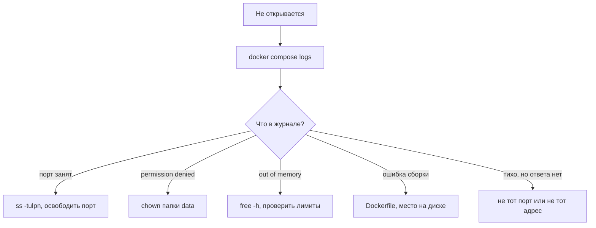

# Типичные ошибки деплоя

## Ситуация

Первый запуск почти никогда не проходит идеально. Что-то не собралось, порт занят, прав не хватило — это нормальная часть работы, а не признак, что вы делаете что-то не так.

Разница между новичком и опытным инженером не в том, что у второго всё получается с первого раза. Она в том, что второй за минуту понимает, где искать причину, а первый начинает переустанавливать систему.

## Зачем это нужно

Есть порядок разбора, который экономит часы. Проверяем слои снизу вверх, каждый следующий имеет смысл только если предыдущий в порядке:

1. **Диск** — если места нет, дальше можно не смотреть: не соберётся и не запустится ничего.
2. **Процесс** — контейнер вообще запущен?
3. **Порт** — приложение слушает нужный порт?
4. **Журнал** — что программа написала перед тем, как упасть?

Журнал стоит последним не потому, что он неважен, а потому что три предыдущих проверки занимают по десять секунд и часто сразу дают ответ.

!!! note "Новые слова"
    - **Код выхода (exit code)** — число, с которым завершился процесс. Ноль означает «нормально», всё остальное — ошибку.
    - **Журнал (лог)** — то, что программа написала о себе во время работы. Смотрится командой `docker compose logs`.
    - **Restarting** — состояние, в котором Docker раз за разом пытается поднять падающий контейнер.

## Как это устроено



## Практика: каталог отказов

### Отказ 1. Контейнер в состоянии Restarting

**Где вводить:** терминал сервера (`ssh ucheb`)

```bash
cd /opt/pulse
docker compose ps
docker compose logs --tail=80
```

**Что должно получиться:** в журнале будет строка с ошибкой. Два самых частых варианта:

- ошибка Python с указанием файла и строки — опечатка в коде;
- `Permission denied: '/data/note.txt'` — у приложения нет прав на папку данных.

Второе лечится так:

```bash
sudo chown -R 10001:10001 /opt/pulse/data
docker compose restart
```

Число 10001 — номер пользователя, под которым приложение работает внутри контейнера. Оно задано в `Dockerfile` намеренно: приложение не должно работать с правами администратора.

### Отказ 2. port is already allocated

Полный текст: `Bind for 0.0.0.0:8080 failed: port is already allocated`. Порт уже занят.

**Где вводить:** терминал сервера

```bash
sudo ss -tulpn | grep 8080
docker ps -a
```

**Что должно получиться:** вы увидите, кто занял порт. Обычно это старый контейнер от предыдущей попытки. Удалите его:

```bash
docker rm -f имя_старого_контейнера
docker compose up -d
```

### Отказ 3. no space left on device

Кончилось место на диске.

**Где вводить:** терминал сервера

```bash
df -h /
docker system df
```

**Что должно получиться:** `df -h` покажет заполнение близко к 100%, а `docker system df` — сколько занимают образы и неиспользуемые слои.

Подробный разбор — в [карточке «диск заполнен»](../../runbooks/disk-full.md). Команду `docker system prune` выполняйте только после того, как поняли, что именно она удалит.

### Отказ 4. Запрос с компьютера зависает

Проверка по внешнему адресу не отвечает, а на сервере всё работает.

Сравните два результата:

**Где вводить:** терминал сервера

```bash
curl -s http://127.0.0.1:8080/health
```

**Где вводить:** PowerShell на вашем компьютере

```powershell
curl http://203.0.113.10:8080/health
```

Что означает результат:

| Сервер | Компьютер | Причина |
|---|---|---|
| отвечает | зависает | закрыт файрвол хостера или `ufw` |
| отвечает | `Connection refused` | публикация порта только на `127.0.0.1` |
| не отвечает | не отвечает | приложение не работает, смотрите журнал |

### Отказ 5. Работает с портом, не работает без порта

Адрес `http://ваш-IP:8080` открывается, а `http://ваш-IP` — нет.

Так и должно быть в модуле 4. На порту 80 пока никто не слушает. Веб-сервер там появится в модуле 5.

!!! failure "Не лечите это лишним пробросом"
    Добавить публикацию `80:8080` — соблазнительно и неправильно: в модуле 5 порт 80 понадобится Caddy для получения сертификата.

### Тренировка: сломать нарочно

**Зачем:** увидеть отказ в контролируемых условиях, чтобы в настоящей аварии не паниковать.

**Где вводить:** терминал сервера

```bash
cd /opt/pulse
docker compose stop
curl -s http://127.0.0.1:8080/health
```

**Что должно получиться:** `curl` не отвечает или пишет `Connection refused`. Это и есть вид отказа «сервис лежит».

Возвращаем:

```bash
docker compose start
curl -s http://127.0.0.1:8080/health
```

**Что должно получиться:** снова `{"status":"ok"}`.

## Проверка

- [ ] Вы знаете порядок разбора: диск, процесс, порт, журнал.
- [ ] Умеете читать последние строки журнала контейнера.
- [ ] Понимаете, чем отличается проверка с сервера от проверки с компьютера.
- [ ] Один раз намеренно остановили и вернули сервис.

## Частые ошибки

!!! failure "Переустановить сервер при первой же ошибке"
    Вы потеряете ключи, настройки и сам урок. Сначала журнал — причина почти всегда написана прямым текстом.

!!! failure "Вставить длинную команду docker run из интернета"
    Вы не сможете повторить её через месяц и не будете знать, что именно в ней делает каждый флаг. Держитесь файлов курса.

!!! failure "Менять несколько вещей сразу"
    Если после трёх правок заработало, вы не знаете, какая помогла. Меняйте по одному и проверяйте.

## Как это в больших командах

Порядок разбора тот же: процесс жив, порт слушает, что в журнале. Отличия в инструментах — журналы собраны в одном месте, а откат к предыдущей рабочей версии делается быстрее, чем вход по SSH.

Разбор аварий записывают в карточки, чтобы в следующий раз не вспоминать заново. Такие карточки есть и у вас — в разделе runbooks.

## Итог

Сначала определяем слой, потом действуем. Каталог отказов выше покрывает почти всё, что случается на первых неделях.

Пора открыть «Пульс» в браузере.

Далее: [Лаборатория. Открыть по IP](../../labs/lab-04-otkryt-po-ip.md).

!!! info "Нагрузка на учебный VPS"
    **Влезает в 1 ГБ.**
