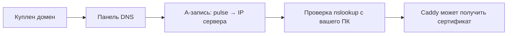

# DNS-записи

## Ситуация

Сайт работает, но адрес выглядит как `http://203.0.113.10:8080`. Такой адрес невозможно продиктовать по телефону, а браузер показывает предупреждение «не защищено».

Хочется нормального имени и замочка. Но замочек выдают **на имя**, а не на набор цифр. Значит, начинать надо с имени.

## Зачем это нужно

Люди не запоминают адреса из цифр. DNS — это записная книжка интернета, которая переводит имена в адреса. Браузер сначала спрашивает у неё «куда идти за `pulse.example.ru`», и только потом отправляет запрос.

Три участника, которых легко перепутать:

| Кто | Что делает |
|---|---|
| **Регистратор** | продаёт имя (REG.RU, Timeweb и другие) |
| **Хостер** | сдаёт сервер и выдаёт публичный адрес |
| **DNS-панель** | место, где имя связывают с адресом |

Регистратор и хостер могут быть разными компаниями — это нормально. Связывает их одна запись.

**A-запись** решает ровно одну задачу: «имя `pulse.example.ru` указывает на такой-то адрес IPv4». Вписывать туда надо адрес вашего сервера из панели хостера, и ничего другого.

**Поддомен** — это имя вида `pulse.example.ru` рядом с основным `example.ru`. Удобно, когда на основном имени уже что-то есть и трогать его не хочется.

**Пропагация** — время, пока мир забывает старый ответ. Вы поправили запись, а телефон соседа ещё час видит прежний адрес. Отсюда главное правило этого урока: не пытайтесь получить сертификат, пока проверка с вашего компьютера не показывает правильный адрес.

!!! note "Новые слова"
    - **DNS** — система, переводящая имена в адреса.
    - **A-запись** — связка «имя → адрес IPv4».
    - **TTL** — сколько секунд помнить ответ. Для учёбы ставьте 300–3600.
    - **CNAME** — «это имя такое же, как вон то». Для поддомена достаточно обычной A-записи.

## Как это устроено



Порядок здесь жёсткий: пока не сработало предыдущее звено, следующее не сработает.

## Практика

!!! info "Если домена пока нет"
    Урок прочитайте, а практику отложите. Продолжайте пользоваться адресом `http://IP:8080` и вернитесь сюда, когда купите имя. Без домена сертификат получить нельзя.

### Шаг 1. Узнать точный адрес сервера

**Где смотреть:** панель хостера, карточка сервера, поле «IPv4» или «Публичный IP».

Либо на самом сервере:

**Где вводить:** терминал сервера (`ssh ucheb`)

```bash
curl -s ifconfig.me
echo
```

**Что должно получиться:** четыре числа через точку. Они должны совпадать с тем, что показывает панель хостера.

### Шаг 2. Создать A-запись

**Где делать:** личный кабинет регистратора, раздел «DNS» или «Записи домена».

Что вписать:

- **Тип:** A
- **Хост (имя):** `pulse` — для поддомена, или `@` — для корневого имени
- **Значение:** адрес из шага 1
- **TTL:** 300 или 3600

<div class="placeholder-screen" markdown>
**Скриншот:** форма создания A-записи в панели регистратора с заполненными полями.
</div>

Чего вписывать не надо:

- `127.0.0.1` — это компьютер посетителя, а не ваш сервер;
- адрес старого сервера, если он у вас был;
- адрес конструктора сайтов, если домен раньше использовался.

### Шаг 3. Проверить, что запись разошлась

**Где вводить:** PowerShell на вашем компьютере (подставьте своё имя)

```powershell
nslookup pulse.example.ru
```

Команда `nslookup` спрашивает у DNS: «какой адрес у этого имени?».

**Что должно получиться:** в конце вывода блок вида:

```
Имя:     pulse.example.ru
Address: 203.0.113.10
```

Адрес должен **точно** совпадать с адресом сервера.

Возможные результаты и что они значат:

| Что видите | Что это значит |
|---|---|
| правильный адрес | всё готово, идите дальше |
| старый или чужой адрес | запись ещё не разошлась, ждите |
| `Non-existent domain` | запись не создана или опечатка в имени |
| «Не удаётся найти сервер» | проблема с интернетом на вашем компьютере |

### Шаг 4. Перепроверить с другого устройства

**Зачем:** ваш компьютер мог запомнить ответ. Проверка с телефона (отключив Wi-Fi) или через любой онлайн-сервис «dns lookup» покажет, что видит остальной мир.

**Что должно получиться:** тот же адрес. Если ответы разные — ждите ещё, к сертификату идти рано.

### Шаг 5. Записать имя в инвентарь

Добавьте строку: имя, у какого регистратора куплено, на какой адрес указывает, дата окончания оплаты. Просроченный домен — обидная и частая причина «сайт пропал».

## Проверка

- [ ] A-запись создана и указывает на адрес вашего сервера.
- [ ] `nslookup` с компьютера показывает правильный адрес.
- [ ] Проверка с другого устройства даёт тот же результат.
- [ ] Имя и дата продления записаны в инвентарь.

## Частые ошибки

!!! failure "A-запись на 127.0.0.1"
    Этот адрес означает «текущий компьютер». Посетитель будет стучаться сам к себе и ничего не увидит.

!!! failure "Включить проксирование Cloudflare, не разобравшись"
    В режиме «оранжевое облачко» Cloudflare подменяет адрес собственным. Для учебной схемы с Caddy проще оставить режим DNS only (серое облачко).

!!! failure "Идти за сертификатом, не дождавшись DNS"
    У выдающего сервиса есть ограничение на число попыток в неделю. Исчерпав его, вы будете ждать днями. Чинить надо запись, а не повторять попытку.

!!! failure "Создать AAAA-запись без IPv6 на сервере"
    Браузер предпочтёт IPv6 и уйдёт в никуда. Пока у сервера нет адреса IPv6, такую запись не создавайте.

## Как это в больших командах

Записи DNS хранят как код, в репозитории, и меняют через проверяемые заявки. Записей десятки: почта, подтверждения владения, отдельные имена для тестовой среды.

У вас одно учебное имя — это правильный минимум для старта.

## Итог

Имя указывает на тот же адрес, что и сервер в панели хостера, и это подтверждено проверкой с двух устройств. Только теперь есть смысл идти за замочком.

Далее: [Caddy и Nginx](02-caddy-nginx.md).

!!! info "Нагрузка на учебный VPS"
    **Сервер не нагружается вовсе** — вся работа идёт в панели регистратора.
