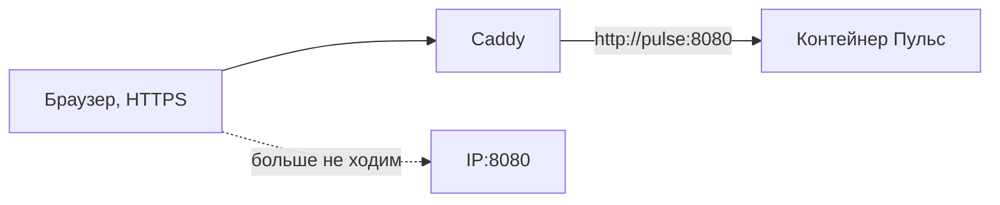

# Caddy и Nginx: вахтёр на входе

## Ситуация

Приложение «Пульс» умеет одно: ответить на запрос. И это правильно — оно не должно само заниматься шифрованием, разбираться, какое имя спросили, и решать, какие порты закрыть от улицы.

Без отдельной программы у входа остаётся два плохих варианта: светить `IP:8080` навсегда или вписывать поддержку сертификатов в код приложения. Первое небезопасно, второе превращает простой учебный код в сложный.

## Зачем это нужно

Нужна отдельная программа на входе. Её называют **обратным прокси** (reverse proxy), а по-человечески — вахтёром: принимает людей с улицы и ведёт в нужную комнату.

Что делает вахтёр, когда человек открывает `https://pulse.example.ru`:

1. принимает зашифрованное соединение на порту 443;
2. смотрит, какое имя спросили — так на одном адресе живут несколько сайтов;
3. переспрашивает нужный контейнер по внутренней сети Docker;
4. отдаёт ответ человеку, как будто сам и есть сайт.

Слово «обратный» смущает зря. Обычный прокси прячет клиента — так устроен корпоративный выход в интернет. Обратный прячет сервер: улица видит только вахтёра, приложение сидит во дворе.

### Caddy или Nginx

В курсе используется Caddy. Nginx упоминается, чтобы вы его узнавали.

| | Caddy | Nginx |
|---|---|---|
| Настройки | несколько строк | заметно многословнее |
| HTTPS | получает сертификат сам | обычно нужен отдельный инструмент |
| Встречается в вакансиях | реже | очень часто |
| Расход памяти | небольшой | небольшой |

Для «Пульса» на 1 ГБ Caddy удобнее: не нужен второй процесс рядом, а настроек минимум. Но увидев в чужом проекте строку `proxy_pass http://app:8080`, вы должны узнать в ней ту же работу вахтёра.

!!! warning "Два вахтёра одновременно не бывает"
    Порты 80 и 443 может занять только один процесс. Поставить Caddy и Nginx рядом «чтобы посмотреть оба» не получится — будет конфликт.

!!! note "Новые слова"
    - **Обратный прокси (reverse proxy)** — принимает запросы с улицы, переспрашивает внутренние сервисы.
    - **Caddyfile** — текстовый файл с настройками Caddy.
    - **proxy_pass / upstream** — как то же самое называется в Nginx.
    - **Завершение TLS** — шифр расшифровывается на вахтёре, дальше внутри сервера идёт обычный HTTP. Это нормально, потому что наружу этот участок не виден.

## Как это устроено



Весь Caddyfile для нашей задачи умещается в три строки:

```
pulse.example.ru {
    reverse_proxy pulse:8080
}
```

Как это читается:

- **слева** — имя, которое человек набирает в браузере. То же самое, что в A-записи.
- **справа** — имя сервиса из файла запуска Compose, не адрес и не `127.0.0.1`.

!!! danger "Почему не 127.0.0.1"
    Внутри контейнера Caddy адрес `127.0.0.1` означает сам контейнер Caddy. Соседний «Пульс» там не живёт. Работает только обращение по имени сервиса — `pulse`.

Чтобы обращение по имени сработало, оба сервиса должны быть описаны в одном файле запуска или явно помещены в одну сеть Docker.

## Практика

### Шаг 1. Посмотреть готовый файл настроек

**Где смотреть:** папка курса на вашем компьютере, файл `labs/pulse/Caddyfile`.

**Что должно получиться:** вы видите блок с именем и строкой `reverse_proxy`. Найдите в нём место, где написано `pulse.example.ru` — его надо будет заменить на ваше настоящее имя.

### Шаг 2. Посмотреть файл запуска с вахтёром

**Где смотреть:** папка курса, файл `labs/pulse/compose.caddy.yml`.

Обратите внимание на три вещи:

- у сервиса `caddy` опубликованы порты 80 и 443;
- у сервиса `pulse` публикации портов **нет** — он доступен только изнутри;
- у Caddy есть папки для хранения сертификатов.

### Шаг 3. Проверить, что порты 80 и 443 открыты

**Зачем:** без них вахтёр не сможет ни получить сертификат, ни принимать посетителей.

**Где вводить:** терминал сервера (`ssh ucheb`)

```bash
sudo ufw status
```

**Что должно получиться:** в списке есть `80/tcp` и `443/tcp` со статусом `ALLOW`. Если нет:

```bash
sudo ufw allow 80/tcp
sudo ufw allow 443/tcp
```

### Шаг 4. Убедиться, что порт 80 свободен

**Зачем:** если его уже кто-то занял, Caddy не запустится.

**Где вводить:** терминал сервера

```bash
sudo ss -tulpn | grep ':80 '
```

**Что должно получиться:** пустой вывод — порт свободен. Если что-то нашлось, это чаще всего предустановленный хостером веб-сервер:

```bash
sudo systemctl stop apache2 nginx
sudo systemctl disable apache2 nginx
```

Команда может написать, что таких служб нет — это нормально, значит, порт занимал кто-то другой, и стоит разобраться по выводу `ss`.

## Проверка

- [ ] Вы можете вслух описать путь запроса: браузер → Caddy на 443 → pulse на 8080.
- [ ] Понимаете, почему в настройках стоит имя сервиса, а не `127.0.0.1`.
- [ ] Порты 80 и 443 разрешены в файрволе.
- [ ] Порт 80 никем не занят.

## Частые ошибки

!!! failure "Написать reverse_proxy 127.0.0.1:8080"
    Caddy будет стучаться сам к себе. Нужно имя сервиса из файла запуска.

!!! failure "Оставить публикацию 8080 «на всякий случай»"
    Тогда вахтёра можно обойти, и вся схема теряет смысл. После лаборатории 5 публикация убирается.

!!! failure "Поставить Caddy и Nginx рядом"
    Порты 80 и 443 достанутся только одному. Второй не запустится.

!!! failure "Описать сервисы в разных файлах запуска"
    Они окажутся в разных сетях, и Caddy не найдёт `pulse` по имени. Держите оба в одном файле.

## Как это в больших командах

Роль та же, исполнители другие. В облаке перед серверами часто ставят балансировщик, в Kubernetes эту работу делает Ingress — вахтёр целого кластера.

На маленьком сервере Caddy на той же машине — честное рабочее решение, а не упрощение для учёбы.

## Итог

Вахтёр берёт на себя шифрование и маршрутизацию по именам, а приложение остаётся простым. Порты подготовлены.

Дальше — откуда берётся сам замочек.

Далее: [HTTPS и сертификат](03-https.md).

!!! info "Нагрузка на учебный VPS"
    **Влезает в 1 ГБ:** Caddy занимает около 50 МБ. **Не ставьте** рядом системы мониторинга.
