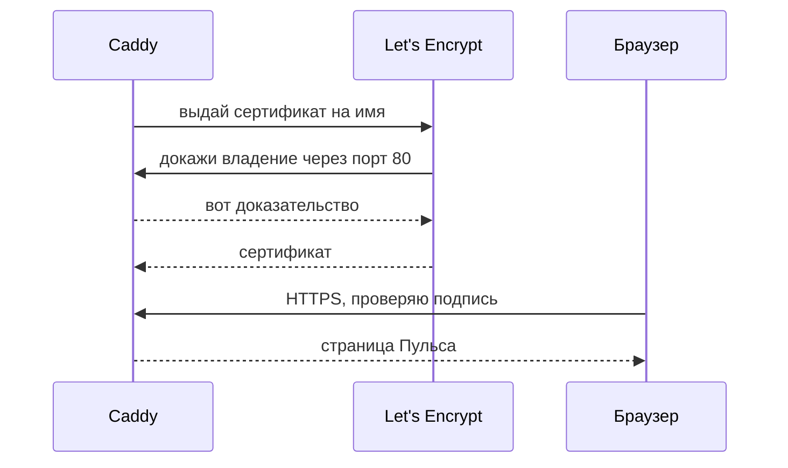

# HTTPS и сертификат

## Ситуация

Браузер показывает на вашем сайте надпись «не защищено». Посетитель видит её раньше, чем содержимое страницы, и делает выводы.

Дело не только в надписи. Без шифрования всё, что человек отправляет на сайт, идёт открытым текстом: любой на том же Wi-Fi в кафе может это прочитать. Пока «Пульс» хранит только заметку, это учебная задача. Как только появятся пароли или оплата — это уже утечка.

## Зачем это нужно

HTTPS решает две задачи сразу, и их полезно различать.

**Шифрование** прячет содержимое разговора между браузером и вашим сервером. Это как запертый чемодан: по дороге никто не прочитает.

**Подтверждение личности** отвечает на вопрос, который сам по себе шифр не решает: откуда браузер знает, что чемодан ваш, а не подменённый по дороге? Для этого нужен **сертификат** — файл с подписью доверенного центра. Смысл подписи простой: «этот ключ принадлежит имени `pulse.example.ru` до такой-то даты».

**Let's Encrypt** — бесплатный центр, который выдаёт такие подписи автоматически. Благодаря ему маленькому сайту не нужно ничего покупать.

У бесплатности есть предел: ограничение на количество попыток в неделю для одного имени. Если DNS ещё не настроен, а вы раз за разом пробуете получить сертификат, вас временно заблокируют на несколько дней. Чинить нужно имя, а не повторять попытку.

### Как центр проверяет, что домен ваш

Способ, который использует Caddy, называется HTTP-01. Робот говорит: «положи вот этот файл на порт 80 по этому имени». Если A-запись указывает на ваш сервер и порт 80 открыт, Caddy сам выкладывает файл и сам его убирает. Вручную вы не делаете ничего.

Отсюда два условия, без которых ничего не выйдет: правильная A-запись и открытый порт 80.

!!! note "Новые слова"
    - **TLS** — протокол шифрования. HTTPS — это обычный HTTP поверх TLS.
    - **ACME** — язык, на котором Caddy договаривается с Let's Encrypt.
    - **HTTP-01** — способ проверки владения именем через порт 80.
    - **Самоподписанный сертификат** — подписанный вами самими. Браузер ему не верит и показывает предупреждение.

## Как это устроено



Раз в пару месяцев Caddy обновляет сертификат сам, без вашего участия — при условии, что имя и порты по-прежнему в порядке.

!!! danger "Где лежат сертификаты и почему их нельзя терять"
    Caddy хранит их в своих папках данных:

    ```yaml
    volumes:
      - ./caddy_data:/data
      - ./caddy_config:/config
    ```

    Команда `docker compose down -v` удаляет тома вместе с сертификатами. Получать их заново — значит тратить попытки из недельного лимита. Не используйте флаг `-v`, пока не понимаете, что именно он сносит.

## Практика

### Шаг 1. Проверить четыре условия

Перед запуском Caddy убедитесь, что всё готово. Если хоть один пункт не выполнен, сертификат не выдадут.

| Условие | Как проверить |
|---|---|
| A-запись верная | `nslookup ваше-имя` с компьютера показывает адрес сервера |
| Порты открыты | `sudo ufw status` содержит 80 и 443 |
| Порт 80 свободен | `sudo ss -tulpn \| grep ':80 '` ничего не выводит |
| Имя без опечаток | сверьте Caddyfile и адресную строку посимвольно |

### Шаг 2. Проверить дату на сервере

**Зачем:** проверка подписи сертификата завязана на время. Сбитые часы дают странные ошибки вида «сертификат ещё не действителен».

**Где вводить:** терминал сервера (`ssh ucheb`)

```bash
date
timedatectl
```

**Что должно получиться:** текущая дата и время, в выводе `timedatectl` строка `System clock synchronized: yes`. Если синхронизации нет:

```bash
sudo timedatectl set-ntp true
```

### Шаг 3. Прочитать журнал Caddy после запуска

Этот шаг выполняется в лаборатории 5, после запуска вахтёра.

**Где вводить:** терминал сервера

```bash
cd /opt/pulse
docker compose -f compose.caddy.yml logs caddy --tail=50
```

**Что должно получиться:** строки со словами `certificate obtained` и `serving initial configuration`. Это значит, что сертификат выдан.

Если вместо этого бесконечно повторяются ошибки:

| Что в журнале | Причина |
|---|---|
| `no such host` | A-запись не создана или не разошлась |
| `timeout during connect` | порт 80 закрыт файрволом |
| `too many failed authorizations` | исчерпан недельный лимит попыток |
| `address already in use` | порт 80 занят другой программой |

Заметив ошибку, **остановите контейнер** и чините причину. Каждая новая попытка тратит лимит.

```bash
docker compose -f compose.caddy.yml stop caddy
```

### Шаг 4. Проверить замочек в браузере

**Где смотреть:** браузер на вашем компьютере, адрес `https://ваше-имя`.

**Что должно получиться:**

- в адресной строке значок замка без предупреждений;
- при нажатии на замок видно, что сертификат выдан Let's Encrypt;
- срок действия — примерно три месяца вперёд;
- если набрать адрес с `http://`, браузер сам переходит на `https://`.

<div class="placeholder-screen" markdown>
**Скриншот:** адресная строка с замком и раскрытые сведения о сертификате.
</div>

## Проверка

- [ ] Все четыре условия из шага 1 выполнены.
- [ ] Часы на сервере синхронизированы.
- [ ] В журнале Caddy есть строка о полученном сертификате.
- [ ] Браузер показывает замок без предупреждений.
- [ ] Вы знаете, что флаг `-v` удаляет сертификаты.

## Частые ошибки

!!! failure "Повторять выпуск при неверном DNS"
    Двадцать попыток за час — и вас заблокируют на неделю. Останавливайте контейнер и чините имя.

!!! failure "Открыть 443, но забыть про 80"
    Проверка владения идёт именно через 80. Без него сертификата не будет, хотя логика подсказывает обратное.

!!! failure "Пытаться получить сертификат на голый IP"
    Let's Encrypt выдаёт подписи только на имена. Для адреса из цифр придётся жить на `http`.

!!! failure "Сделать самоподписанный сертификат для публичного сайта"
    Браузер покажет большое красное предупреждение — хуже, чем обычный HTTP.

## Как это в больших командах

Тот же Let's Encrypt либо внутренний центр компании. Часто сертификат живёт не на самой машине, а на облачном балансировщике перед ней.

В Kubernetes ту же работу выполняет cert-manager, разговаривающий по тому же протоколу ACME. Механика одинаковая, отличается только масштаб.

## Итог

Правильное имя плюс открытые порты 80 и 443 плюс вахтёр дают замочек без ручной работы. Обновление тоже происходит само.

Дальше — как разместить на одном сервере несколько имён.

Далее: [Несколько сервисов на одном сервере](04-neskolko-servisov.md).

!!! info "Нагрузка на учебный VPS"
    **Влезает в 1 ГБ.** Не выпускайте сертификаты на десяток поддоменов без необходимости — это тратит лимит.
