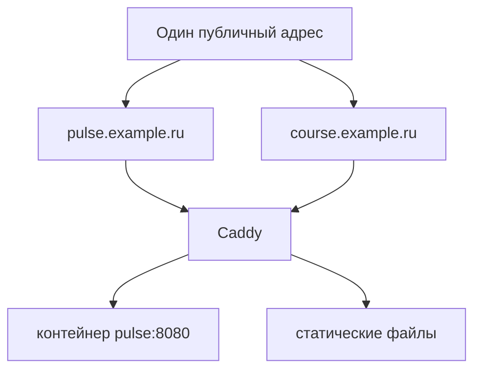

# Несколько сервисов на одном сервере

## Ситуация

Сайт открывается по имени, с замочком. Естественная следующая мысль: раз сервер уже есть, давайте разместим на нём и второй проект, и панель управления, и систему графиков.

Здесь надо разделить два вопроса, которые обычно путают. Первый — **можно ли технически** отдать несколько имён одной машине. Да, можно, и это несложно. Второй — **хватит ли памяти**. И вот с этим на 1 ГБ всё строго.

## Зачем это нужно

У машины один публичный адрес, а имён может быть сколько угодно. Разбирается с этим тот же вахтёр: он смотрит, какое имя спросили, и ведёт в соответствующий контейнер. Такое правило называют виртуальным хостом.

Новый сайт — это новое имя в DNS и ещё один блок в настройках вахтёра. Не второй сервер и не второй вахтёр.

Важно понимать границу: **память не умножается от количества имён, она тратится на количество работающих программ.**

Что реально помещается рядом с «Пульсом» на 1 ГБ:

- статическая страница или собранный учебник (почти не занимает памяти);
- ещё один маленький сервис вроде нашего, с лимитом 64 МБ;
- страница-заглушка на другом имени.

Что не помещается:

- системы сбора метрик и графиков — каждая просит сотни мегабайт;
- полноценная база данных «на вырост»;
- платформы автоматизации вроде n8n;
- браузерная автоматизация;
- Kubernetes в любом виде.

Отдельно про панели управления Docker: на этом тарифе они не ставятся. Они занимают память и, будучи открытыми в интернет, становятся самостоятельной дырой в безопасности. Если такая панель когда-нибудь понадобится — доступ к ней организуют через туннель, об этом в модуле 14.

!!! note "Новые слова"
    - **Виртуальный хост** — правило «какое имя спросили, в какой контейнер вести».
    - **Внутренняя сеть Compose** — сеть, в которой контейнеры видят друг друга по именам. Порты наружу при этом не нужны.

## Как это устроено



В файле настроек это выглядит как несколько блоков подряд:

```
pulse.example.ru {
    reverse_proxy pulse:8080
}

course.example.ru {
    root * /srv/course
    file_server
}
```

Для каждого имени нужна своя A-запись, указывающая на тот же самый адрес.

## Практика

Эти шаги выполняются после лаборатории 5, когда Caddy уже работает.

### Шаг 1. Убрать публикацию порта приложения

**Зачем:** пока порт 8080 опубликован, вахтёра можно обойти, и вся схема с сертификатом ничего не защищает.

**Где смотреть:** файл `/opt/pulse/compose.caddy.yml` на сервере.

У сервиса `pulse` строк `ports:` быть не должно. Если они есть — уберите и примените:

**Где вводить:** терминал сервера (`ssh ucheb`)

```bash
cd /opt/pulse
docker compose -f compose.caddy.yml up -d
```

### Шаг 2. Проверить, что порт закрылся

**Где вводить:** PowerShell на вашем компьютере

```powershell
curl http://203.0.113.10:8080/health
```

**Что должно получиться:** ошибка подключения. Здесь отказ — это успех: приложение больше не доступно напрямую.

Если ответ всё-таки пришёл, значит, работает старый набор контейнеров. Проверьте:

**Где вводить:** терминал сервера

```bash
docker ps -a
```

**Что должно получиться:** в списке только `caddy` и `pulse` в состоянии `Up`. Всё лишнее остановите:

```bash
docker rm -f имя_лишнего_контейнера
```

### Шаг 3. Проверить, что вахтёр по-прежнему достаёт приложение

**Зачем:** убедиться, что связь идёт по внутренней сети, а не через публичный порт.

**Где вводить:** PowerShell на вашем компьютере

```powershell
curl https://pulse.example.ru/health
```

**Что должно получиться:** ответ `{"status":"ok"}`. Приложение доступно только через вахтёра — ровно то, чего мы добивались.

### Шаг 4. Записать таблицу имён

Заведите в инвентаре табличку такого вида:

| Имя | Куда ведёт | Комментарий |
|---|---|---|
| pulse.example.ru | контейнер pulse | учебный сервис |

Она должна умещаться в одну записку. Если перестала умещаться, самое время задуматься о втором сервере.

## Проверка

- [ ] Публикация порта 8080 убрана.
- [ ] Обращение к `IP:8080` снаружи не проходит.
- [ ] Обращение по имени через HTTPS работает.
- [ ] Рядом нет второго тяжёлого сервиса.
- [ ] Таблица «имя → сервис» записана.

## Частые ошибки

!!! failure "Публиковать порт для каждого нового сервиса"
    Порты 3000, 5678, 9090 наружу возвращают дырявый сервер. Вход должен быть один.

!!! failure "Поставить рядом систему графиков «раз уж сервер есть»"
    На 1 ГБ это заканчивается нехваткой памяти, и падает в первую очередь то, что вам дорого.

!!! failure "Добавить знакомый инструмент автоматизации"
    Знакомство не добавляет памяти. Держите тяжёлые инструменты на отдельной машине.

!!! failure "Запустить второй набор контейнеров из другого файла"
    Получится два проекта на одной машине, конкурирующих за порты. Проверяйте `docker ps -a`.

## Как это в больших командах

Имён и сервисов много, но памяти там тоже больше на порядки. При этом дисциплина «один вход, внутренности закрыты» соблюдается строже, а не слабее.

На маленьком тарифе цена ошибки выше: лишний сервис сразу приводит к нехватке памяти, а не к незаметному росту счёта.

## Итог

Один адрес, вахтёр распределяет по именам, внутренности закрыты от улицы. Количество имён ограничено вашим желанием, количество сервисов — объёмом памяти.

Далее: [Лаборатория. Домен и замочек](../../labs/lab-05-domen-https.md).

!!! info "Нагрузка на учебный VPS"
    **Влезает:** Caddy плюс «Пульс» плюс статика. **Не влезает:** третий тяжёлый набор сервисов.
