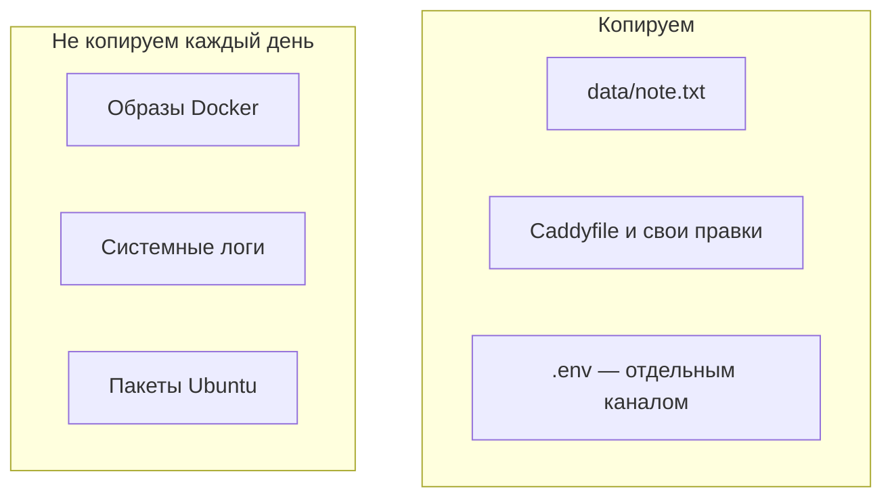

# Что бэкапить, а что нет

## Ситуация

Слово «бэкап» звучит просто: сделай копию. На практике новичок выбирает одну из двух крайностей.

Первая — копировать весь сервер на всякий случай. Диск на 10 ГБ кончается за неделю, а восстановиться из такой копии всё равно сложно.

Вторая — копировать только файлы с кодом. Они и так лежат в репозитории, а единственная заметка пользователя при этом пропадает.

## Зачем это нужно

Есть один вопрос, который отделяет нужное от ненужного:

> Если завтра этот файл исчезнет — его можно получить заново или он существует в единственном экземпляре?

По этому признаку всё на сервере делится на три группы.

**Данные** — то, что создали люди. Заметка «Пульса», база, загруженные файлы. Заново их не наберёшь. Это главное, что копируют.

**Собираемое** — образы Docker, папка с готовым сайтом, установленные пакеты. Всё это получается из рецептов, которые лежат в репозитории. Копировать их каждый день — тратить диск впустую.

**Состояние сервера** — пользователи Linux, правила файрвола, ключи доступа. Формально это тоже данные, но их обычно проще описать в инвентаре и восстановить за час, чем тащить снимок всего диска каждую ночь.

### Что копируем в нашем курсе

| Что | Где лежит | Как копируем |
|---|---|---|
| Заметка «Пульса» | `/opt/pulse/data` | ежедневный архив |
| Настройки Caddy и свои правки | `/opt/pulse/Caddyfile` | вместе с архивом |
| Значения из `.env` | `/opt/pulse/.env` | **отдельно**, в менеджер паролей |
| Код приложения | репозиторий на компьютере | не копируем, он уже в двух местах |

Чего не копируем ежедневно:

- слои образов Docker — скачаются заново;
- содержимое `/var/log` целиком — потеря неприятна, но не смертельна;
- кэш системы пакетов.

!!! danger "Секреты не кладут в общий архив"
    Заметка «Пульса» учебная, её не жалко. Токен бота — нет. Значения из `.env` храните в менеджере паролей или в зашифрованном архиве, но не рядом с обычной копией данных.

!!! note "Новые слова"
    - **RPO** — сколько свежих данных вы готовы потерять, измеряется во времени. Копируете раз в сутки — значит, готовы потерять до суток работы.
    - **Снимок (snapshot)** — фотография всего диска, которую делает хостер одной кнопкой.
    - **Артефакт** — то, что собирается из рецепта: образ, готовый сайт.

## Как это устроено



## Практика

### Шаг 1. Посмотреть, что вообще есть в папке данных

**Где вводить:** терминал сервера (`ssh ucheb`)

```bash
ls -la /opt/pulse/data
sudo du -sh /opt/pulse/data
```

**Что должно получиться:**

- список файлов, среди которых `note.txt`;
- размер папки — скорее всего несколько килобайт.

Если папка пустая, откройте сайт, сохраните заметку «до бэкапа» и повторите команду.

### Шаг 2. Сравнить с объёмом собираемого

**Зачем:** увидеть своими глазами, почему образы не копируют.

**Где вводить:** терминал сервера

```bash
docker system df
```

**Что должно получиться:** таблица, где в строке `Images` стоят сотни мегабайт. Сравните с килобайтами из шага 1 — разница в тысячи раз, а ценность обратная.

### Шаг 3. Записать карту данных

Занесите в инвентарь три строки:

1. **Данные:** `/opt/pulse/data` на сервере.
2. **Код:** репозиторий, путь на вашем компьютере.
3. **Секреты:** название записи в менеджере паролей.

Эта карта — то, что вы будете читать в панике, когда что-то сломается. Лучше, чтобы она уже была написана.

## Проверка

Вы можете ответить, что произойдёт в каждом случае:

- [ ] Удалили контейнер — заметка цела, потому что она в папке на сервере.
- [ ] Удалили папку `/opt/pulse` целиком без копии — заметка потеряна навсегда.
- [ ] Удалили образ Python — скачается заново при следующей сборке.
- [ ] Потеряли `.env` — придётся выпускать новые токены.

## Частые ошибки

!!! failure "Копировать всю служебную папку Docker"
    Она большая, плохо восстанавливается, и в ней могут оказаться секреты из слоёв образов. Копируют данные приложения, а не внутренности Docker.

!!! failure "Положить .env в тот же архив, что и данные"
    Архив с данными может уехать в облако или на флешку. Токен вместе с ним — плохая идея.

!!! failure "Считать репозиторий бэкапом данных"
    Репозиторий хранит код. Файл `note.txt` в него не попадает специально — он в списке исключений.

!!! failure "Делать снимок диска раз в месяц и считать вопрос закрытым"
    Снимок лежит у того же хостера, и между снимками проходит месяц работы. Это страховка перед опасными действиями, а не замена ежедневной копии.

## Как это в больших командах

Существует карта данных: какие базы, какие хранилища файлов, сколько данных допустимо потерять по каждому. Копируют базы и файловые хранилища, а сами серверы обычно не копируют — их пересоздают из кода.

Вы делаете ту же карту, только она умещается в три строки.

## Итог

Копируем то, что существует в единственном экземпляре. Всё, что собирается из рецепта, каждый день не таскаем. Секреты идут отдельным каналом.

Дальше — сколько копий нужно и где они должны лежать.

Далее: [Правило 3-2-1](02-pravilo-321.md).

!!! info "Нагрузка на учебный VPS"
    **Влезает в 1 ГБ.** Команды только смотрят диск, ничего не создают.
