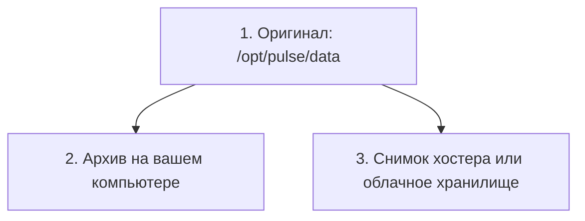

# Правило 3-2-1

## Ситуация

Вы сделали копию данных и положили её в папку `data.bak` рядом с оригиналом. Кажется, что вопрос закрыт.

Но подумайте, от чего эта копия спасает. От вашей же опечатки — да. От смерти диска — нет, он унесёт обе папки. От блокировки аккаунта у хостера — тоже нет.

## Зачем это нужно

Данные теряют тремя разными способами, и защищаться от них надо по-разному. Правило 3-2-1 — это способ проверить, закрыты ли все три.

**Три копии** закрывают человеческую ошибку: случайное удаление, опечатку в команде. Оригинал плюс ещё две. Но три папки на одном диске — это всё ещё одна копия под разными именами.

**Два разных носителя** закрывают поломку железа. Диск сервера и диск вашего компьютера — это два носителя. Две папки на одном диске — один.

**Одна копия не здесь** закрывает беду с целым местом: пожар в дата-центре, блокировка аккаунта, взлом. Если все три архива лежат у одного хостера, то проблема у хостера уничтожает все три сразу.

### Две цифры, которые надо назвать вслух

| Что | Вопрос, на который отвечает | Честный ответ для курса |
|---|---|---|
| **RPO** | Сколько работы можно потерять? | сутки — копируем раз в день |
| **RTO** | За сколько поднимемся обратно? | полчаса руками |

Эти цифры не бывают «правильными» — они бывают выбранными осознанно. Если заметку написали в 17:00, а последняя копия вчерашняя, сегодняшний текст потерян. Это не провал, это цена, которую вы выбрали, копируя раз в сутки.

!!! note "Новые слова"
    - **Носитель** — физически отдельное место хранения. Не папка, а устройство.
    - **Объектное хранилище** — шкаф для файлов по сети: положил файл, забрал файл.
    - **RPO / RTO** — «сколько потеряем» и «за сколько вернёмся».

## Как это устроено

Для учебного проекта честный минимум выглядит так:

1. **Живые данные** на сервере.
2. **Архив на вашем компьютере** — другой носитель и другое место сразу.
3. **Третья копия** — снимок диска у хостера либо архив в облачном хранилище.

Если третьей копии пока нет — так и напишите в инвентаре: «третьей копии нет». Для старта это допустимо, но пусть это будет осознанный долг, а не иллюзия.

## Практика

### Шаг 1. Посчитать свои копии

Возьмите каждое место, где, как вам кажется, лежат данные, и задайте три вопроса:

- Это тот же диск, что и оригинал?
- Это тот же аккаунт у того же хостера?
- Я хоть раз восстанавливалась именно отсюда?

Если на любой вопрос ответ неприятный — запишите это в инвентарь как долг.

### Шаг 2. Посмотреть, что делает учебный скрипт

**Где смотреть:** папка курса на вашем компьютере, файл `labs/backup/backup-pulse.sh`.

**Что должно получиться:** вы увидите, что скрипт упаковывает папку `data` в архив с датой в имени. И всё. Он **не** уносит архив никуда — это отдельная задача следующего урока.

Упаковать архив и оставить его рядом с оригиналом — это ещё не 3-2-1.

### Шаг 3. Заполнить табличку в инвентаре

Скопируйте себе такую таблицу и заполните честно:

| Копия | Где лежит | Когда обновлялась | Восстанавливались? |
|---|---|---|---|
| 1 | `/opt/pulse/data` | живые данные | — |
| 2 | | | |
| 3 | | | |

Пустые ячейки — это и есть ваш список задач на ближайшие уроки.

## Проверка

- [ ] Вы можете назвать, какую беду закрывает каждая цифра правила.
- [ ] Вы не называете бэкапом папку `data.bak` на том же сервере.
- [ ] Вы назвали свои RPO и RTO вслух.
- [ ] Таблица копий заполнена, пробелы записаны как долг.

## Частые ошибки

!!! failure "Три архива в одной папке на сервере"
    Один диск, один аккаунт. Умер хостер — умерли все три сразу.

!!! failure "Полагаться только на снимок хостера раз в месяц"
    Удобно, но вы потеряете месяц работы, и копия лежит там же, где оригинал.

!!! failure "Отправить архив в чат, потому что «шифровать нечем»"
    Лучше меньше копий, чем секреты в переписке. Если шифровать нечем, просто не кладите в архив `.env`.

!!! failure "Записать копию как существующую, ни разу из неё не восстановившись"
    Это самый опасный пункт. Ему посвящён отдельный урок в этом модуле.

## Как это в больших командах

Копии уезжают в другой регион или вообще к другому провайдеру. Проверка восстановления стоит в календаре как обязательное мероприятие. Используют специальные инструменты вроде restic и borg, а для баз данных — встроенные механизмы.

Цифры правила при этом ровно те же.

## Итог

Три экземпляра, два разных носителя, один не здесь. Плюс две названные вслух цифры: сколько готовы потерять и за сколько вернётесь.

Дальше — куда конкретно класть копию, если сервер в России.

Далее: [Куда класть копию в РФ](03-kuda-klast-rf.md).

!!! info "Нагрузка на учебный VPS"
    **Теория плюс маленький архив.** Сервер не нагружается.
