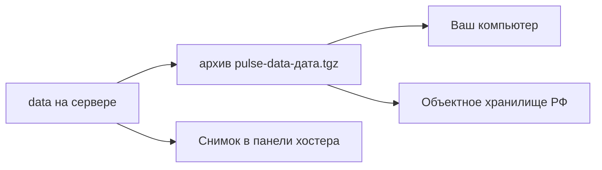

# Куда класть копию, если хостинг в РФ

## Ситуация

В англоязычных статьях совет один: «залейте на S3». Для учебного проекта в России это лишние сложности — оплата зарубежной картой, вопросы доступа, а для реальных проектов ещё и требования к хранению персональных данных.

При этом правило 3-2-1 без ответа на вопрос «куда» остаётся лозунгом. Разберём полки, которые реально работают.

## Зачем это нужно

Есть четыре варианта, и у каждого своя задача.

**Свой компьютер.** Архив забирается по SSH командой `scp`. Это сразу и другой носитель, и другое место, и бесплатно. Минус очевиден: ноутбук тоже ломается и теряется. Для учебной заметки как вторая копия — достаточно.

**Объектное хранилище.** Это шкаф для файлов по сети: положили архив, скачали архив. Не сервер, не Ubuntu, не Docker — просто хранилище. В России такие услуги есть у Yandex Object Storage, Selectel и Timeweb. Их называют S3-совместимыми, потому что они понимают тот же язык, что придумал Amazon. Слово «S3» здесь означает жанр полки, а не требование идти в AWS.

**Снимок диска у хостера.** Фотография всей машины одной кнопкой. Задача другая — откатиться целиком после неудачного эксперимента. Лежит у того же арендодателя, поэтому как единственная копия не годится.

**Второй сервер.** Полноценное решение, но это деньги и ещё одна машина, за которой надо следить. Для курса рано.

### Сравнение

| Куда | Плюс | Минус | Когда в курсе |
|---|---|---|---|
| Свой компьютер (`scp`) | бесплатно, другое место | компьютер тоже уязвим | **основной учебный путь** |
| Снимок у хостера | один клик | тот же хостер, стоит денег | перед опасными действиями |
| Объектное хранилище РФ | настоящее «не здесь» | ключи доступа, оплата за гигабайты | когда появятся данные людей |
| Второй сервер | полноценно | деньги и обслуживание | рано |

!!! danger "Куда класть нельзя"
    - В публичный репозиторий курса — архив туда не кладут никогда.
    - В чат мессенджера «пока некуда» — это утечка и вредная привычка.
    - Ключи доступа к хранилищу — в скрипт, который попадёт в репозиторий. Они живут в `.env` или в секретах CI.

!!! note "Новые слова"
    - **scp** — команда, копирующая файл по SSH. Работает там же, где работает `ssh`.
    - **Бакет** — отдельный «ящик» внутри объектного хранилища, со своим именем.
    - **Ключ доступа** — пара «идентификатор и секрет», которой программа представляется хранилищу.

## Как это устроено



<div class="placeholder-screen" markdown>
**Скриншот:** раздел снимков в панели хостера. Ищите слова **Snapshot**, **Образ диска** или **Резервная копия**.
</div>

## Практика

### Шаг 1. Упаковать данные в архив

**Зачем:** из одной папки получить один файл, который удобно переносить.

**Где вводить:** терминал сервера (`ssh ucheb`)

```bash
tar -czf /tmp/pulse-data.tgz -C /opt/pulse data
ls -lh /tmp/pulse-data.tgz
```

Разбор команды: `-c` создать, `-z` сжать, `-f` в указанный файл. Ключ `-C /opt/pulse` означает «зайди в эту папку и упакуй оттуда папку `data`» — так внутри архива не окажется длинного пути.

**Что должно получиться:** строка с файлом. Размер должен быть хотя бы несколько сотен байт. Если там ноль — вы упаковали пустую папку.

### Шаг 2. Проверить содержимое архива, не распаковывая

**Зачем:** убедиться, что внутри именно то, что нужно. Это занимает секунду и избавляет от неприятных открытий.

**Где вводить:** терминал сервера

```bash
tar -tzf /tmp/pulse-data.tgz
```

Ключ `-t` означает «только показать список». Ничего не создаётся и не портится.

**Что должно получиться:** строки `data/` и `data/note.txt`. Если списка нет — архив пустой, возвращайтесь к шагу 1.

### Шаг 3. Забрать архив на свой компьютер

**Где вводить:** PowerShell на вашем компьютере

```powershell
scp ucheb:/tmp/pulse-data.tgz $env:USERPROFILE\Documents\
```

Короткое имя `ucheb` работает благодаря файлу настроек SSH из лаборатории 1.

**Что должно получиться:** строка с именем файла и индикатором прогресса, в конце `100%`.

### Шаг 4. Открыть архив на компьютере

**Зачем:** проверка, что файл не побился при передаче и открывается не только на сервере.

**Где смотреть:** папка «Документы», файл `pulse-data.tgz`. Откройте его архиватором (7-Zip или встроенный).

**Что должно получиться:** внутри видна папка `data` и в ней файл `note.txt` с вашим текстом.

### Шаг 5. Убрать временный файл с сервера

**Зачем:** на диске всего 10 ГБ, а архивы копятся незаметно.

**Где вводить:** терминал сервера

```bash
rm /tmp/pulse-data.tgz
ls /tmp/pulse-data.tgz
```

**Что должно получиться:** вторая команда отвечает `No such file or directory` — файла больше нет.

### Шаг 6. Записать в инвентарь

Добавьте строку: куда уезжает копия, когда уехала последний раз, кто (вы) это делает. Дата важнее всего остального — по ней видно, живой процесс или заброшенный.

## Проверка

- [ ] Архив собран и его список файлов проверен командой `tar -tzf`.
- [ ] Файл скачан на компьютер и открывается архиватором.
- [ ] Внутри лежит `data/note.txt` с вашим текстом.
- [ ] Временный файл на сервере удалён.
- [ ] Дата копии записана в инвентарь.

## Частые ошибки

!!! failure "Оставить архивы во временной папке и считать, что бэкап есть"
    Временную папку система чистит, и лежит она на том же диске. Это не копия.

!!! failure "Проверять архив только по размеру файла"
    Двести байт может весить и пустой архив. Смотрите список содержимого.

!!! failure "Отправить архив в мессенджер"
    Сегодня там учебная заметка, завтра — данные людей. Привычка формируется сейчас.

!!! failure "Вписать ключи от хранилища прямо в скрипт"
    Скрипт попадёт в репозиторий вместе с ключами. Секреты живут в `.env`.

## Как это в больших командах

Копии лежат в хранилище другого дата-центра, зашифрованные, с правилом автоматической чистки: например, хранить последние семь дней плюс по одной копии за каждый месяц.

Для баз данных у облачных провайдеров копии делает сам провайдер — но команды всё равно раз в квартал восстанавливают базу на пустой сервер, чтобы убедиться, что механизм работает.

## Итог

Учебный путь — архив на свой компьютер. Взрослый — ещё и облачное хранилище. Снимок хостера остаётся страховкой перед опасными действиями, но не заменяет копию.

Дальше — самая важная часть, без которой всё вышеперечисленное не считается.

Далее: [Проверка восстановления](04-proverka-vosstanovleniya.md).

!!! info "Нагрузка на учебный VPS"
    **Влезает в 1 ГБ.** Архив весит килобайты. Отдельную машину ради бэкапов не заводим.
