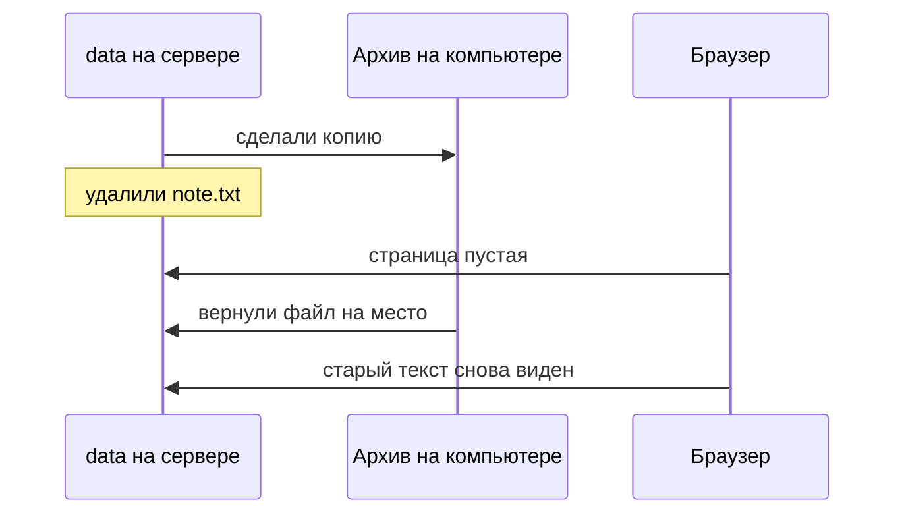

# Проверка восстановления

## Ситуация

Самая обидная история в этой профессии звучит так: копии исправно делались два года, а в день аварии распаковать оказалось нечего. Архив пустой, или в нём не та папка, или пароль от него никто не знает.

Механизм работал. Никто ни разу не проверил, что именно он производит.

## Зачем это нужно

Отсюда правило, которое стоит запомнить дословно:

> Бэкап, из которого вы ни разу не восстанавливались, — это не бэкап. Это надежда.

Восстановление — обязательная часть процесса, а не приятное дополнение. И проверять его надо в спокойной обстановке, а не в день аварии, когда руки трясутся.

Что именно мы проверяем:

- **архив открывается** — не побился при передаче;
- **внутри ожидаемые файлы** — а не пустая папка или не тот каталог;
- **после возврата на место сервис работает** — файл лёг туда, куда приложение смотрит;
- **в браузере виден старый текст** — вот это и есть настоящий критерий.

Первые три пункта можно проверить командами. Последний — только глазами.

!!! note "Новые слова"
    - **Учебная тревога (restore drill)** — специально устроенная потеря данных, чтобы потренировать восстановление.
    - **Целостность** — архив цел, внутри то, что ожидалось.
    - **Откат данных** — возврат к известному прошлому состоянию. Не путайте с откатом кода из модуля 8: здесь возвращаются именно данные.

## Как это устроено



Порядок действий важнее выбора инструментов:

1. Есть архив, который открывается на другой машине.
2. Текущую папку данных отложили в сторону, а не затёрли.
3. Распаковали копию на место.
4. Проверили права доступа.
5. Открыли сайт и прочитали глазами.
6. Записали дату проверки в инвентарь.

## Практика

Полный сценарий с учебной поломкой — в [лаборатории](../../labs/lab-06-polomka-i-otkat.md). Здесь разберём команды, которые там понадобятся.

### Шаг 1. Посмотреть содержимое архива до распаковки

**Зачем:** узнать, что внутри, не тронув при этом живые данные.

**Где вводить:** терминал сервера (`ssh ucheb`)

```bash
tar -tzf /tmp/pulse-data.tgz
```

**Что должно получиться:** список из двух строк — `data/` и `data/note.txt`.

!!! danger "Если в списке нет нужного файла — не распаковывайте"
    Распаковка поверх живых данных из неправильного архива превращает одну проблему в две. Сначала найдите правильный архив.

### Шаг 2. Отложить текущие данные в сторону

**Зачем:** если текущая заметка окажется новее архивной, вы сможете вернуться к ней. Переименовать всегда безопаснее, чем перезаписать.

**Где вводить:** терминал сервера

```bash
cd /opt/pulse
sudo mv data data.broken
ls -la
```

**Что должно получиться:** в списке есть `data.broken`, а папки `data` больше нет.

### Шаг 3. Распаковать копию

**Где вводить:** терминал сервера

```bash
cd /opt/pulse
sudo tar -xzf /tmp/pulse-data.tgz
ls -la data
```

Ключ `-x` означает «распаковать».

**Что должно получиться:** папка `data` снова существует, внутри `note.txt` с прежним текстом.

### Шаг 4. Вернуть права

**Зачем:** после распаковки файлы принадлежат администратору, а приложение работает под пользователем с номером 10001 и писать в них не сможет.

**Где вводить:** терминал сервера

```bash
sudo chown -R 10001:10001 /opt/pulse/data
ls -la /opt/pulse/data
```

**Что должно получиться:** в колонках владельца стоит `10001`, а не `root`.

### Шаг 5. Перезапустить и посмотреть глазами

**Где вводить:** терминал сервера

```bash
docker compose -f compose.caddy.yml restart
```

Затем откройте сайт в браузере.

**Что должно получиться:** на странице виден **тот самый текст**, который был до поломки. Не «файл вроде на месте», а конкретный знакомый текст.

### Шаг 6. Убрать отложенную папку и записать дату

**Где вводить:** терминал сервера

```bash
sudo rm -rf /opt/pulse/data.broken
```

Удаляйте только после того, как убедились в браузере, что всё вернулось.

В инвентарь добавьте строку: «Восстановление проверено такого-то числа, заняло столько-то минут». Второе число — это ваш реальный RTO.

## Проверка

- [ ] Содержимое архива проверено до распаковки.
- [ ] Текущие данные были отложены, а не затёрты.
- [ ] Права после распаковки возвращены пользователю 10001.
- [ ] В браузере виден прежний текст.
- [ ] Дата проверки и затраченное время записаны.

## Частые ошибки

!!! failure "Распаковать поверх, не глядя"
    Если живая заметка была новее архивной, вы её потеряли. Сначала переименуйте, потом распаковывайте.

!!! failure "Проверить только размер файла"
    Маленький размер бывает и у правильного архива, и у пустого. Смотрите список содержимого.

!!! failure "Восстановить и не открыть сайт"
    Файл может лечь не туда, куда смотрит приложение. Обнаружите через неделю, когда разбираться будет поздно.

!!! failure "Забыть про права и решить, что сломалось восстановление"
    Типичная картина: файл на месте, а приложение ругается на доступ. Лечится одной командой `chown`.

## Как это в больших командах

Раз в квартал копию базы поднимают на отдельный пустой сервер и прогоняют по ней короткий набор проверок. Время восстановления записывают в минутах.

Если проверка не прошла, бэкап официально считается неисправным, и чинят именно его — а не надеются, что в реальной аварии всё получится.

## Итог

Нет проверки — нет бэкапа. Вы знаете шесть шагов восстановления и знаете, что главный критерий — знакомый текст на экране.

Пора сломать учебные данные намеренно.

Далее: [Лаборатория. Поломка и откат](../../labs/lab-06-polomka-i-otkat.md).

!!! info "Нагрузка на учебный VPS"
    **Влезает в 1 ГБ.**
