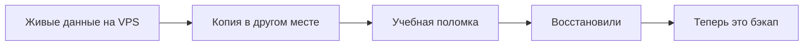

# Модуль 6. Данные и бэкапы

Сайт можно собрать заново из git и Docker. Заметку пользователя, базу, загруженные файлы — нельзя. Этот модуль закрывает второе правило прода: **есть копия, из которой вы уже восстанавливались**.

Уроки:

1. [Что бэкапить, а что нет](01-chto-bekapat.md)
2. [Правило 3-2-1](02-pravilo-321.md)
3. [Куда класть копию в РФ](03-kuda-klast-rf.md)
4. [Проверка восстановления](04-proverka-vosstanovleniya.md)
5. [Лаборатория. Поломка и откат](../../labs/lab-06-polomka-i-otkat.md)

**Нагрузка:** маленький файл «Пульса» — влезает в 1 ГБ / 10 ГБ. Отдельную «систему бэкапов уровня банка» не ставим.
