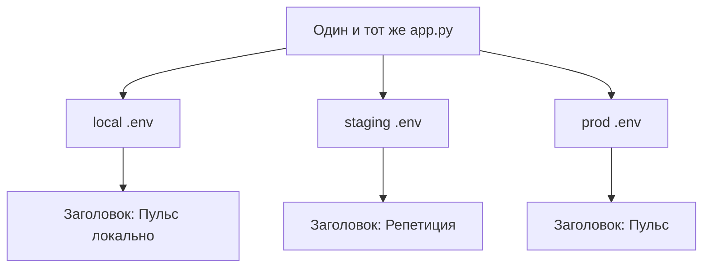

# Три среды и .env

## Ситуация

Вы хотите поменять заголовок на сайте и посмотреть, как получилось. Меняете прямо на рабочем сервере — потому что он один и другого нет.

Пока сайт учебный, ничего страшного. Но привычка опасная: рано или поздно такая правка попадёт в момент, когда сайтом пользуются люди. А чуть позже случается обратное — в рабочем окружении остаётся тестовый ключ или включённый режим отладки.

## Зачем это нужно

Один и тот же код может жить в нескольких мирах. Различаются в них три вещи: данные, ключи и цена ошибки.

**local — ваш компьютер.** Задача этого мира: ломать спокойно. Ключи учебные или вообще пустые. Упало — перезапустили, никто не заметил.

**staging — репетиция.** Задача: проверить выкладку в условиях, похожих на рабочие. Тот же Docker, но другой адрес, другие ключи, а данные можно сносить в любой момент.

**production — люди.** Задача: работать. Ключи настоящие, изменения только осознанные, эксперименты сюда не приносят.

### Как код узнаёт, в каком он мире

Через **переменные среды**. Это значения, которые программа читает из окружения при запуске, а не из зашитой в код строки.

«Пульс» уже устроен так: заголовок он берёт из переменной `PULSE_TITLE`. Меняя её, вы меняете поведение, не трогая `app.py`.

Файл `.env` — это просто удобный способ задать такие переменные. Правило его хранения одно и без исключений:

| Файл | В репозитории | Что внутри |
|---|---|---|
| `.env.example` | **да** | имена переменных без значений |
| `.env` | **никогда** | настоящие значения |

Три мира — три разных файла `.env`, а не один, скопированный всюду.

!!! warning "Про 1 ГБ"
    Отдельный сервер под репетицию на этом тарифе не обязателен. Но сама идея разных миров нужна всё равно: минимум «компьютер» и «сервер» с разными файлами `.env`.

!!! note "Новые слова"
    - **Переменная среды** — значение, которое процесс получает при старте от системы.
    - **`.env`** — текстовый файл со списком таких значений.
    - **`.env.example`** — образец с именами переменных, но без секретов.

## Как это устроено



Чего делать не надо: заводить три копии файла с кодом вроде `app-prod.py`. Исправление уедет в одну копию и забудется в другой, а разбираться вы будете через месяц.

## Практика

### Шаг 1. Посмотреть, что сейчас в файлах

**Где вводить:** терминал сервера (`ssh ucheb`)

```bash
cd /opt/pulse
cat .env.example
cat .env
ls -la .env
```

**Что должно получиться:**

- `.env.example` содержит имена переменных, значения пустые или примерные;
- `.env` содержит реальные значения;
- права у `.env` — `-rw-------`, то есть доступ только владельцу.

Если права другие:

```bash
chmod 600 .env
```

### Шаг 2. Поменять заголовок, не трогая код

**Зачем:** убедиться на практике, что поведение управляется переменными.

**Где вводить:** терминал сервера

```bash
nano /opt/pulse/.env
```

Найдите строку `PULSE_TITLE` и впишите `PULSE_TITLE=Пульс прод`. Сохранение: `Ctrl+O`, `Enter`, выход `Ctrl+X`.

Применяем:

```bash
cd /opt/pulse
docker compose -f compose.caddy.yml up -d --force-recreate
```

Ключ `--force-recreate` заставляет пересоздать контейнер. Без него процесс продолжит работать со старым окружением, потому что переменные читаются только при запуске.

**Что должно получиться:** откройте сайт с `Ctrl+F5` — заголовок изменился. Файл `app.py` при этом вы не трогали.

### Шаг 3. Убедиться, что переменная действительно дошла

**Где вводить:** терминал сервера

```bash
docker compose -f compose.caddy.yml exec pulse env | grep PULSE
```

**Что должно получиться:** строка `PULSE_TITLE=Пульс прод`.

Если переменной нет или значение старое, проверьте два места:

- в файле запуска должна быть строка `env_file: .env`;
- в разделе `environment:` не должно быть той же переменной с пустым значением — она перебьёт файл.

### Шаг 4. Завести свой файл на компьютере

**Где вводить:** PowerShell на вашем компьютере, в папке курса

```powershell
cd .\labs\pulse
copy .env.example .env
```

Впишите в него `PULSE_TITLE=Пульс локально`.

**Что должно получиться:** проверьте, что файл не попадёт в репозиторий:

```powershell
cd ..\..
git status
```

**Что должно получиться:** файла `.env` в списке изменений нет — он уже перечислен в исключениях.

## Проверка

- [ ] Вы поменяли заголовок сайта, не редактируя `app.py`.
- [ ] Знаете, зачем нужен `--force-recreate`.
- [ ] Умеете посмотреть переменные внутри работающего контейнера.
- [ ] `git status` не показывает файл `.env`.
- [ ] У `.env` на сервере права 600.

## Частые ошибки

!!! failure "Один файл .env, скопированный во все миры"
    Утечка из репетиционного окружения означает утечку из рабочего, потому что ключи одни и те же.

!!! failure "Записать ключ прямо в Dockerfile"
    Он попадёт в образ и уедет вместе с ним в любое хранилище. Секреты подставляются при запуске, а не при сборке.

!!! failure "Поменять .env и не пересоздать контейнер"
    Процесс помнит окружение, с которым стартовал. Изменения вступят в силу только после пересоздания.

!!! failure "Надеяться, что список исключений спасёт уже добавленный файл"
    Если `.env` однажды попал в репозиторий, он остаётся в истории. Нужна смена ключей плюс удаление файла из отслеживания.

## Как это в больших командах

Секреты лежат в отдельном защищённом хранилище и попадают в контейнер в момент запуска. Названия миров те же самые: dev, stage, prod.

На одном маленьком сервере вы воспроизводите ту же идею разными файлами — без сложных систем, но с той же дисциплиной.

## Итог

Код общий, значения разные, в репозитории только образец без секретов. Поведение меняется переменной, а не правкой файла.

Дальше — зачем нужна репетиция и как её устроить, когда сервер один.

Далее: [Staging как репетиция](02-staging.md).

!!! info "Нагрузка на учебный VPS"
    **Влезает в 1 ГБ.** Второй набор контейнеров рядом с рабочим не поднимайте, не посмотрев `free -h`.
