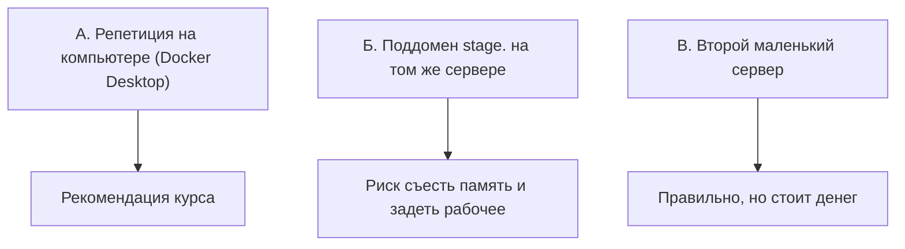

# Staging как репетиция

## Ситуация

Вы поправили код и хотите выложить новую версию. Единственный способ узнать, работает ли она, — выложить и посмотреть.

Если не работает, узнают об этом все, включая пользователей. И чинить вы будете в спешке, под настроение «скорее верни как было».

## Зачем это нужно

Нужно место, где новую версию можно посмотреть первым — до людей. Это и есть staging, репетиционный зал.

Он отвечает ровно на один вопрос: **новая версия вообще поднимается и открывается?** Не «всё ли идеально», а «встаёт или падает».

Чем staging похож на рабочее окружение и чем отличается:

| | Одинаково | По-другому |
|---|---|---|
| Способ запуска | Docker, тот же файл запуска | — |
| Адрес | — | другой домен или порт |
| Ключи | — | тестовые, не боевые |
| Данные | — | можно снести в любой момент |

Главное правило: **в репетиционное окружение не кладут боевые ключи.** Соблазн велик — лень заводить второй набор. Но именно так утечка из тестового контура становится утечкой из рабочего.

### Что реально доступно на 1 ГБ

Три варианта, и не все одинаково хороши:



**Рекомендация курса — вариант А.** Репетируйте на своём компьютере, а на сервере держите только рабочую версию.

Вариант Б допустим, только если `free -h` показывает несколько сотен свободных мегабайт, и вы помните, что ошибка в команде для репетиции может задеть рабочую папку.

Вариант В — правильный взрослый путь, к которому имеет смысл прийти, когда появятся живые пользователи.

!!! note "Новые слова"
    - **Дымовой тест (smoke test)** — короткий список проверок «не дымится ли». Не полное тестирование, а несколько главных сценариев.
    - **Прод-подобная среда** — окружение, максимально похожее на рабочее по способу запуска.

## Как это устроено

Дымовой список для любой среды — четыре пункта:

1. Проверка здоровья отвечает `{"status":"ok"}`.
2. Главная страница открывается.
3. Заметка сохраняется.
4. После обновления страницы текст на месте.

Если все четыре прошли — версия годится. Если нет — в рабочее окружение она не едет.

!!! danger "Репетиция не должна смотреть в рабочие данные"
    Если репетиционный контейнер подключит ту же папку `data`, он сотрёт живую заметку. У репетиции своя папка, всегда.

## Практика

### Шаг 1. Проверить, есть ли Docker на компьютере

**Где вводить:** PowerShell на вашем компьютере

```powershell
docker version
```

**Что должно получиться:** версии клиента и сервера. Если команда не найдена — Docker Desktop не установлен. Это не блокирует курс: пропустите шаги 2–4 и переходите к шагу 5.

### Шаг 2. Подготовить репетиционный запуск

**Где вводить:** PowerShell на вашем компьютере, в папке курса

```powershell
cd .\labs\pulse
copy .env.example .env
```

Откройте `.env` и впишите `PULSE_TITLE=Репетиция`. Так вы с первого взгляда отличите репетицию от рабочего сайта.

**Что должно получиться:** в папке `labs/pulse` появился файл `.env` со словом «Репетиция».

### Шаг 3. Запустить

**Где вводить:** PowerShell на вашем компьютере, в папке `labs/pulse`

```powershell
docker compose up -d --build
docker compose ps
```

**Что должно получиться:** контейнер в состоянии `Up`. Обратите внимание: это ваш компьютер, сервер тут ни при чём, его память не тратится.

### Шаг 4. Прогнать дымовой список

**Где вводить:** PowerShell на вашем компьютере

```powershell
curl http://127.0.0.1:8080/health
```

**Что должно получиться:** `{"status":"ok"}`.

Дальше в браузере по адресу `http://127.0.0.1:8080`:

- страница открывается, заголовок «Репетиция»;
- заметка сохраняется;
- после обновления страницы текст на месте.

Останавливаем, чтобы не мешало:

```powershell
docker compose down
```

### Шаг 5. Записать в инвентарь честный ответ

Впишите одну из строк:

- «Репетиция: локально, Docker Desktop»;
- «Репетиции нет, выкладываю сразу в рабочее — долг».

Оба варианта нормальны на старте. Ненормально — считать репетицией то, чего нет.

## Проверка

- [ ] Вы знаете, на какие четыре вопроса отвечает дымовой список.
- [ ] Понимаете, почему на 1 ГБ репетиция живёт на компьютере.
- [ ] У репетиционного окружения свои данные и свои ключи.
- [ ] В инвентаре записано честное положение дел.

## Частые ошибки

!!! failure "Подключить к репетиции рабочую папку данных"
    Репетиция сотрёт живую заметку. Папка должна быть своя.

!!! failure "Выложить на репетицию и не посмотреть самому"
    Тогда это декорация. Смысл в том, чтобы вы были первым пользователем новой версии.

!!! failure "Держать в репетиционном окружении боевой ключ платёжной системы"
    Для этого существуют тестовые магазины, об этом в модуле 15.

!!! failure "Поднять второй набор контейнеров на сервере, не посмотрев память"
    На 1 ГБ это заканчивается нехваткой памяти, и падает в первую очередь рабочая версия.

## Как это в больших командах

Есть отдельное имя вроде `staging.company.ru`, отдельная база и тот же самый механизм выкладки, что у рабочего окружения, но с другим набором секретов.

Действует жёсткое правило: пока репетиция «красная», в рабочее окружение ничего не едет.

На маленьком сервере вы сохраняете привычку репетировать, а не копируете всю инфраструктуру.

## Итог

Репетировать нужно, но на слабом сервере репетиция обычно живёт на вашем компьютере. Четыре пункта дымового списка — достаточный минимум.

Дальше — что делать, если ключ всё-таки утёк.

Далее: [Ротация ключа](03-rotaciya.md).

!!! info "Нагрузка на учебный VPS"
    **Локальная репетиция не нагружает сервер вовсе.** Второй набор контейнеров на сервере — только при явном запасе памяти.
