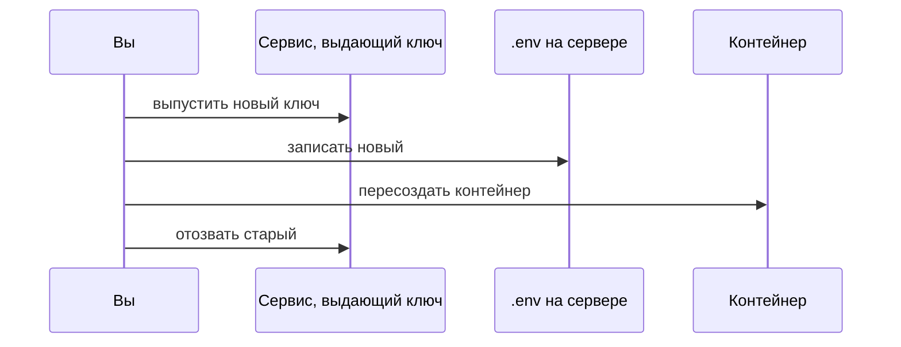

# Ротация: ключ засветился

## Ситуация

Вы отправили коллеге кусок конфигурации, чтобы он посмотрел ошибку. В нём оказался токен. Через минуту вы это заметили и удалили сообщение.

Сообщение исчезло с экрана. Токен — нет. Кто успел скопировать, тот уже может им пользоваться, и вы об этом не узнаете.

## Зачем это нужно

Утечку секрета нельзя отменить. Её можно только вылечить — выпустив новый ключ и выключив старый. Эта процедура называется ротацией.

Порядок действий здесь жёсткий, и оба способа его нарушить приводят к плохому:

| Ошибка | Что будет |
|---|---|
| выключили старый до того, как прописали новый | сервис лёг, пока вы возитесь |
| прописали новый, но не выключили старый | у постороннего по-прежнему есть доступ |

Правильная последовательность — пять шагов:

1. Выпустить новый секрет.
2. Прописать его туда, где он нужен.
3. Перезапустить то, что его читает.
4. Убедиться, что новый работает.
5. Отозвать старый и убедиться, что он больше не работает.

### Где искать следы утечки

Секрет редко утекает в одно место. Проверьте все:

- история репозитория — даже если файл удалён, он остался в прошлых версиях;
- журналы автоматических сборок;
- скриншоты в переписке и в документации;
- образы Docker, если ключ попал в них при сборке;
- задачи и комментарии в трекере.

!!! note "Новые слова"
    - **Ротация** — замена секрета на новый с отзывом старого.
    - **Отзыв (revoke)** — выключение старого секрета на стороне сервиса, который его выдал.
    - **Поверхность утечки** — полный список мест, где секрет мог оказаться.

## Как это устроено



«Сервис, выдающий ключ» у каждого секрета свой:

| Секрет | Где менять |
|---|---|
| Токен бота Telegram | BotFather |
| Ключ платёжной системы | личный кабинет ЮKassa |
| Ключ облачного хранилища | панель хостера |
| Ключ SSH | `ssh-keygen` плюс правка `authorized_keys` |

У SSH порядок немного свой: создать новый ключ на компьютере, добавить публичную часть на сервер, **проверить вход новым ключом в отдельном окне**, и только потом убрать старый из `authorized_keys` и удалить его с диска.

## Практика

### Шаг 1. Потренироваться на безопасном значении

**Зачем:** прогнать ритуал, ничего при этом не ломая. Заголовок сайта — не секрет, но последовательность действий та же.

**Где вводить:** терминал сервера (`ssh ucheb`)

```bash
cd /opt/pulse
nano .env
```

Замените значение `PULSE_TITLE` на `Пульс после ротации`.

```bash
docker compose -f compose.caddy.yml up -d --force-recreate
docker compose -f compose.caddy.yml exec pulse env | grep PULSE_TITLE
```

**Что должно получиться:** в выводе новое значение. В браузере после `Ctrl+F5` — новый заголовок.

### Шаг 2. Проверить, что старое значение нигде не зашито

**Зачем:** частая ловушка — значение поменяли в одном месте, а оно продолжает жить в другом.

**Где вводить:** терминал сервера

```bash
grep -R "Пульс прод" /opt/pulse --exclude-dir=data
```

**Что должно получиться:** пустой вывод. Если нашлось в `Dockerfile` или в файле запуска — значение зашито в сборку, и менять его через `.env` бесполезно.

### Шаг 3. Проверить историю репозитория

**Зачем:** убедиться, что секреты туда никогда не попадали.

**Где вводить:** PowerShell на вашем компьютере, в папке курса

```powershell
git log --all --full-history -- .env
```

**Что должно получиться:** пустой вывод — файла в истории не было.

Если что-то нашлось, значит, секреты в истории есть. Порядок действий: сначала сменить все засветившиеся ключи, потом убрать файл из отслеживания командой `git rm --cached .env`. Убирать из истории уже утёкший ключ бессмысленно — его всё равно надо менять.

### Шаг 4. Записать чеклист на будущее

Сохраните в инвентарь порядок действий для токена бота — он понадобится в модуле 11:

1. Выпустить новый токен в BotFather. Старый Telegram отключает сразу сам.
2. Прописать новый в `.env` на сервере.
3. Пересоздать контейнер, который его читает.
4. Отправить тестовое сообщение и убедиться, что доходит.
5. Проверить, нет ли старого токена в репозитории и скриншотах.

## Проверка

- [ ] Вы знаете правильный порядок пяти шагов и понимаете, чем плох каждый неправильный.
- [ ] Прогнали ритуал на безопасном значении.
- [ ] Проверили, что значение не зашито в сборку.
- [ ] Убедились, что `.env` никогда не попадал в историю репозитория.

## Частые ошибки

!!! failure "Поменять значение и не пересоздать контейнер"
    Процесс помнит окружение, с которым стартовал. Нового значения он не увидит.

!!! failure "Закоммитить новый ключ, чтобы не потерять"
    Вы только что повторили ту же утечку, от которой лечились.

!!! failure "Сменить пароль от панели хостера и не записать в менеджер паролей"
    Запрётесь сами, и доступ придётся восстанавливать через поддержку.

!!! failure "Считать, что удаление сообщения отзывает ключ"
    Не отзывает. Отзывает только действие в том сервисе, который ключ выдал.

## Как это в больших командах

Ключи выдаются на короткий срок и меняются автоматически. Есть предупреждение «этому ключу больше 90 дней, пора менять». Утечка считается инцидентом и разбирается по процедуре из модуля 12.

Ваш вариант — тот же процесс, записанный в пять строк в инвентаре.

## Итог

Новый ключ, прописать, перезапустить, проверить, отозвать старый. Именно в этом порядке.

Дальше — практика с двумя окружениями.

Далее: [Лаборатория. Два .env](../../labs/lab-07-dve-sredy.md).

!!! info "Нагрузка на учебный VPS"
    **Влезает в 1 ГБ.**
