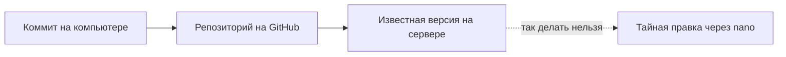

# Git как источник правды

## Ситуация

На рабочем столе лежат папки «pulse», «pulse-новый» и «pulse-финал-2-точно». Вчера сайт работал, сегодня нет, и вопрос «что именно изменилось» остаётся без ответа.

Ещё хуже другой вариант: вы поправили файл прямо на сервере через `nano`, потому что было срочно. Через неделю вы копируете на сервер файлы с компьютера — и это исправление бесследно исчезает.

## Зачем это нужно

Git — это история кода. Не хранилище файлов, не замена бэкапу данных, а именно история: кто, когда и **зачем** что-то изменил.

Три вещи, которые он даёт:

- **ответ на вопрос «что было вчера»** — можно посмотреть любую прошлую версию;
- **возможность вернуться** — откат к работавшей версии одной командой;
- **основу для автоматизации** — робот из следующего урока выкладывает не «файлы с вашего стола», а конкретную версию из истории.

### Ключевая идея: источник правды

Источник правды — это место, где лежит настоящая, актуальная версия кода. И это **репозиторий**, а не сервер и не ваш компьютер.

Сервер должен *получать* известную версию. Как только на сервере появляется правка, которой нет в репозитории, вы теряете возможность отвечать на вопрос «что сейчас работает».

| Что | Где живёт | Почему |
|---|---|---|
| Код приложения | репозиторий | его нужно версионировать |
| Файлы запуска, `Dockerfile` | репозиторий | это тоже код |
| `.env` | только на сервере | секреты |
| `data/` | только на сервере | данные, их лечит бэкап |

!!! note "Новые слова"
    - **Репозиторий** — папка с историей изменений. Сама история лежит в скрытом каталоге `.git`.
    - **Коммит** — снимок состояния файлов плюс сообщение «зачем».
    - **Ветка `main`** — основная линия истории, та, которую считают готовой к выкладке.
    - **Рабочее дерево** — файлы, которые вы видите сейчас. Пока вы не сделали коммит, они отличаются от последнего снимка.

## Как это устроено



Правило курса: сначала изменение в репозитории, потом на сервер. Исключения только два — `.env` и `data/`, они в репозиторий не попадают никогда.

### Про сообщения коммитов

Сообщение должно отвечать на вопрос «почему», а не «что». Через месяц вы будете искать причину изменения, а не имя файла.

| Плохо | Хорошо |
|---|---|
| `правки` | `Добавляет проверку здоровья в Пульс` |
| `фикс` | `Чинит права на папку данных после распаковки` |
| `файл 3` | `Переносит заголовок из кода в переменную среды` |

## Практика

### Шаг 1. Проверить, есть ли уже репозиторий

**Где вводить:** PowerShell на вашем компьютере, в папке курса

```powershell
git status
```

**Что должно получиться:** один из двух ответов:

- список изменённых файлов — репозиторий уже есть, переходите к шагу 3;
- `fatal: not a git repository` — репозитория нет, идите к шагу 2.

Если команда `git` вообще не найдена, установите Git с сайта git-scm.com.

### Шаг 2. Создать репозиторий

**Где вводить:** PowerShell на вашем компьютере, в папке курса

```powershell
git init
git status
```

**Что должно получиться:** сообщение о создании пустого репозитория, затем длинный список файлов в разделе «Untracked files».

### Шаг 3. Проверить, что секреты не попадут внутрь

**Зачем:** это надо сделать **до** первого добавления файлов, а не после.

**Где вводить:** PowerShell на вашем компьютере

```powershell
git status --short
```

**Что должно получиться:** в списке **не должно быть**:

- `.env` в любой папке;
- папки `.venv`;
- папки `site`;
- файлов с ключами SSH.

Если что-то из этого видно — не добавляйте ничего, сначала поправьте `.gitignore`.

### Шаг 4. Добавить файлы явными путями

**Зачем:** команда `git add .` хватает всё подряд, включая то, чего вы не заметили. Пока не привыкли — перечисляйте явно.

**Где вводить:** PowerShell на вашем компьютере

```powershell
git add README.md mkdocs.yml requirements.txt .gitignore docs labs
git status --short
```

**Что должно получиться:** список файлов с пометкой `A` (добавлен). Прочитайте его глазами — секретов там быть не должно.

### Шаг 5. Сделать первый снимок

**Где вводить:** PowerShell на вашем компьютере

```powershell
git commit -m "Добавляет учебник курса и учебное приложение Пульс"
```

**Что должно получиться:** строка с количеством изменённых файлов.

Смотрим историю:

```powershell
git log --oneline -5
```

**Что должно получиться:** список последних снимков — по одной строке на каждый, с коротким идентификатором и вашим сообщением.

### Шаг 6. Убедиться, что секретов нет в истории

**Где вводить:** PowerShell на вашем компьютере

```powershell
git log --all --full-history -- .env
git log --all --full-history -- "**/.env"
```

**Что должно получиться:** пустой вывод в обоих случаях. Если что-то нашлось — секреты в истории, их надо менять по процедуре ротации из модуля 7.

## Проверка

- [ ] `git status` показывает понятное состояние.
- [ ] Ни один файл `.env` не отслеживается.
- [ ] Сделан первый коммит с осмысленным сообщением.
- [ ] Вы знаете, что `data/` и `.env` в репозиторий не попадают.
- [ ] История не содержит секретов.

## Частые ошибки

!!! failure "Команда git add с точкой"
    Слишком легко захватить `.env` или ключ. Пока не выработалась привычка проверять, добавляйте пути явно.

!!! failure "Добавить в репозиторий собранный сайт"
    Папка `site` — это результат сборки. Источник находится в `docs`. Хранить обе версии — значит получать конфликты на пустом месте.

!!! failure "Править файлы прямо на сервере"
    Либо следующее копирование затрёт вашу правку, либо репозиторий навсегда разойдётся с реальностью. Ломайте эту привычку сразу.

!!! failure "Писать в сообщении коммита «правки»"
    Через месяц это сообщение не поможет ни вам, ни кому-либо ещё.

## Как это в больших командах

Основная ветка защищена: напрямую в неё не пишут, изменения проходят через проверку. Серверы руками не редактируют вообще — считается, что любая ручная правка потеряется.

Вы осваиваете ту же дисциплину на одном репозитории, и она полностью переносится.

## Итог

История в репозитории, секреты и данные — за его пределами. Сервер получает известную версию, а не живёт своей жизнью.

Дальше — как поручить выкладку роботу.

Далее: [Что такое CI/CD](02-cicd.md).

!!! info "Нагрузка на учебный VPS"
    **Нулевая.** Git работает на вашем компьютере и на GitHub.
