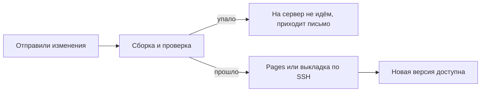

# Что такое CI/CD

## Ситуация

Выкладка вручную выглядит так: скопировать файлы, собрать, перезапустить, открыть и проверить. Четыре шага, ничего сложного.

Сложность появляется на десятый раз, вечером, когда вы устали. Один шаг пропущен, и вы уже не помните, какой именно. Сайт ведёт себя странно, а в голове только «кажется, я это уже делала».

## Зачем это нужно

Робот не умнее вас. Его преимущество в другом: он **повторяем**. Каждый шаг записан в журнал, пропуск шага виден сразу, а сломанную сборку он на сервер не понесёт.

Эти буквы обозначают две соседние работы, и их полезно различать.

**CI** (непрерывная интеграция) отвечает на вопрос: **можно ли это выпускать?** На каждое изменение робот проверяет, собирается ли проект и не сломан ли синтаксис. Слово «непрерывная» означает, что проверка происходит на каждое изменение, а не раз в месяц перед показом.

**CD** отвечает на вопрос: **куда положить результат?** У этой буквы два оттенка:

- *delivery* — готовый результат собран и лежит наготове;
- *deployment* — результат уже там, где его откроют люди.

В разговоре обычно говорят просто «деплой». Важно не название, а куда именно робот кладёт результат.

### Два разных робота в этом курсе

Их нельзя путать, потому что цена ошибки разная.

| | Робот 1: учебник | Робот 2: «Пульс» |
|---|---|---|
| Что делает | собирает сайт курса | обновляет приложение на сервере |
| Куда кладёт | GitHub Pages | ваш VPS по SSH |
| Трогает ли сервер | нет | да |
| Цена ошибки | сайт курса не обновился | приложение перезапустилось или легло |
| Когда включать | **первым** | когда ручной путь стал безошибочным |

Начинайте с первого. Он ничего не может сломать на вашем сервере, зато даёт понять, как устроены роботы вообще.

!!! note "Новые слова"
    - **Пайплайн** — цепочка шагов: взять код, поставить зависимости, собрать, выложить. Упал шаг — дальше не идём.
    - **Раннер** — компьютер, на котором эти шаги выполняются.
    - **Артефакт** — результат сборки: папка с готовым сайтом, образ Docker.

!!! warning "Раннер — не ваш сервер"
    Для публичных репозиториев шаги выполняются в облаке GitHub, бесплатно. Собирать учебник на машине с 1 ГБ — тратить её память и диск на работу, которую кто-то готов сделать за вас.

## Как это устроено



Ключевая развилка — посередине. Если сборка не прошла, дальше не идёт **ничего**. Это и есть защита от «выложила сломанное».

Откат при этом мыслится просто: репозиторий помнит предыдущую версию, и робот может выложить её точно так же. Это не волшебная кнопка отмены, а возврат к известному хорошему состоянию.

## Практика

### Шаг 1. Посмотреть готовые примеры

**Где смотреть:** папка курса на вашем компьютере:

- `labs/ci/pages.yml` — сборка и публикация учебника;
- `labs/ci/deploy-pulse.example.yml` — схема выкладки «Пульса».

**Что должно получиться:** вы увидите файлы в формате YAML со списком шагов. Пока не нужно понимать каждую строку — достаточно узнать структуру: когда запускать, на чём запускать, какие шаги выполнить.

!!! danger "Второй файл не включайте сразу"
    Он ходит на ваш сервер и перезапускает приложение. Сначала разберитесь с первым.

### Шаг 2. Найти в примере три части

Откройте `labs/ci/pages.yml` и найдите:

- **`on:`** — условие запуска, то есть когда робот просыпается;
- **`runs-on:`** — на какой машине выполняются шаги;
- **`steps:`** — сами шаги по порядку.

**Что должно получиться:** вы можете показать пальцем на каждую из трёх частей. Этого достаточно, чтобы читать чужие пайплайны.

### Шаг 3. Нарисовать свой пайплайн на бумаге

**Зачем:** пока схема не уложилась в голове, чужой YAML выглядит как шум.

Нарисуйте три квадрата и подпишите под каждым, **зачем** он нужен:

1. Проверка — что проверяем и что будет, если не пройдёт.
2. Сборка — что получается на выходе.
3. Выкладка — куда именно кладём результат.

### Шаг 4. Убедиться, что ручной путь работает

**Зачем:** робот повторяет ваши действия. Если вручную выкладка не получается, автоматизация только запутает.

**Где вводить:** PowerShell на вашем компьютере, в папке курса

```powershell
.\.venv\Scripts\Activate.ps1
mkdocs build --strict
```

**Что должно получиться:** `Documentation built in ... seconds` без ошибок. Именно эту команду и будет выполнять робот.

Если сборка падает у вас, она упадёт и у него. Чините сначала здесь.

## Проверка

- [ ] Вы можете объяснить разницу: CI отвечает «можно ли», CD — «куда положить».
- [ ] Понимаете, почему раннер не должен жить на вашем сервере.
- [ ] Различаете двух роботов курса и знаете, какой безопаснее.
- [ ] Ручная сборка учебника проходит без ошибок.

## Частые ошибки

!!! failure "Включить выкладку без проверки"
    Сломанный сайт уедет к людям. Сначала сборка, потом публикация — именно в таком порядке.

!!! failure "Сделать раннером свой VPS"
    Сборка съест память и диск машины, на которой работает ваше приложение.

!!! failure "Положить секреты в файл пайплайна"
    Этот файл лежит в репозитории и виден всем, у кого есть доступ. Секреты хранятся в настройках репозитория, об этом следующий урок.

!!! failure "Автоматизировать процесс, который вручную не работает"
    Робот воспроизведёт вашу ошибку быстрее и чаще. Сначала отладьте руками.

## Как это в больших командах

Пайплайнов несколько, у опасных шагов стоит ручное подтверждение «да, выкладываем». Шаги для репетиционного и рабочего окружений одинаковые, отличаются только наборы секретов.

Инструменты разные — GitHub Actions, GitLab CI, собственные раннеры — но три квадрата на бумаге везде те же самые.

## Итог

Робот повторяет ваш ручной путь и останавливается, если путь сломан. Первым делом автоматизируем учебник, а не приложение.

Дальше — как устроен такой робот и куда класть секреты.

Далее: [GitHub Actions и секреты](03-actions-i-sekrety.md).

!!! info "Нагрузка на учебный VPS"
    **Сборка идёт не на вашем сервере.** Выкладка «Пульса» по SSH создаёт ту же короткую нагрузку, что и ваш ручной вход.
