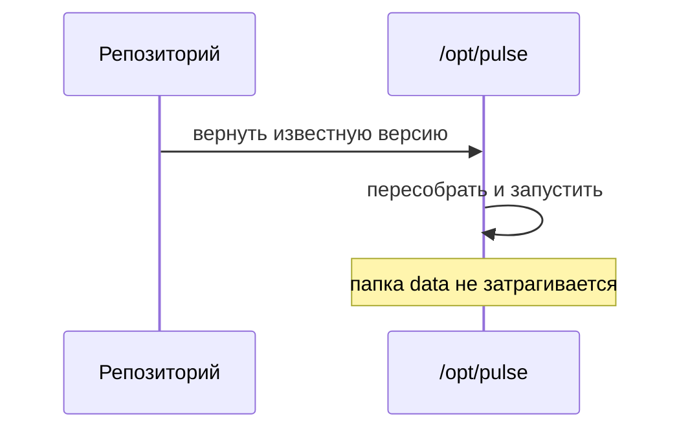

# Откат и GitHub Pages

## Ситуация

Вы выложили новую версию, и она оказалась хуже старой. Что-то не открывается, что-то выглядит сломанным.

Без заранее продуманного отката дальше начинается починка в панике: правки наугад, перезапуски, попытки вспомнить, как было. Обычно это занимает больше времени, чем сам сбой.

## Зачем это нужно

Правильная реакция на плохую версию — не «чинить», а **вернуть известное хорошее состояние**. Чинить можно потом, спокойно.

Это работает, потому что репозиторий помнит все предыдущие версии. Откат — это не волшебная кнопка отмены, а обычная выкладка, только выкладывают не новую версию, а предыдущую.

!!! danger "Откатывается код, не данные"
    Возврат к прошлой версии касается приложения и файлов запуска. Папку `data` он не трогает и трогать не должен — за данные отвечает бэкап из модуля 6.

    Особенно важно: при откате **никогда** не используйте флаг `-v` у команды остановки. Он удалит тома вместе с сертификатами и данными.

### GitHub Pages как безопасный первый «продакшен»

Pages — бесплатный хостинг статических сайтов от GitHub. Сломать там что-то не страшно: ваш сервер и «Пульс» никак не затронуты.

| | Pages | Ваш сервер |
|---|---|---|
| Что лежит | учебник курса | приложение «Пульс» |
| Кто пострадает при ошибке | никто | вы и пользователи |
| Как откатить | повторить прошлую сборку | вернуть прошлую версию кода |

!!! note "Новые слова"
    - **Откат (rollback)** — возврат к предыдущей известной работающей версии.
    - **`site_url`** — поле в `mkdocs.yml`, где указан адрес публикации. Если оно не совпадёт с реальным адресом, оформление и ссылки поедут.
    - **`gh-deploy`** — команда, которая сама собирает сайт и публикует его. Удобна для ручной выкладки.

## Как это устроено

Откат приложения на сервере:



Откат учебника на Pages устроен ещё проще: в разделе Actions открыть прошлый успешный запуск и повторить его.

## Практика

### Шаг 1. Убедиться, что сборка проходит локально

**Зачем:** робот выполняет ту же команду. Если она падает у вас, она упадёт и у него.

**Где вводить:** PowerShell на вашем компьютере, в папке курса

```powershell
.\.venv\Scripts\Activate.ps1
mkdocs build --strict
```

**Что должно получиться:** `Documentation built in ... seconds` и никаких предупреждений. Ключ `--strict` превращает предупреждения в ошибки — это полезно, потому что битую ссылку лучше найти сейчас.

### Шаг 2. Указать адрес публикации

**Где смотреть:** файл `mkdocs.yml` в папке курса, поле `site_url`.

Впишите адрес вида:

```
site_url: https://ВАШ_ЛОГИН.github.io/DevOPS_SRE_course/
```

**Что должно получиться:** адрес заканчивается косой чертой и точно совпадает с тем, что покажет GitHub в настройках Pages. Несовпадение ломает оформление сайта.

### Шаг 3. Положить описание робота на место

**Где вводить:** PowerShell на вашем компьютере, в папке курса

```powershell
mkdir -Force .github\workflows
copy .\labs\ci\pages.yml .github\workflows\pages.yml
```

**Что должно получиться:** файл появился в папке `.github/workflows`. Именно там GitHub его ищет — в другом месте он не сработает.

### Шаг 4. Посмотреть историю версий

**Зачем:** чтобы знать, куда откатываться, надо уметь читать список версий.

**Где вводить:** PowerShell на вашем компьютере

```powershell
git log --oneline -10
```

**Что должно получиться:** десять строк, в каждой короткий идентификатор версии и ваше сообщение. Идентификатор — это и есть адрес, по которому можно вернуться.

### Шаг 5. Потренировать откат приложения (без риска)

**Зачем:** посмотреть команды заранее, чтобы в реальной ситуации не искать их.

Порядок отката приложения на сервере выглядит так:

**Где вводить:** терминал сервера (`ssh ucheb`)

```bash
cd /opt/pulse
docker compose -f compose.caddy.yml ps
```

**Что должно получиться:** вы видите текущее состояние — от чего откатываетесь.

Дальше, если папка `/opt/pulse` получена из репозитория:

```bash
git log --oneline -5
git checkout ИДЕНТИФИКАТОР_ВЕРСИИ
docker compose -f compose.caddy.yml up -d --build
```

Если папка копировалась вручную через `scp`, откат означает скопировать файлы из прошлой версии с компьютера. Именно поэтому модуль настаивал на репозитории: с ним откат занимает минуту.

### Шаг 6. Записать процедуру в инвентарь

Три строки, которые пригодятся в плохой день:

1. Как посмотреть текущую версию.
2. Как вернуться к предыдущей.
3. Что при этом **нельзя** делать (удалять тома).

## Проверка

- [ ] Локальная строгая сборка проходит без ошибок.
- [ ] `site_url` совпадает с реальным адресом публикации.
- [ ] Описание робота лежит в `.github/workflows`.
- [ ] Вы умеете посмотреть список версий и знаете, что такое идентификатор версии.
- [ ] Понимаете, что откат не касается данных.

## Частые ошибки

!!! failure "Адрес публикации не совпадает с настройками"
    Сайт откроется, но без оформления: стили и ссылки ищутся по неверному пути. Сверьте адрес с тем, что показывает GitHub.

!!! failure "Откатить код и заодно удалить тома"
    Флаг `-v` унесёт данные и сертификаты. Откат касается только кода.

!!! failure "Надеяться на бесплатные Pages для закрытого репозитория"
    На бесплатном тарифе публикация закрытых репозиториев бывает недоступна. Варианты: сделать репозиторий публичным (убедившись, что секретов в нём нет) или выложить учебник на свой сервер позже.

!!! failure "Чинить сломанную версию вместо отката"
    Сначала вернуть работающее состояние, потом разбираться. В обратном порядке простой длится дольше.

## Как это в больших командах

Откат — отдельная кнопка «вернуть предыдущий выпуск». Образы помечены идентификаторами версий, поэтому всегда понятно, что именно сейчас работает.

Отдельная сложность — база данных: изменения её структуры откатываются не всегда, и это планируют заранее. У вас этой проблемы пока нет.

## Итог

Первым автоматизируем учебник — там ошибка ничего не стоит. Откат означает вернуть известную работающую версию, а не чинить наугад.

Далее: [Лаборатория. Pages и деплой](../../labs/lab-08-pages-i-deploy.md).

!!! info "Нагрузка на учебный VPS"
    **Публикация учебника не нагружает сервер вовсе.** Откат приложения — такая же нагрузка, как обычная выкладка.
