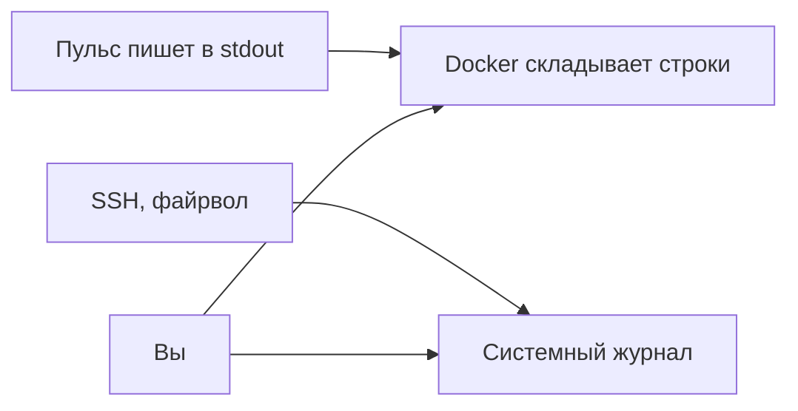

# Что такое лог и уровни

## Ситуация

Сайт вёл себя странно, а теперь снова работает. Что именно случилось — непонятно. В голове остаются формулировки «вроде тормозило» и «кажется, не сохранилось».

С такими данными починить ничего нельзя. Нужны факты: в 16:12 приложение не смогло записать файл, потому что закончилось место.

## Зачем это нужно

Лог — это дневник программы. Каждая строка отвечает на вопрос **что произошло в конкретный момент**.

Это самый дешёвый способ понимать, что творится на сервере. Никаких систем графиков для этого не нужно — логи уже есть, их надо только прочитать.

### Откуда берутся строки

Программа не «пишет в файл» — она просто говорит в два стандартных потока:

- обычный поток вывода (`stdout`) — для обычных событий;
- поток ошибок (`stderr`) — для проблем.

Docker подхватывает оба и складывает. Службы самой Ubuntu — SSH, файрвол — пишут в свой системный журнал. Получается два дневника, но идея одна: время плюс смысл события.

### Уровни: не все строки одинаково важны

| Уровень | Что означает | Когда нужен |
|---|---|---|
| `debug` | подробности для разработки | только во время разбора поломки |
| `info` | нормальные события: запустился, слушает порт | всегда |
| `warning` | странно, но работаем | всегда |
| `error` | конкретное действие не удалось | всегда |
| `critical` | пора будить человека | всегда |

Уровень `debug` в постоянной работе не оставляют: он производит огромное количество строк и способен забить диск на 10 ГБ за считанные дни.

### Какой должна быть строка

Хорошая строка содержит четыре вещи: время, уровень, что делали, чем закончилось.

```
2026-09-25 16:12:01 error req=a1b2 не удалось сохранить заметку: нет места на диске
```

Плохая строка — просто слово `Exception` без времени и подробностей.

!!! danger "Что в логи не пишут никогда"
    - пароли и токены;
    - номера карт целиком;
    - персональные данные «на всякий случай»;
    - тело платёжного запроса целиком.

    Дневник, в который попал секрет, сам становится утечкой. И удалить его оттуда обычно уже нельзя.

!!! note "Новые слова"
    - **stdout / stderr** — два потока, в которые говорит любая программа.
    - **journald** — системный журнал Ubuntu.
    - **Идентификатор запроса** — номер, по которому можно найти в каше строк одну конкретную попытку. «Пульс» печатает его, если клиент прислал заголовок `X-Request-Id`.

## Как это устроено



## Практика

### Шаг 1. Посмотреть, что пишет «Пульс»

**Где вводить:** терминал сервера (`ssh ucheb`)

```bash
cd /opt/pulse
docker compose -f compose.caddy.yml logs pulse --tail=20
```

**Что должно получиться:** несколько строк. Среди них — сообщение о запуске и прослушивании порта, а также записи о запросах, если вы открывали сайт.

Если строк нет вовсе, откройте сайт в браузере и повторите команду.

### Шаг 2. Увидеть свой собственный запрос в логе

**Зачем:** понять на практике, как работает поиск по идентификатору.

**Где вводить:** терминал сервера

```bash
curl -s -H "X-Request-Id: urok9" http://127.0.0.1:8080/health
docker compose -f compose.caddy.yml logs pulse --tail=10 | grep urok9
```

Если порт 8080 уже закрыт после модуля 5, обратитесь по своему домену:

```bash
curl -s -H "X-Request-Id: urok9" https://pulse.ваш-домен.ru/health
```

**Что должно получиться:** строка с вашей меткой `urok9`. Так в реальном разборе находят конкретную попытку конкретного человека среди тысяч строк.

### Шаг 3. Посмотреть, где именно приложение пишет строки

**Где смотреть:** файл `labs/pulse/app.py` в папке курса, метод `log_message`.

**Что должно получиться:** вы видите, что каждый запрос оставляет строку. Никакой магии — это обычный вывод в поток.

### Шаг 4. Определить уровень для трёх событий

Проверьте себя: какой уровень уместен?

| Событие | Уровень |
|---|---|
| Процесс запустился и слушает порт | `info` |
| Кто-то открыл несуществующий адрес | `info` или `warning` |
| Нет прав на запись в папку данных | `error` |

## Проверка

- [ ] Вы нашли в логе собственный запрос по метке.
- [ ] Можете назвать четыре части хорошей строки лога.
- [ ] Знаете, чего в логи не пишут.
- [ ] Понимаете, что `docker compose logs` — это уже полноценные логи.

## Частые ошибки

!!! failure "Оставить подробный режим включённым навсегда"
    Диск на 10 ГБ забивается, а в потоке подробностей легко утекает лишнее. Подробный режим включают на время разбора и выключают после.

!!! failure "Записывать в лог содержимое платежа целиком"
    Там могут оказаться данные карты. Записывают идентификатор платежа, а не всё сообщение.

!!! failure "Считать, что логов нет, потому что нет системы графиков"
    Логи есть с первого дня. Системы графиков только делают их удобнее.

!!! failure "Писать строку без времени"
    Без времени строку невозможно сопоставить с тем, что видел человек.

## Как это в больших командах

Строки уезжают в центральное хранилище, где их можно искать по всем серверам сразу. Формат при этом строгий: обязательные поля времени, уровня, сообщения и идентификатора запроса.

Вы уже соблюдаете главное правило: одна строка — одно событие, без секретов.

## Итог

Лог — дневник с отметками серьёзности. Он есть у вас уже сейчас, и в нём можно найти конкретный запрос.

Дальше — где именно искать, когда что-то сломалось.

Далее: [Где смотреть](02-gde-smotret.md).

!!! info "Нагрузка на учебный VPS"
    **Влезает в 1 ГБ.** Чтение логов ничего не потребляет.
