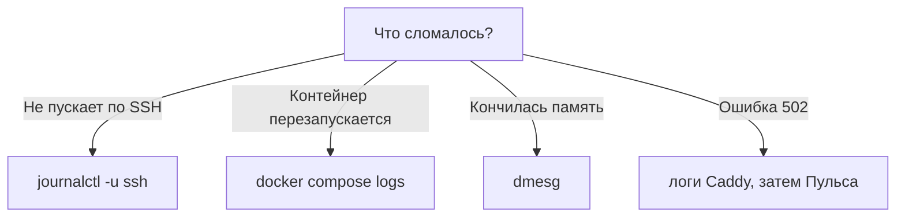

# Где смотреть: journalctl и docker logs

## Ситуация

Что-то сломалось. Вы вводите команду, видите пустой вывод и делаете вывод: «логов нет».

Логи есть. Вы смотрите не в тот ящик. Следы приложения и следы системы лежат в разных местах, и знание, куда заглянуть первым, экономит половину времени разбора.

## Зачем это нужно

Ящиков всего три, и у каждого своя зона ответственности.

**`docker compose logs`** — что писали ваши контейнеры: приложение и вахтёр. Если «Пульс» не может сохранить заметку, строка будет здесь.

**`journalctl`** — что делала сама Ubuntu: служба Docker, SSH, файрвол. Если после перезагрузки не пускает по SSH, смотреть надо сюда (через консоль хостера, раз SSH не работает).

**`dmesg`** — сообщения ядра. Главное, что там ищут, — нехватка памяти.

### Куда идти в зависимости от симптома

| Что случилось | Куда смотреть |
|---|---|
| Контейнер перезапускается по кругу | `docker compose logs` |
| Сайт отвечает ошибкой 502 | логи Caddy, потом логи приложения |
| Не пускает по SSH | `journalctl -u ssh` через консоль хостера |
| Сервер завис и перезагрузился | `dmesg` на предмет нехватки памяти |
| Docker не запустился | `journalctl -u docker` |

Порядок поиска: сначала приложение, потом вахтёр, потом система. Не наоборот.

!!! note "Новые слова"
    - **journalctl** — команда для чтения системного журнала Ubuntu.
    - **Ротация логов** — автоматическое удаление старых записей, чтобы они не съели диск.
    - **`--no-pager`** — показать вывод сразу, без постраничного просмотра, из которого надо выходить клавишей `q`.

!!! warning "Ротация — не мелочь"
    Без ограничения на размер успешный сайт забьёт диск собственными логами. У «Пульса» потолок уже задан в файле запуска строкой `max-size: 2m`.

## Как это устроено



## Практика

### Шаг 1. Прочитать логи приложения

**Где вводить:** терминал сервера (`ssh ucheb`)

```bash
cd /opt/pulse
docker compose -f compose.caddy.yml logs pulse --tail=50 --timestamps
```

Разбор ключей: `--tail=50` показывает последние 50 строк, `--timestamps` добавляет точное время.

**Что должно получиться:** строки с временем слева. Если вывод пустой, контейнер только что создан и ещё ничего не написал.

### Шаг 2. Прочитать логи вахтёра

**Где вводить:** терминал сервера

```bash
docker compose -f compose.caddy.yml logs caddy --tail=50
```

**Что должно получиться:** записи о запуске и о полученном сертификате. Именно здесь появится причина, если сайт отвечает ошибкой 502.

### Шаг 3. Посмотреть, что говорит система

**Где вводить:** терминал сервера

```bash
sudo systemctl status docker
sudo journalctl -u docker --since "30 min ago" --no-pager
```

**Что должно получиться:**

- первая команда показывает `Active: active (running)`, выход по клавише `q`;
- вторая печатает события службы Docker за последние полчаса.

Ключ `--since` понимает человеческие формулировки: `"30 min ago"`, `"1 hour ago"`, `"today"`.

### Шаг 4. Проверить журнал SSH

**Где вводить:** терминал сервера

```bash
sudo journalctl -u ssh --since "1 hour ago" --no-pager | tail -20
```

**Что должно получиться:** записи о входах. Среди них вы найдёте свой сегодняшний вход.

Пустой вывод — это тоже информация: за указанный период событий не было. Увеличьте промежуток в `--since`.

### Шаг 5. Проверить, не было ли нехватки памяти

**Где вводить:** терминал сервера

```bash
sudo dmesg -T | grep -i -E "killed process|out of memory"
```

**Что должно получиться:** в норме — пустой вывод. Если строки есть, там указано, какой процесс система остановила и когда. Это объясняет загадочные зависания.

### Шаг 6. Посмотреть, сколько места занимают журналы

**Зачем:** на диске 10 ГБ логи способны стать проблемой.

**Где вводить:** терминал сервера

```bash
sudo journalctl --disk-usage
docker system df
df -h /
```

**Что должно получиться:**

- размер системного журнала, обычно десятки мегабайт;
- таблица с объёмом образов и контейнеров;
- общее заполнение диска.

Запишите эти числа — с ними будет что сравнивать, когда место начнёт кончаться.

## Проверка

- [ ] Вы без подсказки выбираете ящик по симптому.
- [ ] Умеете задать промежуток времени через `--since`.
- [ ] Знаете, как выйти из постраничного просмотра (клавиша `q`).
- [ ] Проверили, не было ли нехватки памяти.
- [ ] Записали текущие объёмы журналов и диска.

## Частые ошибки

!!! failure "Смотреть логи не того контейнера"
    Проверьте имена командой `docker ps -a`. Логи Caddy и логи приложения — разные вещи.

!!! failure "Запросить пять последних строк, когда ошибка была час назад"
    Увеличьте `--tail` или задайте промежуток через `--since`.

!!! failure "Хранить логи без ограничения размера"
    Через месяц диск кончится, и упадёт всё сразу. Потолок задают один раз в файле запуска.

!!! failure "Искать причину отказа SSH в логах Docker"
    Это разные ящики. Проблемы с доступом на сервер смотрят в системном журнале.

## Как это в больших командах

Вопрос формулируется так же: «покажи ошибки за последние пятнадцать минут у такого-то сервиса». Отличается только интерфейс — вместо команд удобный поиск по всем серверам сразу.

На маленьких машинах команды Linux никуда не исчезают и остаются первым инструментом.

## Итог

Три ящика: контейнеры, система, ядро. Симптом подсказывает, какой открывать первым.

Дальше — как из отдельных строк собрать вывод о причине.

Далее: [Расследование по следам](03-rassledovanie.md).

!!! info "Нагрузка на учебный VPS"
    **Влезает в 1 ГБ.**
