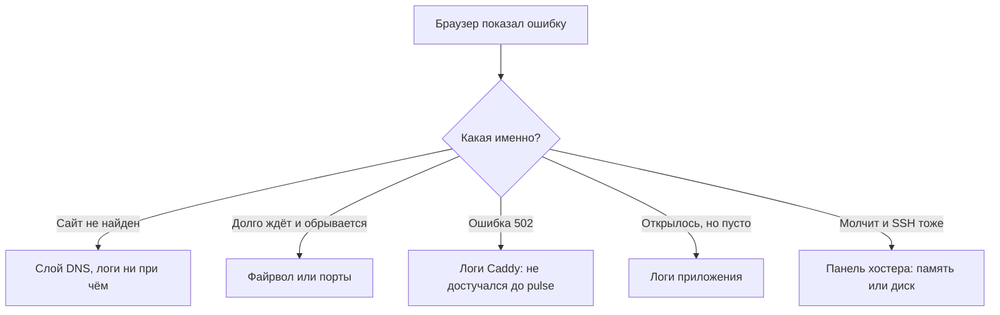

# Расследование по следам

## Ситуация

Сайт не открывается. Первый порыв — начать что-нибудь делать: перезапустить контейнер, потом поправить DNS, потом перезагрузить сервер.

Иногда это помогает. Проблема в том, что вы не узнаете, что именно помогло, и в следующий раз будете перебирать всё заново.

## Зачем это нужно

Нужен порядок, который приводит к ответу «сломан вот этот слой» — и только потом к лечению.

Слоёв немного, и симптом почти всегда указывает на один из них:

| Слой | Симптом |
|---|---|
| DNS | браузер пишет, что не нашёл такой сайт |
| Файрвол или сеть | запрос долго ждёт и обрывается |
| Вахтёр | ошибка 502 — Caddy жив, а за ним никого |
| Контейнер | сайт открывается, но ведёт себя неправильно |
| Диск или память | не отвечает вообще ничего, включая SSH |

Главное правило разбора формулируется в одну строку:

> Одна гипотеза — одна проверка — один вывод.

Если поменять DNS, файрвол и файл запуска одновременно и всё заработает, вы не узнаете причину. А значит, она вернётся.

### Пять строк, которые стоит записать

Это заготовка описания инцидента из модуля 12. Записывать лучше по ходу, а не потом по памяти.

1. Что видел человек — точный текст ошибки.
2. Отвечает ли SSH: да или нет.
3. Что показывает `docker compose ps`.
4. Последние 30 строк логов.
5. Вывод: сломан слой такой-то.

!!! warning "Сверяйте время"
    Частая ловушка: вы смотрите логи за вчера, а упало полчаса назад. Проверьте время на сервере командой `date` и сопоставьте с тем, когда вы открывали браузер.

!!! note "Новые слова"
    - **Слой** — уровень, на котором может сломаться путь запроса.
    - **Гипотеза** — предположение вида «Caddy не видит Пульс», которое проверяется одной командой.
    - **502** — ответ, означающий «вахтёр работает, но тот, к кому он обратился, не ответил».

## Как это устроено



### Как читать типовые строки

| Что в логе | Что это значит |
|---|---|
| `dial tcp: lookup pulse` в логах Caddy | вахтёр не нашёл контейнер по имени: разные сети или контейнер не запущен |
| `PermissionError: '/data/note.txt'` | нет прав на папку данных, лечится `chown` |
| Python с указанием файла и строки | ошибка в самом коде |
| `Out of memory` в `dmesg` | не хватило памяти, разбирайтесь с лимитами |

## Практика

### Шаг 1. Сверить время на сервере

**Где вводить:** терминал сервера (`ssh ucheb`)

```bash
date
```

**Что должно получиться:** текущее время. Запомните разницу с вашими часами, если сервер живёт в другом часовом поясе.

### Шаг 2. Пройти по слоям сверху вниз

Это последовательность, которую стоит выполнять именно в таком порядке.

**Где вводить:** терминал сервера

```bash
cd /opt/pulse
docker compose -f compose.caddy.yml ps
```

**Что должно получиться:** состояние контейнеров. Возможные варианты и что они значат:

- `Up` у обоих — процессы живы, ищите причину выше по пути запроса;
- `Exited` — процесс упал, смотрите логи;
- `Restarting` — падает при каждом запуске, смотрите логи обязательно.

### Шаг 3. Прочитать логи того, кто сломался

**Где вводить:** терминал сервера

```bash
docker compose -f compose.caddy.yml logs --tail=30 --timestamps
```

**Что должно получиться:** последние события обоих контейнеров с точным временем. Ищите строки со словами `error`, `failed`, `denied`, `refused`.

### Шаг 4. Проверить ресурсы

**Зачем:** нехватка места или памяти объясняет странности, которые иначе выглядят необъяснимыми.

**Где вводить:** терминал сервера

```bash
df -h /
free -h
```

**Что должно получиться:** заполнение диска заметно меньше 100% и ненулевая колонка `available` у памяти.

### Шаг 5. Сформулировать вывод одной фразой

Цель разбора — фраза вида:

> Слой контейнера, в логе ошибка прав на `/data`, лечится командой `chown 10001`.

Если такой фразы не получается, вы ещё не нашли причину и лечить рано.

!!! info "С телефона расследование не делается"
    Для разбора нужен SSH. Телефон годится, чтобы увидеть факт «открывается или нет» и зайти в панель хостера.

## Проверка

- [ ] Вы помните пять строк, которые надо записать.
- [ ] Знаете, какой симптом на какой слой указывает.
- [ ] Умеете сформулировать вывод одной фразой.
- [ ] Понимаете, почему нельзя менять несколько вещей сразу.

## Частые ошибки

!!! failure "Менять несколько настроек одновременно"
    Заработало — но вы не знаете почему. Причина вернётся, и вы начнёте сначала.

!!! failure "Не смотреть на время"
    Легко полчаса изучать вчерашние строки и не найти ничего.

!!! failure "Считать ошибку 502 проблемой интернета"
    Эта ошибка почти всегда означает: вахтёр работает, а приложение за ним — нет.

!!! failure "Переустанавливать систему вместо разбора"
    Вы потеряете настройки и урок, а причина, скорее всего, была написана в логе прямым текстом.

## Как это в больших командах

Тот же граф слоёв, только к логам добавляются графики и трассировки запросов. Дежурный заполняет карточку теми же пятью строками — они универсальны.

Ваш черновик расследования уже по форме взрослый, просто меньшего масштаба.

## Итог

Сначала слой, потом лечение. Записывать по ходу, менять по одному, формулировать вывод фразой.

Пора попробовать на практике.

Далее: [Лаборатория. Найти причину по логам](../../labs/lab-09-nayti-po-logam.md).

!!! info "Нагрузка на учебный VPS"
    **Влезает в 1 ГБ.**
