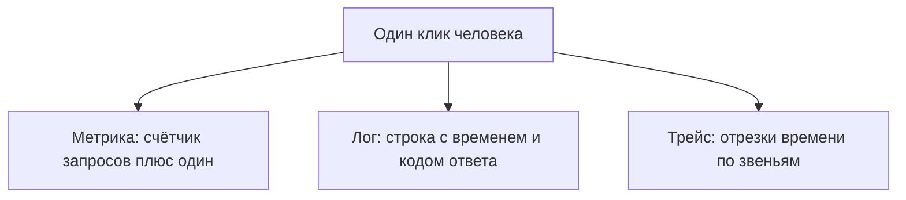

# Метрики, логи, трейсы

## Ситуация

Знакомый пишет: «у тебя сайт тупил вчера вечером». Вы заходите — всё работает.

Что вы можете ответить? Ничего определённого. Не потому, что вы плохой инженер, а потому, что у вас нет способа узнать, что происходило вчера в девять вечера.

## Зачем это нужно

Есть три инструмента, которые смотрят на жизнь сервиса с трёх разных сторон. Их часто называют тремя столпами наблюдаемости. Они не конкурируют — каждый отвечает на свой вопрос.

**Метрика** — число, которое снимают регулярно. «За последнюю минуту 12 запросов, из них 1 с ошибкой, памяти занято 200 МБ». Отвечает на вопрос **сколько и как часто**. На графике видно волну, но конкретный запрос конкретного человека в нём не найти.

**Лог** — текстовая запись о событии. Отвечает на вопрос **почему вот этот запрос не сработал**. График этого не расскажет никогда.

**Трейс** — время прохождения одного запроса по частям системы: вахтёр 3 мс, приложение 40 мс, база 200 мс. Отвечает на вопрос **где именно застряло**, когда звеньев много.

### Почему нельзя обойтись одним

| Что есть | Чего не хватает |
|---|---|
| только метрики | видно, что ошибок стало 20%, но неизвестно каких |
| только логи | утонете в строках и не увидите общую картину |
| только трейсы | красивый путь запроса без представления о дне в целом |

!!! info "Что из этого нужно вам сейчас"
    На сервере с 1 ГБ живут первые два: логи (они уже есть) и метрики, снимаемые руками. Трейсы нужно понимать, но ставить их пока некуда и незачем — у «Пульса» всего два звена.

    Трассировка понадобится, когда появится цепочка вида «сайт → сервис автоматизации → нейросеть → база».

!!! note "Новые слова"
    - **Наблюдаемость** — способность понять, что внутри, по внешним признакам, не подключаясь к серверу.
    - **Uptime** — «отвечает ли адрес». Не то же самое, что «всё ли внутри правильно».
    - **Идентификатор запроса** — метка, связывающая лог и трассировку одного обращения.

## Как это устроено



Один и тот же клик оставляет три разных следа. В большом мире они связаны между собой — с графика можно перейти к строке лога, а оттуда к трассировке.

### Чем пользоваться на своём сервере

| Вопрос | Столп | Как отвечаете сейчас |
|---|---|---|
| Сайт вообще отвечает? | метрика | `curl /health`, внешняя проверка |
| Почему у Маши была ошибка в 16:02? | лог | `docker compose logs` и метка запроса |
| Почему медленно, хотя процессор свободен? | трейс | на 1 ГБ почти никак, смотрите диск |

Обратите внимание: команды `free -h` и `docker stats` — это уже метрики. Просто снятые вручную и без истории.

## Практика

### Шаг 1. Снять метрики руками

**Где вводить:** терминал сервера (`ssh ucheb`)

```bash
free -h
df -h /
docker stats --no-stream
```

**Что должно получиться:** три набора чисел:

- сколько памяти доступно (колонка `available`);
- какой процент диска занят;
- сколько памяти ест контейнер и каков его лимит.

Запишите их. Через неделю эти же числа покажут, растёт ли расход.

### Шаг 2. Измерить время ответа

**Зачем:** «сайт тупит» превращается в число.

**Где вводить:** терминал сервера

```bash
curl -s -o /dev/null -w "код %{http_code}, время %{time_total} сек\n" https://pulse.ваш-домен.ru/health
```

Ключ `-w` просит `curl` напечатать сведения о запросе, `-o /dev/null` выбрасывает само содержимое ответа.

**Что должно получиться:** строка вида `код 200, время 0.115 сек`. Это ваша первая осмысленная метрика времени ответа.

Повторите несколько раз и запомните обычное значение. Отклонение от него и будет означать «тупит».

### Шаг 3. Разложить жалобу на три столпа

Возьмите фразу «сайт вчера тупил» и запишите три вопроса:

1. Какое **число** вы хотели бы увидеть? (время ответа за вчерашний вечер)
2. Какую **строку** хотели бы найти? (ошибка в логе в то же время)
3. Какой **путь** хотели бы проследить? (где именно задержка)

**Что должно получиться:** три конкретных вопроса вместо одного расплывчатого. Это и есть навык, ради которого нужен модуль.

## Проверка

- [ ] Вы можете объяснить три столпа своими словами, не употребляя слово «стек».
- [ ] Знаете, какой инструмент отвечает на какой вопрос.
- [ ] Сняли базовые числа и записали их.
- [ ] Измерили обычное время ответа своего сайта.

## Частые ошибки

!!! failure "Поставить систему графиков и решить, что логи больше не нужны"
    График никогда не покажет текст конкретной ошибки. Инструменты дополняют друг друга.

!!! failure "Считать «адрес отвечает» достаточной проверкой"
    Сайт может отвечать и при этом показывать пустую страницу или ошибку. Нужен ещё и код ответа.

!!! failure "Пытаться внедрить трассировку на 1 ГБ"
    Её агенты займут память, которой у вас нет, а пользы на двух звеньях не будет.

!!! failure "Не записывать обычные значения"
    Без точки отсчёта вы не отличите «медленно» от «как всегда».

## Как это в больших командах

Для каждого столпа есть свой инструмент, а сверху общая витрина, где они связаны: с графика можно перейти к логу с тем же идентификатором запроса, оттуда — к трассировке.

Вы понимаете смысл этих переходов, даже если самой витрины пока нет.

## Итог

Три вопроса — три инструмента. На вашем сервере работают логи и ручные измерения, и этого достаточно для маленького сайта.

Дальше — что можно поставить, не убив 1 ГБ.

Далее: [Лёгкий стек на 1 ГБ](02-legkiy-stek.md).

!!! info "Нагрузка на учебный VPS"
    **Влезает в 1 ГБ.** Команды только читают числа.
