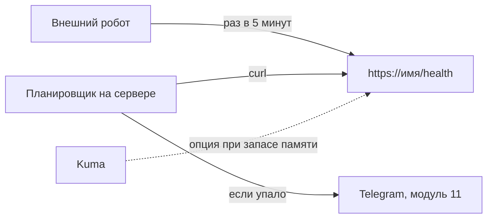

# Лёгкий стек на 1 ГБ

## Ситуация

Третье правило продакшена звучит так: узнать о поломке раньше пользователя. Пока вы проверяете сайт сами по утрам, правило не выполняется — ночная поломка обнаружится в десять утра.

Напрашивается мысль поставить систему мониторинга. Но на машине с 1 ГБ такая система съест больше памяти, чем ваше приложение.

## Зачем это нужно

Нужен кто-то, кто будет спрашивать «ты жив?» пока вы спите. Вариантов четыре, и они сильно различаются по аппетиту.

**Внешний робот проверки.** Сервис вроде UptimeRobot или мониторинг вашего хостера раз в несколько минут открывает адрес и записывает результат. Главное достоинство — он живёт **не на вашем сервере**. Если машина умерла, локальная проверка умерла вместе с ней и промолчит, а внешняя закричит.

**Скрипт с расписанием на самом сервере.** Простой `curl` раз в пять минут, запускаемый системным планировщиком. Ноль лишних программ. Минус тот же: молчит, когда мертва машина целиком. Зато умеет проверять то, что снаружи не видно — например, свободное место на диске.

**Uptime Kuma** — самодельная панель таких проверок с красивым интерфейсом. Легче больших систем, но всё равно занимает сотни мегабайт.

**Netdata** — живые графики машины. Удобно, но аппетит для 1 ГБ обычно чрезмерный.

### Рекомендация курса

| Инструмент | Расход памяти | Ставим? |
|---|---|---|
| Внешняя проверка | ноль на вашем сервере | **да, в первую очередь** |
| Скрипт по расписанию | несколько мегабайт | **да, в модуле 11** |
| Uptime Kuma | сотни мегабайт | только при явном запасе |
| Netdata | сотни мегабайт | нет на этом тарифе |
| Полная система метрик | больше гигабайта | нет, нужен сервер крупнее |

!!! warning "Проверка должна быть честной"
    Адрес `/health` должен отвечать правду. Если он всегда возвращает «ок» независимо от состояния, вся конструкция бессмысленна. У «Пульса» проверка задумана честной.

!!! note "Новые слова"
    - **Uptime-проверка** — робот открывает адрес и записывает результат с временем.
    - **Внешняя проверка** — та, что выполняется не с вашего сервера.
    - **Планировщик (cron)** — механизм Linux, запускающий команды по расписанию.

## Как это устроено



Два робота дополняют друг друга: внешний замечает смерть машины, внутренний — проблемы, которых снаружи не видно.

## Практика

### Шаг 1. Убедиться, что есть что проверять

**Где смотреть:** браузер, адрес `https://pulse.ваш-домен.ru/health`.

**Что должно получиться:** на странице текст `{"status":"ok"}`. Это тот адрес, который будет опрашивать робот.

### Шаг 2. Замерить запас памяти

**Зачем:** решение «ставить или не ставить панель» принимается по числу, а не по настроению.

**Где вводить:** терминал сервера (`ssh ucheb`)

```bash
free -h
```

**Что должно получиться:** значение в колонке `available`. Дальше по нему принимается решение:

- меньше 150 МБ — не ставьте ничего дополнительного;
- 150–300 МБ — только внешняя проверка и скрипт;
- больше 300 МБ — можно осторожно попробовать Kuma, будучи готовой её снести.

### Шаг 3. Измерить, что именно будет проверять робот

**Где вводить:** терминал сервера

```bash
curl -fsS -o /dev/null -w "%{http_code} %{time_total}\n" https://pulse.ваш-домен.ru/health
```

Ключ `-f` заставляет `curl` считать ошибкой коды вроде 500, `-s` убирает индикатор прогресса.

**Что должно получиться:** строка вида `200 0.112`. Первое число — код ответа, второе — время в секундах.

Проверьте, как выглядит неудача:

```bash
curl -fsS -o /dev/null -w "%{http_code}\n" https://pulse.ваш-домен.ru/nesushchestvuyushchiy-adres
echo "код возврата: $?"
```

**Что должно получиться:** непустой код возврата, отличный от нуля. Именно по нему скрипт в модуле 11 поймёт, что пора писать вам.

### Шаг 4. Завести внешнюю проверку

**Где делать:** сайт выбранного сервиса проверок или панель вашего хостера.

Что указать:

- тип проверки: **HTTP(S)**;
- адрес: `https://pulse.ваш-домен.ru/health`;
- ожидаемый код ответа: **200**;
- интервал: **5 минут**;
- уведомление: почта, позже добавим Telegram.

<div class="placeholder-screen" markdown>
**Скриншот:** форма создания HTTP-проверки с заполненным адресом и интервалом.
</div>

**Что должно получиться:** через несколько минут в панели появится зелёная отметка и время ответа.

!!! tip "Назовите проверку нейтрально"
    В названии не указывайте лишнего: «учебный пульс» достаточно. Панели таких сервисов иногда бывают публичными.

### Шаг 5. Проверить, что она работает

**Зачем:** проверка, которая не срабатывает, хуже отсутствия проверки — она создаёт ложное спокойствие.

**Где вводить:** терминал сервера

```bash
cd /opt/pulse
docker compose -f compose.caddy.yml stop pulse
```

Подождите 5–10 минут.

**Что должно получиться:** письмо о недоступности сайта. Если не пришло — проверка настроена неправильно.

Возвращаем:

```bash
docker compose -f compose.caddy.yml start pulse
```

**Что должно получиться:** второе письмо — о восстановлении.

### Шаг 6. Записать в инвентарь

Отметьте честно, кто сейчас следит за сайтом: внешний робот, вы по утрам, или пока никто. Последний вариант тоже бывает — главное его осознавать.

## Проверка

- [ ] Есть адрес, отвечающий правду о состоянии сервиса.
- [ ] Вы знаете свой запас памяти в мегабайтах.
- [ ] Внешняя проверка настроена и опрашивает правильный адрес.
- [ ] Проверка испытана намеренной остановкой сервиса.
- [ ] В инвентаре записано, кто следит за сайтом.

## Частые ошибки

!!! failure "Проверять адрес с портом 8080 после того, как его закрыли"
    Робот должен стучаться туда же, куда приходят люди: по защищённому адресу.

!!! failure "Открыть панель мониторинга в интернет без пароля"
    Это ещё одна административная панель. Если ставите — только за вахтёром и с паролем.

!!! failure "Проверять тяжёлую главную страницу каждые десять секунд"
    Вы сами создадите нагрузку на свой сервер. Адрес проверки должен быть дешёвым.

!!! failure "Настроить проверку и ни разу не испытать"
    Пока не увидели уведомление своими глазами, считайте, что проверки нет.

## Как это в больших командах

Проверки выполняются из нескольких точек мира — так отличают «сайт лёг» от «проблемы у одного провайдера». Плюс собственные метрики внутри системы.

Вы берёте именно внешнюю проверку как первый взрослый элемент, не поднимая у себя ничего тяжёлого.

## Итог

На 1 ГБ порядок такой: честный адрес проверки, внешний робот, потом скрипт с уведомлением в Telegram. Тяжёлые системы — знание, а не установка.

Дальше разберём, что это за системы и кто в них за что отвечает.

Далее: [Prometheus, Grafana, Loki](03-prometheus-grafana.md).

!!! info "Нагрузка на учебный VPS"
    **Внешняя проверка не нагружает сервер вовсе.** Панель Kuma — только при запасе памяти. Полная система метрик — нужен сервер крупнее.
