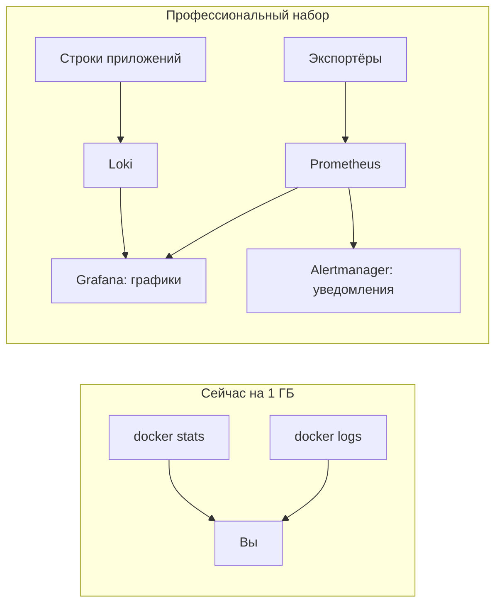

# Prometheus, Grafana, Loki — профессиональный слой

## Ситуация

В вакансиях и чужих инструкциях эти три названия стоят подряд, будто это одна программа. Из-за этого складывается впечатление, что мониторинг — неделимая махина, которую либо ставишь целиком, либо живёшь без неё.

На деле это четыре разные роли, и понимать их по отдельности гораздо полезнее, чем запомнить три названия подряд.

!!! danger "На 1 ГБ этот набор не ставят"
    Урок нужен для понимания, а не для установки. Запуск полного набора на вашем сервере закончится нехваткой памяти и потерей доступа по SSH. Файлы примеров читайте, но не запускайте.

## Зачем это нужно

Представьте больницу. Один человек измеряет температуру каждые полчаса и записывает в тетрадь. Второй ведёт дневник «что случилось с пациенткой». Третий вешает графики в ординаторской. Четвёртый звонит дежурному, если температура выше порога.

Четыре роли — четыре названия.

**Prometheus** — тот, кто ходит и собирает числа. Программы открывают страницу со своими показателями, а он раз в несколько десятков секунд её читает и складывает к себе. Красиво рисовать он не умеет, его дело — регулярный замер и хранение истории.

**Экспортёр** — переводчик. Сама Ubuntu не умеет отдавать показатели в нужном формате, поэтому рядом ставят маленькую программу, которая снимает расход процессора, памяти и диска и отдаёт их в понятном виде.

**Grafana** — витрина. Показывает графики людям. Сама ничего не собирает: она читает числа у Prometheus и строки у Loki.

**Loki** — склад логов, устроенный по тем же принципам. Агент забирает строки с серверов, вы ищете по тексту и меткам. Пока логи умещаются в `docker compose logs` на одной машине, он не нужен.

**Alertmanager** — почтальон. Правило сказало «диск заполнен больше чем на 85%», и он отправляет сообщение, склеивая повторы, чтобы один и тот же сигнал не пришёл сто раз.

### Что соответствует вашим сегодняшним действиям

| Что вы делаете руками | Кто это делает в большой системе |
|---|---|
| `free -h` раз в день | экспортёр плюс график памяти |
| `docker compose logs` | агент, склад логов и поиск |
| `curl /health` | внешняя проверка доступности |
| «надо не забыть посмотреть» | почтальон, пишущий в Telegram |

Как видите, ничего принципиально нового. Отличается доставка и то, что робот не забывает.

!!! note "Новые слова"
    - **Scrape** — «сходить и забрать показатели». Так работает Prometheus.
    - **Экспортёр** — программа-переводчик показателей в нужный формат.
    - **Дашборд** — набор графиков на одном экране.

## Как это устроено



Смысл настройки Prometheus умещается в несколько строк:

```yaml
scrape_interval: 30s
scrape_configs:
  - job_name: node
    static_configs:
      - targets: ["node_exporter:9100"]
```

Читается так: раз в 30 секунд сходи по указанному адресу и забери показатели. Это ровно то же самое, что вы делаете, набирая `free -h`, — только регулярно и с сохранением истории.

## Практика

### Шаг 1. Прочитать примеры

**Где смотреть:** папка курса, файлы:

- `labs/observability/prometheus.example.yml` — что и как часто опрашивать;
- `labs/observability/alerts.example.yml` — при каких условиях поднимать тревогу.

**Что должно получиться:** вы находите в первом файле интервал опроса и список адресов, во втором — пороговые значения.

!!! warning "Только читать"
    Эти файлы лежат в курсе как учебный материал. Команду запуска для них на своём сервере не выполняйте.

### Шаг 2. Проследить путь одного сигнала

Возьмите ситуацию «кончается диск» и проследите её по схеме:

1. Экспортёр видит, что занято 87%.
2. Prometheus забирает это число и сохраняет.
3. Правило сравнивает с порогом 85%.
4. Почтальон отправляет сообщение.
5. Вы открываете [карточку «диск заполнен»](../../runbooks/disk-full.md).

**Что должно получиться:** вы замечаете, что пятый шаг у вас уже есть, а первые четыре сейчас заменяет ваша собственная привычка смотреть `df -h`.

### Шаг 3. Сравнить пороги

**Где вводить:** терминал сервера (`ssh ucheb`)

```bash
df -h /
```

**Что должно получиться:** процент заполнения. Сравните его с порогом 85% из файла правил. Ровно это сравнение и делает робот — просто каждые полминуты, а не когда вспомнится.

### Шаг 4. Записать план на будущее

Когда появится сервер на 2–4 ГБ, порядок установки такой:

1. Сначала только Prometheus, Grafana и экспортёр машины.
2. Убедиться, что памяти хватает и графики понятны.
3. Только потом думать про склад логов.

Один новый слой за раз. Ставить всё сразу — гарантированный способ не понять, что именно сломалось.

## Проверка

- [ ] Вы можете назвать роль каждого из четырёх компонентов одной фразой.
- [ ] Понимаете, какое ваше ручное действие чему соответствует.
- [ ] Проследили путь сигнала «кончается диск» от показателя до карточки.
- [ ] Знаете, почему на 1 ГБ этот набор не ставят.

## Частые ошибки

!!! failure "Запустить весь набор «просто посмотреть»"
    Память кончится, SSH перестанет отвечать, и день уйдёт на восстановление сервера вместо учёбы.

!!! failure "Хранить историю показателей две недели на диске 10 ГБ"
    Она разрастётся и займёт всё место. На маленьких машинах даже несколько суток бывает много.

!!! failure "Открыть витрину графиков в интернет"
    Это административная панель. Доступ к ней — только через вахтёра с паролем, а лучше через туннель.

!!! failure "Взять готовый набор графиков из интернета на 80 панелей"
    Восемь понятных графиков полезнее восьмидесяти непонятных. Какие именно — в следующем уроке.

## Как это в больших командах

Используют либо этот набор, либо облачный аналог от провайдера. Смысл и роли одинаковые, отличаются названия и то, кто обслуживает сами системы мониторинга.

Вы уже знаете соответствие, и при встрече с любым из вариантов будете понимать, что перед вами.

## Итог

Четыре роли: сборщик чисел, переводчик, витрина, почтальон. Плюс отдельный склад для строк. На вашем тарифе — знание, а не установка.

Дальше — какие именно показатели имеет смысл смотреть.

Далее: [Какие панели нужны](04-kakie-paneli.md).

!!! info "Нагрузка на учебный VPS"
    **Урок не нагружает сервер.** Запуск описанного набора требует машины от 2–4 ГБ.
