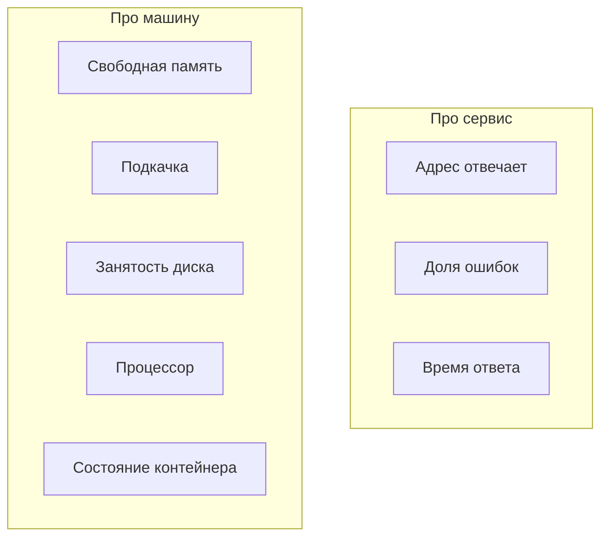

# Какие панели нужны на старте

## Ситуация

В интернете легко найти готовый набор графиков на восемьдесят панелей. Выглядит внушительно, ставится одним действием.

Пользы от него примерно ноль. Глаз не за что зацепиться, и понять, всё ли в порядке, по такому экрану невозможно. Восемь понятных чисел работают лучше восьмидесяти непонятных.

## Зачем это нужно

Есть два устоявшихся набора показателей, и вам нужны оба, потому что они смотрят на разное.

**Для сервиса** — три вещи, которые обычно обозначают как RED:

- сколько запросов приходит;
- какая доля из них заканчивается ошибкой;
- сколько времени занимает ответ.

**Для машины** — насколько загружены ресурсы, есть ли нехватка, нет ли сбоев оборудования.

Первый набор отвечает на вопрос «хорошо ли людям», второй — «хорошо ли железу». Они не заменяют друг друга: сервер может быть свободен, а сайт при этом отвечать ошибками.

### Восемь показателей для вашего случая

| # | Показатель | Где смотрите сейчас |
|---|---|---|
| 1 | Отвечает ли адрес проверки | внешняя проверка, `curl` |
| 2 | Доля ошибок | логи Caddy |
| 3 | Время ответа | `curl -w time_total` |
| 4 | Свободная память | `free -h`, колонка `available` |
| 5 | Использование подкачки | `free -h`, строка `Swap` |
| 6 | Занятость диска | `df -h /` |
| 7 | Загрузка процессора | `top` или `docker stats` |
| 8 | Состояние контейнера | `docker compose ps` |

Девятый появляется после модуля 5 — **сколько дней осталось до окончания сертификата**.

Чего на старте не нужно: температура в дата-центре, состояние сетевых маршрутов, десятки графиков внутренних механизмов языка программирования.

!!! note "Новые слова"
    - **RED** — сокращение для трёх показателей сервиса: количество, ошибки, длительность.
    - **Перцентиль** — способ смотреть на время ответа честно, не пряча редкие медленные случаи за средним значением.

## Как это устроено



!!! warning "Среднее время ответа обманывает"
    Если девяносто девять запросов быстрые, а один занял тридцать секунд, среднее выглядит прекрасно. А человек, попавший в этот один, ушёл.

    Взрослый способ — смотреть, во сколько укладываются 95% запросов. Ваш нынешний способ проще: «ответ дольше двух секунд — уже странно».

## Практика

### Шаг 1. Снять все восемь показателей за один заход

**Где вводить:** терминал сервера (`ssh ucheb`)

```bash
curl -s -o /dev/null -w "1. код %{http_code}, время %{time_total} сек\n" https://pulse.ваш-домен.ru/health
free -h
df -h /
docker compose -f compose.caddy.yml ps
```

**Что должно получиться:** четыре блока вывода, из которых читаются все восемь чисел. Это занимает примерно минуту.

### Шаг 2. Проверить срок сертификата

**Зачем:** истёкший сертификат выглядит для посетителя страшнее, чем недоступный сайт.

**Где вводить:** PowerShell на вашем компьютере

```powershell
curl.exe -vI https://pulse.ваш-домен.ru 2>&1 | Select-String "expire"
```

Либо проще — нажмите на замок в адресной строке браузера.

**Что должно получиться:** дата окончания примерно через три месяца. Caddy обновит сертификат сам, но знать, где посмотреть, полезно.

### Шаг 3. Записать обычные значения

**Зачем:** без точки отсчёта вы не отличите проблему от нормы.

Заполните таблицу в инвентаре:

| Показатель | Обычное значение | Когда беспокоиться |
|---|---|---|
| Время ответа | | больше 2 сек |
| Свободная память | | меньше 100 МБ |
| Занятость диска | | больше 85% |
| Подкачка | | активно используется |

Вторую колонку заполните числами из шага 1, третью оставьте как есть.

### Шаг 4. Завести привычку

Раз в неделю, минут на десять: пройти по таблице и сравнить с записанными значениями.

Это простое действие уже является рабочей привычкой из области надёжности, о которой будет модуль 12. Расход ресурсов почти всегда растёт медленно, и заметить это можно только в сравнении.

## Проверка

- [ ] Вы можете назвать восемь показателей, не подглядывая.
- [ ] Знаете команду для каждого из них.
- [ ] Обычные значения записаны в инвентарь.
- [ ] Понимаете, почему среднее время ответа вводит в заблуждение.
- [ ] Назначили себе день недели для проверки.

## Частые ошибки

!!! failure "Смотреть только на процессор"
    На машине с 1 ГБ убивает нехватка памяти и места, а процессор при этом обычно спокоен.

!!! failure "Следить за временем ответа, но не за долей ошибок"
    Быстро отдавать ошибку — не достижение.

!!! failure "Заводить десятки графиков до того, как научились читать восемь"
    Лишние числа маскируют важные.

!!! failure "Не записывать норму"
    «Памяти 180 мегабайт» — это много или мало? Без записанного обычного значения ответа нет.

## Как это в больших командах

Три показателя сервиса заводят на каждый сервис, показатели ресурсов — на каждую машину, а сверху добавляют график выполнения обещаний перед пользователями. О нём речь в модуле 12.

Эти восемь никуда не исчезают — к ним просто добавляются другие.

## Итог

Немного понятных чисел полезнее музея графиков. Записанная норма превращает наблюдение в сравнение.

Дальше — как сделать, чтобы о проблеме сообщали вам, а не вы её искали.

Далее: [Модуль 11. Алерты](../m11/index.md).

!!! info "Нагрузка на учебный VPS"
    **Влезает в 1 ГБ** как привычка смотреть числа. Графические панели — когда появится память.
