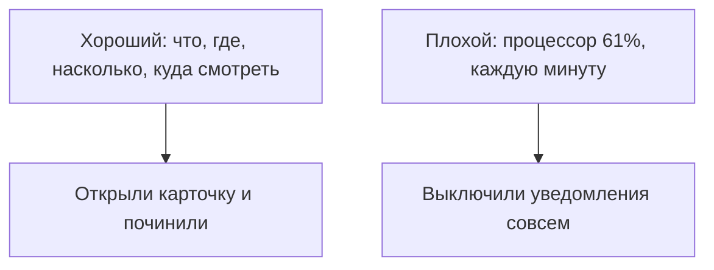

# Хороший и плохой алерт

## Ситуация

Вы настроили уведомления. Первую ночь телефон пищал двести раз: загрузка процессора подскочила, кто-то открыл несуществующую страницу, контейнер перезапустился.

Вы выключили звук. Через неделю сайт действительно лёг, а телефон промолчал — потому что вы сами его заглушили.

## Зачем это нужно

Алерт — это сигнал **к действию**, а не ещё одно уведомление в ленте. Из этого следует всё остальное.

Хорошее сообщение отвечает сразу на три вопроса:

1. **Что сломалось** — с именем сервиса и сервера.
2. **Насколько плохо** — люди не могут пользоваться или просто тревожный признак.
3. **Что делать первым** — ссылка на карточку разбора.

Третий пункт кажется необязательным, пока не окажешься перед телефоном в три часа ночи. Без него вы начинаете искать в поиске то, что уже знали днём.

### Порог и время

Сигнал должен срабатывать не на всплеск, а на устойчивое состояние.

| Формулировка | Годится? |
|---|---|
| «Диск занят больше 85% уже десять минут» | да |
| «Диск на секунду показал 86%» | нет |
| «Проверка не отвечает две попытки подряд» | да |
| «Один запрос ответил медленно» | нет |

### Шум и что он делает

Шум — это сообщения, после которых вы ничего не предпринимаете. Каждое такое сообщение учит вас смахивать уведомления не глядя. А потом вы смахиваете настоящее.

Это состояние называют усталостью от алертов, и оно означает, что наблюдение мертво, хотя все галочки на месте.

!!! danger "Правило курса: нет карточки — нет алерта"
    Прежде чем заводить новый сигнал, напишите карточку из трёх шагов: что проверить, что сделать, кого позвать. Если карточка не пишется, значит, вы сами не знаете, что делать по этому сигналу — и будить вас им бессмысленно.

!!! note "Новые слова"
    - **Алерт** — сигнал, требующий действия.
    - **Шум** — сигналы, после которых действий не следует.
    - **Усталость от алертов** — выработанная привычка игнорировать уведомления.

## Как это устроено



Сравните два текста.

Хороший:

```
КРИТИЧНО. Пульс (vps-ucheb): проверка health не отвечает 200 уже 2 минуты.
Карточка: «сайт не открывается».
```

Плохой:

```
Warning: metric alert
```

Во втором нет ни сервиса, ни сервера, ни серьёзности, ни подсказки. Через год, когда у вас будет два сервера, такое сообщение вообще потеряет смысл.

## Практика

### Шаг 1. Проверить свои три последних тревоги

Вспомните три случая, когда вы думали «надо бы про это узнавать». Для каждого ответьте:

- Какое действие вы реально совершите, получив такой сигнал ночью?
- Есть ли карточка с этим действием?

**Что должно получиться:** часть пунктов отсеется. Если действия нет — это не алерт, а показатель для воскресного просмотра.

### Шаг 2. Написать текст своего будущего сообщения

Составьте шаблон, в котором есть четыре части:

| Часть | Пример |
|---|---|
| Серьёзность | `КРИТИЧНО` |
| Что и где | `Пульс (vps-ucheb)` |
| Что именно не так | `health не 200 уже 2 минуты` |
| Куда смотреть | `карточка «сайт не открывается»` |

**Что должно получиться:** одна строка, которую вы поймёте спросонья.

### Шаг 3. Проверить, что карточки существуют

**Где смотреть:** раздел карточек в курсе.

Убедитесь, что есть три карточки: «сайт не открывается», «диск заполнен», «сертификат истекает».

**Что должно получиться:** по каждой вы можете назвать первое действие, не открывая её.

## Проверка

- [ ] Вы отличаете устойчивое состояние от всплеска.
- [ ] Знаете четыре части хорошего сообщения.
- [ ] Понимаете, чем опасен шум.
- [ ] Для каждого планируемого сигнала есть карточка.

## Частые ошибки

!!! failure "Включить все сигналы, которые предлагает система"
    Вы получите поток уведомлений и через неделю отключите его целиком.

!!! failure "Сделать все сигналы одинаково срочными"
    Тогда по-настоящему срочное невозможно отличить от остального.

!!! failure "Не указывать в сообщении сервер"
    Пока сервер один, это неважно. Когда их станет два, старые сообщения превратятся в загадку.

!!! failure "Завести сигнал без карточки"
    Ночью вы будете придумывать план действий заново и с меньшей головой, чем днём.

## Как это в больших командах

Существует понятие бюджета шума: если сигнал несколько раз подряд не привёл ни к какому действию, его переписывают или удаляют. Это не необязательная гигиена, а правило.

Вы дежурите одна, но правило работает так же.

## Итог

Алерт равен действию плюс карточке плюс тишине в остальное время. Всё, что не проходит эту проверку, — показатель для спокойного просмотра.

Дальше — конкретный список из пяти первых сигналов.

Далее: [Что алертить сначала](02-chto-alertit.md).

!!! info "Нагрузка на учебный VPS"
    **Урок не нагружает сервер.**
