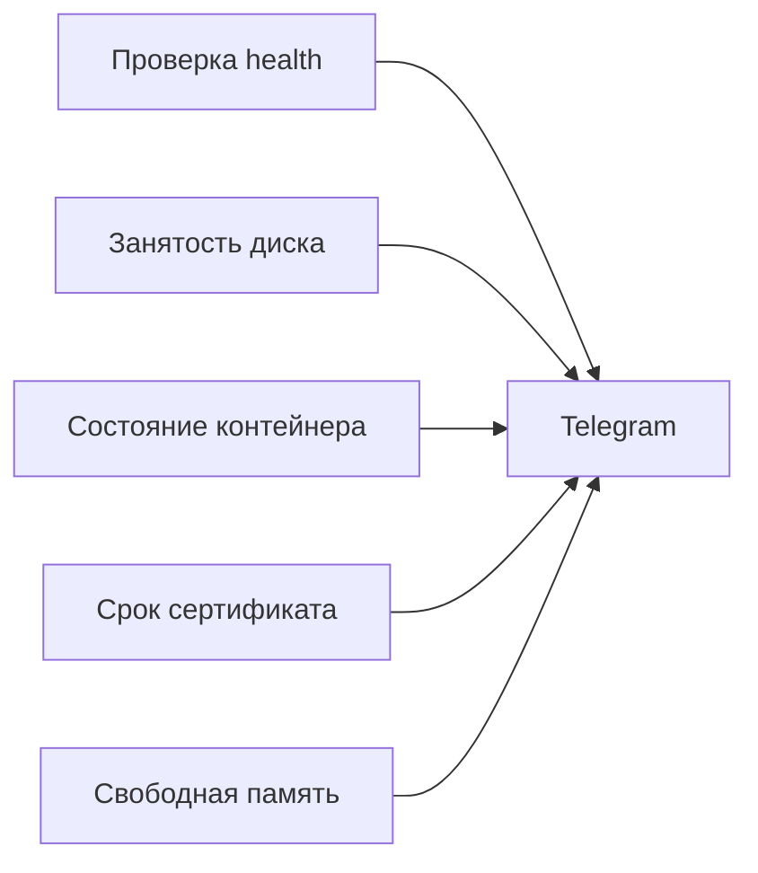

# Что алертить сначала

## Ситуация

Выбрать, о чём именно вас должны уведомлять, сложнее, чем кажется. Хочется знать про всё, а результат мы разобрали в прошлом уроке: поток сообщений и выключенный звук.

Хорошая новость: для маленького сайта пяти сигналов достаточно, чтобы закрыть большую часть реальных бед.

## Зачем это нужно

Каждый из пяти будит на конкретное действие и связан с готовой карточкой.

| Сигнал | Когда срабатывает | Почему важен | Карточка |
|---|---|---|---|
| Проверка health не отвечает | код не 200 дольше 2 минут | люди уже не могут пользоваться | [сайт не открывается](../../runbooks/site-down.md) |
| Диск заполнен | больше 85% | скоро некуда писать данные и логи | [диск заполнен](../../runbooks/disk-full.md) |
| Контейнер не работает | состояние не `running` | приложение умерло, вахтёр отдаёт ошибку | та же карточка про сайт |
| Сертификат истекает | меньше 14 дней | замочек пропадёт в календарный день | [сертификат](../../runbooks/ssl-expiring.md) |
| Мало памяти | `available` близко к нулю или записи о нехватке | сервер на грани, нельзя ставить новое | [подготовка сервера](../../lab-server.md) |

### Чего в этом списке нет и почему

- **Загрузка процессора.** На одном ядре всплески — норма. Обновление пакетов легко даёт 100%, и это не повод будить.
- **Одиночная ошибка 404.** Боты стучатся в несуществующие адреса постоянно. Это запись в дневнике, а не сирена.
- **Успешный вход по SSH.** Это вы и есть.
- **Один перезапуск контейнера за сутки.** Механизм автоподъёма именно для этого и сделан.

!!! info "База появится позже"
    Сигнал «база не отвечает» имеет смысл, когда база есть. Сейчас данные — обычный файл, и его проблемы выглядят как ошибка записи в логе, а не как отдельная недоступная служба.

## Как это устроено



### Что автоматизируется легко, а что позже

| Сигнал | Автоматизировать сейчас |
|---|---|
| Проверка health | да, скрипт в лаборатории |
| Диск | да, тот же скрипт |
| Контейнер | да, простая команда |
| Сертификат | сначала глазами раз в неделю |
| Память | сначала глазами раз в неделю |

Начинать надо с первых трёх. Остальное переводите в автоматику, когда скрипт станет привычным.

!!! note "Внешняя проверка и скрипт — не дубли"
    Они ловят разные беды. Внешний робот замечает, что сервер умер целиком или сломался домен. Скрипт на сервере видит то, что снаружи не видно: кончающееся место, состояние контейнера.

## Практика

### Шаг 1. Проверить каждый сигнал руками

**Зачем:** прежде чем поручать роботу, убедитесь, что вы сами умеете это проверить.

**Где вводить:** терминал сервера (`ssh ucheb`)

```bash
curl -s -o /dev/null -w "health: %{http_code}\n" https://pulse.ваш-домен.ru/health
df -h / | tail -1
docker inspect pulse --format 'контейнер: {{ .State.Status }}'
free -h | grep Mem
```

**Что должно получиться:** четыре строки:

- `health: 200`;
- строка с процентом занятости диска;
- `контейнер: running`;
- строка с памятью, где в колонке `available` заметное число.

Если какой-то показатель уже за порогом, разберитесь с ним до того, как заводить уведомления.

### Шаг 2. Определить свои пороги

Пороги не высечены в камне. Для учебного сервиса разумно так:

| Показатель | Порог | Почему такой |
|---|---|---|
| health | 2 неудачные проверки подряд | одна может быть случайной |
| Диск | 85% | остаётся полтора гигабайта на манёвр |
| Сертификат | 14 дней | хватит времени спокойно разобраться |
| Память | `available` меньше 100 МБ | ниже начинаются отказы |

Для настоящего магазина в день распродажи цифры были бы другими. Важно, что вы их выбрали осознанно.

### Шаг 3. Заполнить таблицу в инвентаре

Заведите табличку и проставьте текущее положение дел:

| Сигнал | Сейчас | Цель |
|---|---|---|
| health | руками | авто |
| Диск | руками | авто |
| Контейнер | руками | авто |
| Сертификат | нет | руками раз в неделю |
| Память | руками | руками раз в неделю |

**Что должно получиться:** вы видите, что именно предстоит сделать в лаборатории 11.

## Проверка

- [ ] Вы знаете пять первых сигналов и пороги для них.
- [ ] Проверили каждый вручную и увидели нормальные значения.
- [ ] Понимаете, почему процессора и одиночных 404 в списке нет.
- [ ] Таблица в инвентаре заполнена.

## Частые ошибки

!!! failure "Отправлять сообщение каждые полминуты, пока сервис лежит"
    За час вы получите сто двадцать сообщений и выключите бота. Скрипт должен помнить, что уже сообщал. В учебном скрипте такая защита есть.

!!! failure "Полагаться только на внешнюю проверку"
    Сайт может отвечать нормально, а место на диске уже кончаться. Завтра он ляжет, и внешний робот сообщит об этом постфактум.

!!! failure "Завести сигнал на процессор"
    На одном ядре он будет срабатывать постоянно и без причины.

!!! failure "Выбрать пороги наугад"
    Порог должен оставлять время на реакцию. 95% заполнения диска — это уже не предупреждение, а авария.

## Как это в больших командах

Те же технические сигналы плюс сигналы по существу бизнеса: выросла очередь заказов, посыпались ошибки оплаты. Но технический минимум идёт первым — без него бизнес-сигналы не на чем строить.

Вы собираете именно этот минимум.

## Итог

Пять сигналов, понятные пороги, три готовые карточки. Остальное — в еженедельный просмотр.

Дальше — как доставить сообщение до телефона.

Далее: [Telegram и n8n](03-telegram-i-n8n.md).

!!! info "Нагрузка на учебный VPS"
    **Скрипт проверки влезает в 1 ГБ.** Систему графиков ради уведомлений ставить не нужно.
