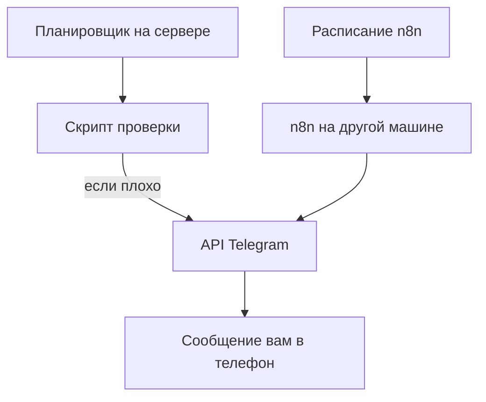

# Telegram напрямую и через n8n

## Ситуация

Сигнал «сайт не дышит» должен дойти до человека, который может его починить. Почта приходит с задержкой и теряется среди рассылок. SMS стоят денег. «Я сама зайду и посмотрю» не работает по определению — вы спите.

Telegram есть у вас в кармане и умеет принимать сообщения от программ. Осталось разобраться, кто именно будет писать и откуда он узнает, что пора.

## Зачем это нужно

В этой конструкции три части, и их важно не смешивать.

**Проверка** отвечает на вопрос «жив ли сервис». Раз в несколько минут кто-то спрашивает адрес `/health` и сравнивает ответ с ожидаемым. Само приложение «Пульс» кричать не умеет — оно только отвечает, когда его спросили.

**Бот** доставляет текст человеку. Он не следит за сайтом сам. Без проверки бот молчит, без бота проверка пишет в файл, который вы ночью не читаете.

**Адрес чата** говорит боту, кому писать. Токен без адреса чата — ключ от двери без адреса квартиры.

### Два способа организовать проверку

| | Скрипт по расписанию | n8n |
|---|---|---|
| Где работает | на вашем сервере | на **другой** машине |
| Расход памяти | несколько мегабайт | сотни мегабайт |
| Сложные условия | неудобно | удобно |
| Для курса | **основной путь** | если он уже где-то работает |

!!! danger "n8n не ставят на этот сервер"
    Он занимает сотни мегабайт. Рядом с «Пульсом» и Caddy на 1 ГБ для него места нет. Если n8n у вас уже крутится в другом месте — используйте его. Если нет — живите скриптом, это нормально.

!!! note "Новые слова"
    - **Бот** — программа в Telegram с собственным токеном, умеющая отправлять сообщения.
    - **Токен бота** — его секретный ключ. Это полноценный секрет, место ему только в `.env`.
    - **chat_id** — номер чата, куда отправлять.
    - **cron** — планировщик Ubuntu, запускающий команды по расписанию.

## Как это устроено



Оба пути приводят к одному и тому же: обращение к интерфейсу Telegram с текстом сообщения.

## Практика

### Шаг 1. Создать бота

**Где делать:** приложение Telegram.

1. Найдите в поиске **BotFather** (с синей галочкой).
2. Отправьте команду `/newbot`.
3. Придумайте имя и адрес бота — адрес должен заканчиваться на `bot`.

**Что должно получиться:** BotFather пришлёт длинную строку вида `123456789:AA...`. Это токен.

!!! warning "Токен — секрет"
    Сразу сохраните его в менеджер паролей. Не вставляйте в чаты, скриншоты и файлы курса. Если засветите — выпускайте новый через BotFather, старый при этом сразу перестанет работать.

### Шаг 2. Начать диалог с ботом

**Зачем:** Telegram запрещает ботам писать первыми. Пока вы не начали диалог, сообщений не будет — молча.

**Где делать:** Telegram. Найдите своего бота по адресу и отправьте `/start`.

**Что должно получиться:** бот появился в списке чатов. Ответа может не быть, это нормально.

### Шаг 3. Узнать номер чата

**Где вводить:** PowerShell на вашем компьютере (подставьте свой токен)

```powershell
curl.exe "https://api.telegram.org/bot<ВАШ_ТОКЕН>/getUpdates"
```

**Что должно получиться:** ответ в фигурных скобках, в котором есть фрагмент `"chat":{"id":123456789`. Это число и есть адрес чата.

Если ответ пустой — вы не отправили боту `/start` в шаге 2.

### Шаг 4. Отправить тестовое сообщение

**Зачем:** убедиться, что доставка работает, до того как строить вокруг неё автоматику.

**Где вводить:** терминал сервера (`ssh ucheb`)

```bash
read -s TOKEN
read CHAT
curl -s "https://api.telegram.org/bot${TOKEN}/sendMessage" \
  --data-urlencode "chat_id=${CHAT}" \
  --data-urlencode "text=тест алерта курса"
```

Команда `read -s` считывает значение, не показывая его на экране, — так токен не останется в истории команд.

**Что должно получиться:**

- в терминале ответ, начинающийся с `{"ok":true`;
- в Telegram сообщение «тест алерта курса».

Если пришёл `{"ok":false`, посмотрите на текст ошибки:

| Ошибка | Причина |
|---|---|
| `Unauthorized` | неверный токен |
| `chat not found` | неверный номер чата или не было `/start` |
| `bot was blocked` | вы заблокировали бота |

### Шаг 5. Положить значения в отдельный файл

**Зачем:** секреты уведомлений держат отдельно от настроек приложения — файл `.env` читает контейнер, а `alert.env` нужен только скрипту проверки.

**Где вводить:** терминал сервера

```bash
nano /opt/pulse/alert.env
```

Впишите три строки, подставив свои значения после знака равенства:

```
TELEGRAM_BOT_TOKEN=
TELEGRAM_CHAT_ID=
PULSE_HEALTH_URL=https://pulse.ваш-домен.ru/health
```

Закрываем файл от посторонних:

```bash
chmod 600 /opt/pulse/alert.env
ls -la /opt/pulse/alert.env
```

**Что должно получиться:** права `-rw-------`, то есть файл читаете только вы.

### Шаг 6. Прочитать учебный скрипт

**Где смотреть:** папка курса, файл `labs/alerts/check-pulse.sh`.

Найдите в нём три вещи:

- чтение значений из `alert.env`;
- запрос к адресу проверки;
- отправку сообщения, если ответ не 200.

**Что должно получиться:** вы понимаете, что скрипт делает то же самое, что вы только что сделали руками.

Рядом лежит `labs/alerts/n8n-health.example.json` — схема тех же действий для n8n, если он у вас есть на другой машине.

## Проверка

- [ ] Бот создан, токен сохранён в менеджере паролей.
- [ ] Вы отправили боту `/start` и узнали номер чата.
- [ ] Тестовое сообщение дошло до телефона.
- [ ] Значения лежат в `alert.env` с правами 600.
- [ ] В репозитории курса токена нет.
- [ ] Вы можете объяснить: бот доставляет, а решает «когда кричать» скрипт.

## Частые ошибки

!!! failure "Бот в группе без права писать сообщения"
    Сообщения не доходят, и никакой ошибки при этом не видно. Проверьте права бота в настройках группы.

!!! failure "Поставить n8n рядом с Пульсом"
    Памяти не хватит, и упадёт в первую очередь рабочий сервис.

!!! failure "Вписать токен прямо в скрипт"
    Скрипт может попасть в репозиторий. Значения читаются из `alert.env`.

!!! failure "Отлаживать проблему выводом токена на экран"
    Он останется в истории команд и в логах. Проверяйте по тексту ошибки от Telegram.

## Как это в больших командах

Для срочных сигналов используют специальные системы оповещения дежурных, которые умеют звонить и передавать сигнал дальше, если первый человек не ответил. Telegram при этом часто остаётся одним из каналов.

n8n в вашей схеме — удобный конструктор условий, но он не заменяет ни пороги, ни карточки разбора.

## Итог

Скрипт проверяет, бот доставляет, токен лежит в `alert.env` с правами 600. Тестовое сообщение уже дошло — значит, механизм работает.

Дальше — как жить с этими сигналами, когда дежурный вы один.

Далее: [Дежурство для одного](04-dezhurstvo.md).

!!! info "Нагрузка на учебный VPS"
    **Скрипт влезает в 1 ГБ.** n8n — не на этот сервер.
