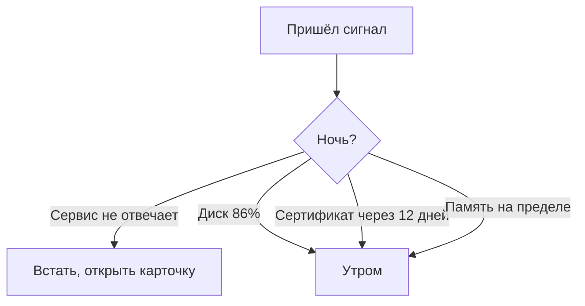

# Дежурство для одного человека

## Ситуация

В крупных компаниях ночи делят между собой несколько человек по графику. У вас нет графика и нет нескольких человек — есть вы.

Если реагировать на каждый писк в три часа ночи, через месяц вы выключите уведомления насовсем. Это не вопрос силы воли: так заканчивается любое дежурство без правил.

## Зачем это нужно

Нужен договор с собой: какие сигналы поднимают ночью, а какие ждут утра. Договор, написанный заранее и в спокойном состоянии.

Разделение простое:

**Ночью поднимает только одно** — люди не могут пользоваться сервисом прямо сейчас. Практически это значит, что проверка не отвечает.

**Утром смотрится всё остальное** — диск заполнен на 86%, сертификат кончается через двенадцать дней, один раз мелькнула ошибка. Всё это не изменится за ночь к худшему настолько, чтобы стоило вставать.

### Пять правил одиночного дежурства

1. **Ночью чините только то, что совсем легло.** Остальное — в девять утра.
2. **Настройте звук выборочно.** Громкие уведомления только для критичных сообщений, остальное — беззвучно.
3. **Заведите еженедельный слот.** Пятнадцать минут в воскресенье: восемь показателей, бэкап, обновления.
4. **Продумайте отпуск заранее.** Либо внешняя проверка пишет ещё кому-то, либо честное предупреждение, что сервис учебный и может быть недоступен.
5. **После ночного разбора не геройствуйте.** Не надо до обеда без сна «заодно улучшить ещё вот это» — так делаются вторые аварии.

!!! note "Новые слова"
    - **Дежурство** — договорённость о том, на какие сигналы вы реагируете и когда.
    - **Передача дежурства** — короткая сводка «что красное, что сделано». В вашем случае вы передаёте её себе вчерашней.

## Как это устроено

## Практика

### Шаг 1. Написать свой договор

Запишите в инвентарь две строки. Именно записать, а не подумать.

- **Ночью поднимает:** …
- **Утром смотрю:** …

**Что должно получиться:** в первой строке одна-две позиции, не больше. Если их пять — вы ещё не приняли решение, а просто перечислили всё, что есть.

### Шаг 2. Настроить уведомления на телефоне

**Где делать:** приложение Telegram на телефоне, настройки конкретного чата с ботом.

Если у вас один бот на все сигналы, вариантов два:

- оставить звук включённым и принять, что изредка он разбудит зря;
- завести второго бота отдельно для критичных сообщений.

Второй вариант правильнее, но начинать можно с первого.

**Что должно получиться:** вы знаете, что услышите ночью, а что увидите утром.

### Шаг 3. Поставить еженедельный слот в календарь

**Зачем:** без напоминания ритуал не приживается.

Поставьте повторяющееся событие на пятнадцать минут в удобный день. В описание впишите короткий список:

- восемь показателей из модуля 10;
- когда последний раз делали копию данных;
- есть ли обновления безопасности;
- сколько дней до окончания домена и сертификата.

**Что должно получиться:** событие в календаре с готовым списком. Не надо вспоминать, что проверять.

### Шаг 4. Записать сводку для себя

**Зачем:** после ночного разбора память подводит. Через три дня вы не вспомните, что именно чинили.

Формат — три строки:

1. Что было красным.
2. Что сделали.
3. Что осталось незакрытым.

**Что должно получиться:** запись, которую можно прочитать утром и продолжить с того же места. Это заготовка разбора инцидента из модуля 12.

## Проверка

- [ ] Договор с собой записан, ночной список короткий.
- [ ] Уведомления настроены осознанно.
- [ ] Еженедельный слот стоит в календаре со списком.
- [ ] Вы знаете формат трёхстрочной сводки.
- [ ] Вы не обещаете себе круглосуточную реакцию на предупреждения.

## Частые ошибки

!!! failure "Включить вибрацию на все уведомления"
    Через неделю вы выключите их целиком, и наступит тишина в самом плохом смысле.

!!! failure "Стесняться, что дежурите одна"
    Большинство небольших проектов так и живут. Честное «сервис учебный, возможны перерывы» лучше, чем игра в крупную компанию.

!!! failure "Разбираться ночью с тем, что подождёт до утра"
    Ночные решения хуже дневных, а усталость накапливается и приводит к настоящим ошибкам.

!!! failure "Не записывать, что чинили"
    Через месяц та же поломка займёт столько же времени, сколько в первый раз.

## Как это в больших командах

Есть график смен, передача дежурства между сменами и компенсация за ночные подъёмы. Содержание передачи — ровно те же три строки: что красное, что сделано, что осталось.

Вы пишете эту сводку себе, и структура у неё та же.

## Итог

Ночью поднимает только лежащий сервис. Всё остальное — ритуал по расписанию, а не адреналин.

Пора получить первое настоящее сообщение.

Далее: [Лаборатория. Алерт в Telegram](../../labs/lab-11-telegram-alert.md).

!!! info "Нагрузка на учебный VPS"
    **Нулевая сверх скрипта проверки.**
