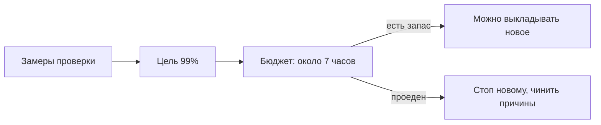

# SLI, SLO и бюджет ошибок

## Ситуация

«Хочу, чтобы сайт работал всегда» — звучит разумно, но означает невыполнимое. Обновления, перезагрузки у хостера, ваши собственные эксперименты, проблемы у провайдера посетителя — всё это неизбежно даёт перерывы.

Без числа каждый сбой воспринимается одинаково: либо как катастрофа, либо как «ну бывает». А ведь двадцать минут в месяц и восемь часов в месяц — это очень разные ситуации.

## Зачем это нужно

Нужна цифра, договор с собой. Она отвечает на практический вопрос: сегодня заниматься надёжностью или можно делать новое?

Три понятия, и они выстраиваются в цепочку.

**Индикатор (SLI)** — как именно вы измеряете. Не ощущение, а правило, которое можно посчитать. Например: доля минут, когда проверка отвечала кодом 200.

**Цель (SLO)** — какую долю вы считаете нормой. Например, 99% минут за календарный месяц.

**Бюджет ошибок** — сколько можно не дотянуть до цели. Если цель 99%, значит, оставшийся 1% времени сервис может быть недоступен.

### Как выглядит бюджет в минутах

В месяце примерно 43 200 минут.

| Цель | Можно быть недоступным |
|---|---|
| 99% | около 7 часов |
| 99,9% | около 43 минут |
| 99,99% | около 4 минут |
| 100% | нисколько — такую цель не ставят |

Для учебного сервиса честная цель — **99%**. Вы одна, и сон важнее. Семь часов в месяц — это реалистично при одном сервере без резерва.

### Зачем нужен бюджет на практике

Он превращает спор «чинить или делать новое» в арифметику:

- бюджет почти целый — можно рисковать, выкладывать новое;
- бюджет проеден — следующая неделя уходит на надёжность.

!!! warning "SLO и SLA — разные вещи"
    **SLO** — внутренняя честная планка для себя.

    **SLA** — юридический договор с клиентом, со штрафами и компенсациями.

    Пока вы не умеете измерять, никаких цифр клиентам не обещайте. Это вернётся в модуле 15, когда появятся платежи.

!!! note "Новые слова"
    - **Доступность** — доля времени, когда сервис работал.
    - **Бюджет ошибок** — допустимое время недоступности за период.

## Как это устроено

Формула простая:

> доступность = минуты с успешной проверкой ÷ минуты, когда мы вообще измеряли



### Что выбрать индикатором для «Пульса»

| Кандидат | Годится? |
|---|---|
| Проверка `/health` отвечает 200 | **да, начните с него** |
| Главная страница красиво выглядит | нет, не измеряется |
| Заметка сохраняется | позже, это отдельный индикатор |
| Сервер включён в панели хостера | нет: машина жива, а сайт может лежать |

## Практика

### Шаг 1. Посчитать свой бюджет

Возьмите цель 99% и посчитайте:

- 43 200 минут в месяце;
- 1% от них — 432 минуты;
- это примерно 7 часов 12 минут.

**Что должно получиться:** конкретное число минут, которое вы запишете в инвентарь.

### Шаг 2. Наладить сбор данных

**Зачем:** без замеров бюджет останется теорией.

Если вы сделали лабораторию 11, данные уже собираются:

**Где вводить:** терминал сервера (`ssh ucheb`)

```bash
wc -l /opt/pulse/alert-state/cron.log
tail -5 /opt/pulse/alert-state/cron.log
```

**Что должно получиться:** количество записей и последние строки с результатами проверок. Каждая строка — один замер.

Второй источник — панель внешней проверки из модуля 10. Там доступность обычно посчитана за вас.

### Шаг 3. Посчитать за прошедшую неделю

**Где смотреть:** панель внешней проверки, раздел статистики.

**Что должно получиться:** число вида «99,7% за 7 дней». Переведите в минуты недоступности и сравните с бюджетом.

Если внешней проверки нет, запишите честно: «считать начинаю с такого-то числа».

### Шаг 4. Записать три строки в инвентарь

1. **Индикатор:** доля успешных проверок `/health`.
2. **Цель:** 99% за календарный месяц.
3. **Бюджет:** 432 минуты, сожжено на сегодня — столько-то.

**Что должно получиться:** три строки, к которым вы возвращаетесь раз в месяц. Не чаще — цифра за два дня ничего не значит.

## Проверка

- [ ] Вы знаете свой бюджет в минутах.
- [ ] Понимаете разницу между внутренней целью и договором с клиентом.
- [ ] Знаете, откуда берутся замеры.
- [ ] Три строки записаны в инвентарь.
- [ ] Вы больше не говорите «должно работать всегда».

## Частые ошибки

!!! failure "Поставить цель 99,99% на одном сервере"
    Одна перезагрузка у хостера съест весь месячный бюджет. Цель должна быть достижима имеющимся железом.

!!! failure "Считать индикатором доступность самой машины"
    Сервер может быть включён, а сайт при этом не работать. Измерять надо то, что видит человек.

!!! failure "Обещать цифру клиентам, не умея её измерять"
    Это юридическая ловушка. Сначала измерение, потом обещания.

!!! failure "Пересчитывать бюджет каждый день"
    За короткий срок цифра скачет и ни о чём не говорит. Смотрите за месяц.

## Как это в больших командах

Индикаторов несколько: доступность, скорость ответа, свежесть обработки очередей. Бюджет виден на общем экране, и выкладка новых возможностей автоматически останавливается, когда он на исходе.

Вам достаточно одной цифры — она уже позволяет принимать решения осознанно.

## Итог

Измеряем проверку, целимся в честный процент, бюджет подсказывает, чем заняться. Когда бюджет тратится залпом — это инцидент.

Далее: [Инцидент](02-incident.md).

!!! info "Нагрузка на учебный VPS"
    **Только теория и арифметика.**
